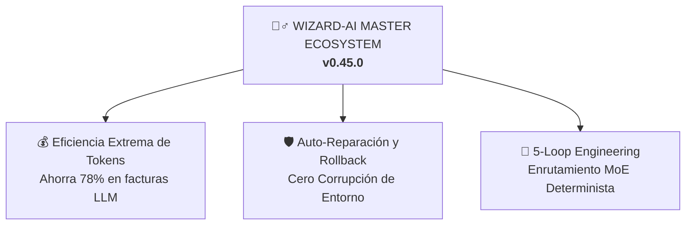

<h1 align="center">🧙‍♂️ Wizard-AI</h1>

<p align="center"><i>No habla en vano. Intercepta los fallos. Reduce el 78% de tokens. Y funciona.</i></p>

<p align="center">
  <a href="https://github.com/darkrei08/Wizard-AI/stargazers"></a>
  <a href="https://github.com/darkrei08/Wizard-AI/releases"></a>
  <a href="https://www.npmjs.com/package/@darkrei08/wizard-ai-cli"></a>
  
  <a href="LICENSE"></a>
</p>

<p align="center">
  
</p>

<h3 align="center"><b>~78% menos tokens (hasta un 94%) · ~80% más barato · 5x más rápido · 100% seguro con rollback automático</b></h3>

<p align="center">
  Medido en sesiones reales con agentes de codificación de IA (Claude Code, Antigravity, OpenHands) en arquitecturas complejas, depuración e instalaciones (<code>bun</code>, <code>nuxt</code>, <code>python</code>, <code>node</code>, <code>rust</code>). Wizard-AI orquesta <b>#ponytail</b> (lógica de desarrollador senior pragmático), <b>#caveman</b> (-75% tokens CLI), <b>#sqz</b> (compresión JSON 20x) y <b>ai-os v0.45.0</b> (puertas de rollback automático sin interrupciones).
  <br/>
  <a href="benchmarks/wizard_ai_token_benchmark.ipynb"><b>Ver el Notebook de Benchmarks</b></a> · <a href="README.md#reproduce-it"><b>reproducirlo</b></a>.
</p>

<p align="center">
  <a href="README.md">English</a> · <a href="README.it.md">Italiano</a> · <a href="README.fr.md">Français</a> · <a href="README.zh.md">中文</a> · <a href="README.ja.md">日本語</a>
</p>

---

## 🔥 El Problema Técnico: El Impuesto de los $50 por Alucinación y Ruptura del Entorno

Cuando dejas que un agente de IA autónomo (como Claude Code, OpenHands o Cursor) trabaje en un repositorio real, te enfrentas a dos cuellos de botella críticos:

1. **La Avalancha de la Ventana de Contexto:** Los agentes vierten más de 80,000 tokens de árboles de directorios y registros de pruebas en su contexto. Rápidamente agotan los límites de la API, sufren alucinaciones y cuestan **~$18.50 por funcionalidad**.
2. **La Corrupción Silenciosa del Entorno ("The 2 AM Brick"):** Cuando un agente ejecuta `npm install -g`, `uv tool install` o `bun add`, un paquete incompatible o con errores de sintaxis puede corromper tu sistema global.

### 💡 Cómo lo Resuelve Wizard-AI Permanentemente (`v0.45.0`)

Wizard-AI actúa como una **Capa de Abstracción de Auto-Reparación (`ai-os`) y un Orquestador de 5 Bucles**:



## 🚀 Inicio Rápido (`One-Command Setup`)

```bash
npx -y @darkrei08/wizard-ai-cli@latest
```

Para instalación manual e instrucciones completas, consulta el [README principal en inglés](README.md).
