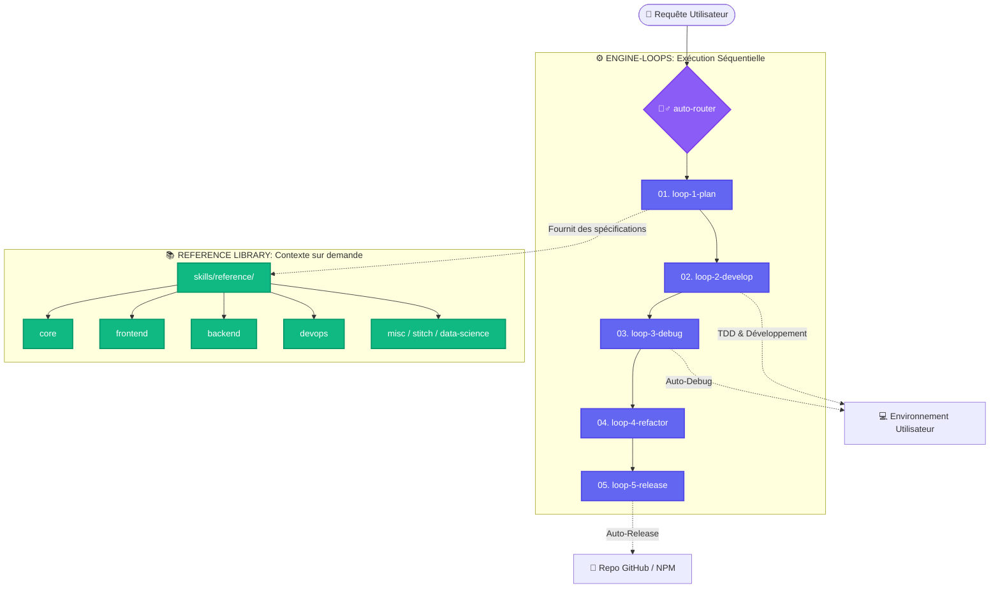

<h1 align="center">🧙‍♂️ Wizard-AI</h1>

<p align="center"><i>Il ne parle pas pour rien. Il intercepte les crashs. Il réduit 78% de tokens. Et ça marche.</i></p>

<h3 align="center"><b>~78% de tokens en moins (jusqu'à 94%) · ~80% moins cher · 5x plus rapide · 100% sécurisé et protégé par rollback</b></h3>

<p align="center">
  Mesuré sur des sessions réelles avec des agents de codage IA (Claude Code, Antigravity, OpenHands) sur des architectures complexes, du débogage et des installations (<code>bun</code>, <code>nuxt</code>, <code>python</code>, <code>node</code>, <code>rust</code>). Wizard-AI orchestre <b>#ponytail</b> (discipline de Senior Dev pragmatique), <b>#caveman</b> (-75% tokens CLI), <b>#sqz</b> (compression JSON 20x) et <b>wizard-ai os</b> (barrières de rollback automatique sans interruption).
  <br/>
  <a href="benchmarks/wizard_ai_token_benchmark.ipynb"><b>Voir le Notebook de Benchmarks</b></a> · <a href="README.md#reproduce-it"><b>le reproduire</b></a>.
</p>

<p align="center">
  <a href="README.md">English</a> · <a href="README.it.md">Italiano</a> · <a href="README.es.md">Español</a> · <a href="README.zh.md">中文</a> · <a href="README.ja.md">日本語</a>
</p>

---

## 🔥 Le Problème Technique : Le Coût des Hallucinations et de la Rupture d'Environnement

Quand vous laissez un agent d'IA autonome (comme Claude Code, OpenHands ou Cursor) travailler sur un dépôt réel, vous faites face à deux goulots d'étranglement critiques :

1. **L'Avalanche de la Fenêtre de Contexte :** Les agents déversent plus de 80 000 tokens d'arborescences de fichiers et de logs de tests. Ils épuisent rapidement les limites d'API, souffrent d'hallucinations et coûtent **~$18.50 par fonctionnalité**.
2. **La Corruption Silencieuse de l'Environnement ("The 2 AM Brick") :** Quand un agent lance `npm install -g`, `uv tool install` ou `bun add`, un paquet instable ou une erreur de syntaxe peut corrompre votre système global.

### 💡 Comment Wizard-AI Résout Ce Problème Définitivement

Wizard-AI agit comme une **Couche d'Abstraction Auto-Réparatrice (`wizard-ai os`) et un Orchestrateur en 5 Boucles** entre l'agent d'IA et votre système d'exploitation :



## 🧠 Agentic Context Engineering & The 4-Layer Format Stack

Dans l'écosystème de l'IA de 2026, l'ingénierie du contexte est la nouvelle norme. Wizard-AI introduit le **4-Layer Format Stack**, conçu pour éliminer les hallucinations et maximiser l'optimisation des tokens :

1. **Layer 4: JavaScript (Exécution)** — La logique s'exécute dans un bac à sable sécurisé via `pi-extensible-workflows`. Fini les scripts bash verbeux.
2. **Layer 3: YAML (Orchestration)** — Uniquement pour le routage, la configuration et les rôles.
3. **Layer 2: Markdown + LEA (Contenu)** — Utilise les **Lossless Evidence Aliases (LEA)** (`[S1]: MEMORY.md` cité comme `[E1]`). Économise jusqu'à 80 % sur les métadonnées répétitives.
4. **Layer 1: Format TOON (Limites API)** — Remplace le JSON par la **Token Oriented Object Notation (TOON)** (réduction de 40 à 75 % des tokens par rapport au JSON brut).

**Règle du PRE & POST Autoloop :** Chaque session compresse le contexte, synchronise la mémoire (`MEMORY.md`) et met à jour le graphe du projet avant et après chaque itération de façon autonome.

### 🔧 Pi Dynamic Configurator (`wz-ai-pi-configurator`)

Intègre automatiquement les modèles de [vekexasia/pi-config](https://github.com/vekexasia/pi-config) dans votre environnement local `~/.pi/agent/` avec des paramètres par défaut et une sélection intelligente des modèles en fonction de votre niveau d'abonnement **Cockpit Tools** :

```bash
wz-ai-pi-configurator
```

### 📚 RepoDocs Wiki Generator (`wz-ai-repodocs`)

Génère automatiquement un wiki documenté pour tout dépôt en utilisant [aryrabelo/repodocs](https://github.com/aryrabelo/repodocs). Intégré à la **Loop 5 (Release)** pour la documentation de fin de cycle :

```bash
wz-ai-repodocs repodocs-all .
```

## 🚀 Démarrage Rapide (`One-Command Setup`)

```bash
npx -y @darkrei08/wizard-ai-cli@latest
```

Pour l'installation manuelle et la documentation complète, consultez le [README principal en anglais](README.md).
