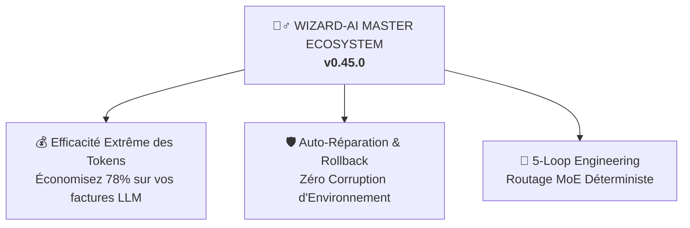

<h1 align="center">🧙‍♂️ Wizard-AI</h1>

<p align="center"><i>Il ne parle pas pour rien. Il intercepte les crashs. Il réduit 78% de tokens. Et ça marche.</i></p>

<p align="center">
  <a href="https://github.com/darkrei08/Wizard-AI/stargazers"></a>
  <a href="https://github.com/darkrei08/Wizard-AI/releases"></a>
  <a href="https://www.npmjs.com/package/@darkrei08/wizard-ai-cli"></a>
  
  <a href="LICENSE"></a>
</p>

<p align="center">
  
</p>

<h3 align="center"><b>~78% de tokens en moins (jusqu'à 94%) · ~80% moins cher · 5x plus rapide · 100% sécurisé et protégé par rollback</b></h3>

<p align="center">
  Mesuré sur des sessions réelles avec des agents de codage IA (Claude Code, Antigravity, OpenHands) sur des architectures complexes, du débogage et des installations (<code>bun</code>, <code>nuxt</code>, <code>python</code>, <code>node</code>, <code>rust</code>). Wizard-AI orchestre <b>#ponytail</b> (discipline de Senior Dev pragmatique), <b>#caveman</b> (-75% tokens CLI), <b>#sqz</b> (compression JSON 20x) et <b>ai-os v0.45.0</b> (barrières de rollback automatique sans interruption).
  <br/>
  <a href="benchmarks/wizard_ai_token_benchmark.ipynb"><b>Voir le Notebook de Benchmark</b></a> · <a href="README.md#reproduce-it"><b>reproduire les tests</b></a>.
</p>

<p align="center">
  <a href="README.md">English</a> · <a href="README.it.md">Italiano</a> · <a href="README.es.md">Español</a> · <a href="README.zh.md">中文</a> · <a href="README.ja.md">日本語</a>
</p>

---

## 🔥 Le Problème Technique : La Taxe des 50$ par Hallucination et Casse d'Environnement

Lorsque vous laissez un agent IA autonome (comme Claude Code, OpenHands ou Cursor) travailler sur un véritable dépôt, vous êtes confronté à deux goulots d'étranglement majeurs :

1. **L'avalanche de la fenêtre de contexte :** Les agents déversent plus de 80 000 tokens d'arborescences de fichiers et de logs de tests. Ils épuisent rapidement les limites d'API, souffrent d'hallucinations et coûtent **~$18.50 par fonctionnalité**.
2. **La corruption silencieuse de l'environnement :** Quand un agent lance `npm install -g`, `uv tool install` ou `bun add`, un paquet instable ou une erreur de syntaxe peut corrompre votre système global.

### 💡 Comment Wizard-AI Résout Ce Problème Définitivement (`v0.45.0`)

Wizard-AI agit comme une **Couche d'Abstraction Auto-Réparatrice (`ai-os`) et un Orchestrateur en 5 Boucles** :



## 🚀 Démarrage Rapide (`One-Command Setup`)

```bash
npx -y @darkrei08/wizard-ai-cli@latest
```

Pour l'installation manuelle et la documentation complète, consultez le [README principal en anglais](README.md).
