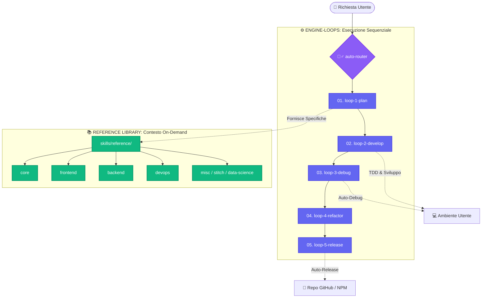

<h1 align="center">🧙‍♂️ Wizard-AI</h1>

<p align="center"><i>Non parla a vuoto. Intercetta i crash. Taglia il 78% di token. E funziona.</i></p>

<p align="center">
  <a href="https://github.com/darkrei08/Wizard-AI/stargazers"></a>
  <a href="https://github.com/darkrei08/Wizard-AI/releases"></a>
  <a href="https://www.npmjs.com/package/@darkrei08/wizard-ai-cli"></a>
  
  <a href="LICENSE"></a>
</p>

<p align="center">
  
</p>

<h3 align="center"><b>~78% di token in meno (fino al 94%) · ~80% più economico · 5x più veloce · 100% sicuro e con rollback</b></h3>

<p align="center">
  Misurato su sessioni reali con agenti coding AI (Claude Code, Antigravity, OpenHands) su architetture complesse, debug e installazioni (<code>bun</code>, <code>nuxt</code>, <code>python</code>, <code>node</code>, <code>rust</code>). Wizard-AI orchestra <b>#ponytail</b> (logica da Senior Dev pigro), <b>#caveman</b> (-75% token in output CLI), <b>#sqz</b> (compressione JSON 20x) e <b>ai-os</b> (rollback automatico a zero downtime). Ogni barriera di sicurezza è attiva mentre il contesto resta leggero e fulmineo.
  <br/>
  <a href="benchmarks/wizard_ai_token_benchmark.ipynb"><b>Guarda il Notebook Benchmark</b></a> · <a href="#riproduci-i-test"><b>riproduci i test</b></a>.
</p>

<p align="center">
  <a href="README.md">English</a> · <a href="README.es.md">Español</a> · <a href="README.fr.md">Français</a> · <a href="README.zh.md">中文</a> · <a href="README.ja.md">日本語</a>
</p>

---

## ✨ Cos'è questo progetto?

Wizard-AI è un setup **con un solo comando** che fornisce a tutti gli agenti AI sulla tua macchina l'accesso allo stesso set di strumenti di produttività:

- 🗜️ **Compressione dei token** — riduci il contesto del prompt fino a 20x
- 🌐 **Grafi di conoscenza** — mappa qualsiasi codebase in un grafo interrogabile
- 🧠 **Memoria persistente** — memoria semantica che sopravvive alle sessioni AI
- 📄 **Conversione di documenti** — PDF, DOCX, XLSX → Markdown pulito
- 🔍 **Reranking intelligente** — filtra i passaggi RAG in base alla pertinenza
- 📈 **Monitoraggio dei consumi** — traccia l'uso dei token e i costi
- 🔗 **LLM Gateway** — un'unica API per oltre 100 provider tramite LiteLLM
- 🛩️ **Cockpit Tools Proxy** — aggira i limiti dei piani gratuiti sfruttando l'abbonamento del tuo IDE (su Windows, Linux e macOS)

Tutti gli strumenti vengono installati una sola volta e resi **disponibili a ogni agente AI** attraverso un sistema di skill condiviso.

### 💡 Come funziona

Wizard-AI funge da **Strato di Astrazione Auto-Rigenerante (`ai-os`) e da Orchestratore Deterministico a 5 Loop** tra l'agente AI e il tuo sistema operativo:



---

## 🚀 Avvio Rapido

### ⚡ Opzione A — Un solo comando via npm (consigliata)

Se hai [Node.js](https://nodejs.org) (≥ 14) e `git` installati, funziona allo stesso modo su Linux, macOS e Windows:

```bash
npx @darkrei08/wizard-ai-cli
# o 'npx @darkrei08/wizard-ai-cli --verbose' per visualizzare log dettagliati
```

Il launcher clona il repository in `~/.wizard-ai` ed esegue automaticamente l'installatore della tua piattaforma (`setup.sh` o `setup.ps1`). Rieseguendo il comando, un'installazione esistente viene aggiornata. Puoi anche installarlo come comando globale:

```bash
npm install -g @darkrei08/wizard-ai-cli
wizard-ai
```

### 🔧 Opzione B — Installazione manuale (3 passaggi)

Per essere completamente autonomo, segui questi passaggi per installare e iniziare a usare l'ecosistema:

#### 1️⃣ Clona il Repository
Clona il repository sul tuo computer locale:
```bash
git clone https://github.com/darkrei08/Wizard-AI.git ~/wizard-ai
cd ~/wizard-ai
```

#### 2️⃣ Esegui l'Installatore
Esegui lo script principale di setup. Usa `--yes` (`-y`) per un'installazione **completamente automatica e non-interattiva** (ideale per CI/CD), oppure eseguilo senza per un'esperienza interattiva con prompt di configurazione.

**Linux / macOS:**
```bash
chmod +x setup.sh

# Completamente automatico (nessun prompt — consigliato per CI/CD)
sudo ./setup.sh --yes

# Modalità interattiva (prompt per le configurazioni opzionali)
sudo ./setup.sh

# Con output dettagliato
sudo ./setup.sh -v -y
```

**Windows (PowerShell):**
```powershell
powershell -ExecutionPolicy Bypass -File setup.ps1
# o aggiungi -VerboseMode per visualizzare log dettagliati
```

> **Flag:** `-v` / `--verbose` mostra log dettagliati. `-y` / `--yes` accetta automaticamente tutti i prompt (setup skill, auto-update, credenziali).

#### 3️⃣ Verifica l'Installazione
Ricarica la tua shell per caricare le nuove variabili d'ambiente, quindi avvia il menu di aiuto:
```bash
source ~/.bashrc   # oppure source ~/.zshrc — su Windows apri un nuovo terminale
ai-help
```
Dovresti vedere la lista dei comandi.

#### 4️⃣ Avvia la Dashboard Locale (Hub)
L'ecosistema include una bellissima interfaccia grafica (Hub) per esplorare le skill e visualizzare le statistiche (incluso il tracciamento di Cockpit Tools).
Puoi aprirla dal terminale con il wrapper integrato, che avvierà un server locale e aprirà automaticamente il browser:
```bash
ai-hub
```
*Alternativa manuale per avviare il server*:
```bash
python3 $WIZARD_AI_DIR/hub/api/server.py --port 9742
# Apri http://localhost:9742 nel tuo browser
```

### 🐳 Opzione C — Esecuzione via Docker (per la Web GUI)
Se preferisci mantenere l'ambiente web isolato, puoi eseguire la Dashboard tramite Docker. Il container monterà automaticamente i volumi del tuo sistema host in modo da leggere la telemetria corretta:

```bash
docker compose up -d
```
L'interfaccia sarà disponibile all'indirizzo `http://localhost:9742`.

---

## 📊 Benchmark delle Prestazioni

Per illustrare l'immenso valore del toolkit Wizard-AI, abbiamo eseguito tre prompt di diversa complessità confrontando l'approccio standard (prompt non ottimizzato) con l'**approccio Wizard-AI** (usando `ai-compress` / `ai-caveman` / `ai-graph`).

### Risultati dei Benchmark

| Livello di Difficoltà | Descrizione del Task | Token (Standard) | Token (Wizard-AI) | Riduzione (%) | Strumenti Utilizzati |
| :--- | :--- | :--- | :--- | :--- | :--- |
| **Basso** | Script Python semplice (Fibonacci fino a 100) | In: `50`<br>Out: `200` | In: `40`<br>Out: `150` | ~25% | `ai-prompt` |
| **Medio** | Estrarre e raggruppare eccezioni 'OutOfMemory' da un log di 10.000 righe | In: `25.000`<br>Out: `500` | In: `5.000`<br>Out: `200` | **80%** | `ai-compress` + `ai-squeeze` |
| **Alto** | Generare architettura e codice per un'app e-commerce Next.js | In: `15.000`<br>Out: `4.000` | In: `3.000`<br>Out: `1.000` | **78%** | `ai-graph` + `ai-caveman` |

### Perché è importante:
- **Risparmio sui Costi**: Inviare un contesto ridotto dell'80% si traduce direttamente nell'80% di costi API in meno.
- **Velocità**: Generare 1.000 token di output richiede molto meno tempo rispetto a 4.000, permettendo all'AI di rispondere in secondi invece che in minuti.
- **Precisione**: Filtrando il rumore con `ai-compress` e `ai-rerank`, l'LLM ha meno allucinazioni e si concentra sul problema reale.

---

## ⚙️ Cosa viene installato?

Dietro le quinte, `setup.sh` gestisce tutto per te:

1. **Registra `$WIZARD_AI_DIR`**: Salva il percorso in `~/.config/wizard-ai/env` e lo inserisce nel caricamento automatico della shell (`~/.bashrc`, `~/.zshrc`).
2. **Prepara l'ambiente Python**: Installa `uv` e crea un ambiente virtuale leggero (`~/.ai-skills/venv`).
3. **Clona le dipendenze**: Scarica i repository necessari sotto `~/.ai-skills/`.
4. **Installa Tool CLI Globali**: Configura gli eseguibili nativi (`graphify`, `litellm`, `markitdown`, `sqz`, `serena`) globalmente via `uv tool`.
5. **Crea Wrapper Personalizzati**: Copia gli script da `bin/` a `~/.local/bin/`.
6. **Configura le Skill**: Copia le skill in `~/.gemini/config/skills/` e le propaga a tutti gli altri agenti.

---

## 🔄 I 5 Workflow Sequenziali di Loop Engineering (`01 → 05`)

Wizard-AI organizza tutte le fasi di pianificazione, sviluppo, debug, refactoring e rilascio in **5 Loop Sequenziali Numerati (`01 → 05`)**:

1. **`01. /loop-1-plan`** — 🎯 **Pianificazione & Specifiche:** Analisi requisiti, grilling interattivo, `.spec.md`, modellazione dominio e `task.md`.
2. **`02. /loop-2-develop`** — ⚡ **Sviluppo & TDD:** Branch git isolato, ciclo TDD Red-Green-Refactor, subagent paralleli e sicurezza OWASP.
3. **`03. /loop-3-debug`** — 🔍 **Debug & Verifica:** Diagnosi bug in 4 fasi, quality gates `ai-debug check` e code review rigorosa.
4. **`04. /loop-4-refactor`** — 🏗️ **Refactoring & Ottimizzazione:** Ricerca semantica (`serena`), clean code/DDD (`ponytail`) e risparmio token (`sqz`, `caveman`).
5. **`05. /loop-5-release`** — 🚀 **Rilascio & Apprendimento:** Merge pulito su main, Semantic Versioning (`auto-release`), pubblicazione npm, handoff e salvataggio in `MEMORY.md`.

> **`loop-install-bind` Gate:** Ogni volta che installi una nuova skill o framework tramite `wizard-ai-installer`, l'agente esegue automaticamente la configurazione dell'aggancio in `skills.json` e nel Loop Chaining Tree.

---

## 🛠️ Comandi Disponibili

Dopo l'installazione, questi comandi saranno disponibili nel tuo terminale:

| Comando | Strumento | Descrizione |
|---|---|---|
| `ai-hub` | GUI Locale | Apre la dashboard e il marketplace nel browser |
| `ai-help` | Hub | Mostra la lista degli strumenti con esempi di utilizzo |
| `ai-update` | Updater | Aggiorna manualmente Wizard-AI (include notifiche desktop cross-platform) |
| `ai-graph [percorso]` | Graphify | Costruisce knowledge graph. **Si aggancia in automatico a Cockpit Tools per non consumare API Keys!** |
| `ai-compress --file f.txt`| LLMLingua | Comprime prompt o contesto fino a 20x |
| `headroom` | Headroom | Compressione del contesto e API proxy (60-95% token in meno) |
| `ai-caveman` | Caveman | Riduce i token di output dell'agente del 75% mantenendo la precisione |
| `ai-ponytail "prompt"` | Ponytail | Agisce da dev senior pigro per prevenire l'over-engineering |
| `ai-compare "prompt"` | aisuite | Esegui un A/B test di un prompt su più modelli LLM |
| `ai-rerank --query "X"` | FlashRank | Riordina componenti o paragrafi (RAG) per pertinenza |
| `ai-squeeze` | Sqz | Comprime l'output del terminale / JSON / log |
| `ai-convert file.pdf` | MarkItDown | Converte qualsiasi file in un pulito Markdown |
| `ai-session-save "msg"` | Session Save | Salva il contesto della sessione corrente in MEMORY.md |
| `ai-mem store "testo"` | claude-mem | Memorizza un'informazione in modo semantico persistente |
| `ai-usage` | GeminiUsage | Traccia i consumi dei token e il budget Gemini |
| `serena find-usages` | Serena | Ricerca semantica del codice e navigazione LSP |
| `ai-sync-skills` | Sync | Propaga le skill aggiornate a tutti gli agenti |
| `book-to-skill doc.pdf` | book-to-skill| Trasforma libri o manuali in skill per agenti AI |
| `litellm --port 4000` | LiteLLM | Gateway API unificato per oltre 100+ LLM |
| `wizard-antigravity` | pi-antigravity-rotator | Proxy di rotazione multi-account per Cockpit Tools |
| `ai-proxy` | Cockpit Proxy | Gestisce il demone proxy di Cockpit Tools |

---

## 🛩️ AI Proxy (Cockpit Tools)

Wizard-AI si integra perfettamente con **Cockpit Tools** tramite `ai-proxy` per aggirare i limiti rate (rate limits) del piano gratuito di Gemini su account multipli.

1. **Installa le Dipendenze del Proxy**
   ```bash
   ai-proxy install
   ```

2. **Importa gli Account di Cockpit Tools (Automatico)**
   Esegui il seguente comando per estrarre in modo sicuro i tuoi `refreshTokens` dal database locale di Cockpit Tools e iniettarli nel file `accounts.json` del proxy:
   ```bash
   ai-proxy provision
   ```
   *(Nota: Questo utilizza la skill locale `cockpit-bridge` e non richiede di ripetere il login ai tuoi account Google).*

3. **Avvia il Demone Proxy**
   Per avviare il proxy come demone in background (che si avvia automaticamente all'avvio del PC):
   ```bash
   ai-proxy enable
   ```
   *Nota: Su Windows, questo crea un VBScript nella cartella di Esecuzione Automatica (Startup). Su Linux, usa systemd. Su Mac, usa launchd.*

   Per visualizzare i log in background in tempo reale:
   ```bash
   ai-proxy logs
   ```

   Per fermare il demone in seguito:
   ```bash
   ai-proxy disable
   ```
*Nota: Questo configura automaticamente il tuo agente Pi per utilizzare il provider `google-antigravity`.*

---

## 🏗️ Master Project Bootstrap

Wizard-AI include ora la skill **`master-project-bootstrap`**, la meta-skill definitiva per inizializzare e architettare progetti pronti per la produzione.

Invocando semplicemente questa skill all'inizio di un nuovo progetto, il tuo agente AI applicherà automaticamente:
- **Clean Architecture** e **SDD/TDD** (tramite `spec-kit` e `test-driven-development`).
- **Selezione Dinamica del Framework** (indirizzando su `express`, `nuxt`, `next.js`, `pocketbase` o `zvec` in base alla complessità del progetto).
- **Documenti Vivi Obbligatori** (`MEMORY.md`, `CHANGELOG.md`, `PROMPT.md`, `AGENT.md`) per mantenere uno stato e un contesto perfetti tra le sessioni.
- **Skill Chaining** (automatizzando `auto-workflow`, `scaffold`, `taste-skill`, `graphify`, `serena`, `auto-debug` e `auto-release` senza interruzioni).

Devi solo fornire la tua idea, e Wizard-AI orchestrerà il setup perfetto.

---

## 🧠 Come Funzionano le Skill

Le skill sono file `SKILL.md` che spiegano agli agenti AI **quando e come** utilizzare ciascuno strumento. Ciascun agente legge la propria cartella:

| Agente | Directory delle Skill |
|---|---|
| Antigravity (Gemini CLI) | `~/.gemini/config/skills/` |
| Claude Code | `~/.claude/skills/` |
| Amp | `~/.config/amp/skills/` |

**`setup.sh` installa le skill una sola volta**. Eseguire `ai-sync-skills` le copia automaticamente in tutte le altre cartelle degli agenti.

### Sincronizzazione Skill Personalizzate

Ogni volta che scrivi o modifichi una skill, esegui:
```bash
ai-sync-skills
```
Questo script eseguirà il backup nel tuo repository locale sotto `skills/` e propagherà le modifiche agli altri agenti.

---

## 📁 Struttura del Progetto

```
wizard-ai/
├── bin/                    # Script wrapper CLI → copiati in ~/.local/bin/
│   └── windows/            # Port PowerShell dei wrapper (Windows)
├── skills/                 # Copiati negli agenti
│   ├── engine-loops/       # IL MOTORE: I 5 Loop Master (01-05). Punti di ingresso.
│   └── reference/          # LA LIBRERIA: Skill di riferimento per domini specifici
│       ├── core/           # Router, loop engine, installer, pattern agentici
│       ├── frontend/       # React, Vue, Angular, skill di design
│       ├── backend/        # Node, Python, Firebase, database
│       ├── devops/         # CI/CD, sicurezza, auto-release
│       ├── data-science/   # Elaborazione documenti, visualizzazione
│       ├── memory-knowledge/ # Graphify, memoria
│       ├── stitch/         # Strumenti design system
│       ├── marketing-media/ # SEO, contenuti
│       └── misc/           # Utility, agenti esterni
├── docs/                   # Guide e documentazione
│   ├── WIKI.it.md          # 📚 Wiki centrale di tutte le skill e risorse
│   └── security-prompts/   # Prompt di audit sicurezza per codice AI
├── local/                  # Cartella ignorata (configurazione e cloni esterni)
├── setup.sh                # Installatore automatico (Linux / macOS)
├── setup.ps1               # Installatore automatico (Windows)
├── cli.js                  # Launcher npm (npx wizard-ai-cli)
├── package.json            # Manifest del pacchetto npm (wizard-ai-cli)
├── CONTRIBUTING.md         # Come aggiungere nuove skill
├── LICENSE                 # Licenza AGPLv3
└── README.md               # Questo file
```

---

## 🔒 Prompt di Audit di Sicurezza

Questo repository include una suite professionale di prompt per l'audit di sicurezza progettati specificamente per le **applicazioni generate tramite AI** (vibe coding).

Li puoi trovare nella cartella [`docs/security-prompts/`](docs/security-prompts/). Coprono:
- Segreti e Variabili d'Ambiente
- Sicurezza del Database (RLS, SQLi)
- Autenticazione e Pagamenti
- Vulnerabilità Frontend
- **Framework di Audit Finale Completo**

Usali con una sessione AI "zero-context" per individuare vulnerabilità prima del deploy in produzione.

---

## 🔧 La Variabile `$WIZARD_AI_DIR`

Dopo aver eseguito `setup.sh`, la tua shell disporrà della variabile `$WIZARD_AI_DIR` impostata sul percorso assoluto in cui si trova il repository:

```bash
echo $WIZARD_AI_DIR
# → /home/utente/wizard-ai
```

Su Windows viene salvata come **variabile d'ambiente utente**:
```powershell
echo $env:WIZARD_AI_DIR
# → C:\Users\utente\wizard-ai
```
Questo consente agli script e alle skill di fare riferimento a file interni in modo dinamico e portabile.

---

## 🤝 Contribuire

Vedi [CONTRIBUTING.it.md](CONTRIBUTING.it.md) per le istruzioni su come aggiungere skill, wrapper e miglioramenti.

---

## 🙏 Crediti

Wizard-AI integra questi eccellenti progetti open-source:

- [Graphify](https://github.com/safishamsi/graphify)
- [LLMLingua](https://github.com/microsoft/LLMLingua)
- [FlashRank](https://github.com/PrithivirajDamodaran/FlashRank)
- [MarkItDown](https://github.com/microsoft/markitdown)
- [Sqz](https://github.com/ojuschugh1/sqz)
- [claude-mem](https://github.com/thedotmack/claude-mem)
- [GeminiUsage](https://github.com/rmedranollamas/geminiusage)
- [LiteLLM](https://github.com/BerriAI/litellm)
- [Serena](https://github.com/oraios/serena)
- [ECC](https://github.com/affaan-m/ECC)
- [book-to-skill](https://github.com/virgiliojr94/book-to-skill)
- [Cockpit Tools](https://github.com/jlcodes99/cockpit-tools) - Proxy locale per abbattere i costi delle API LLM

---

## ⚖️ Licenza

Rilasciato sotto licenza [AGPLv3](LICENSE) — libero utilizzo, modifica e condivisione.
