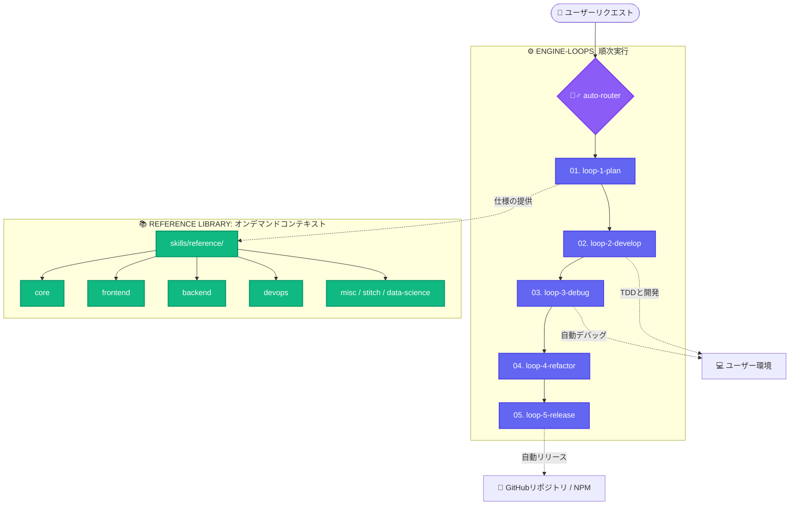

<h1 align="center">🧙‍♂️ Wizard-AI</h1>

<p align="center"><i>無駄を語らず、クラッシュを防ぎ、78%のトークンを削ぎ落とす。朝一番で開発に取り掛かろう。</i></p>

<h3 align="center"><b>~78%削減のトークン効率（最大94%省力化）· ~80%のコスト削減 · 5x 高速化 · 100% 安全な自動ロールバック保護</b></h3>

<p align="center">
  実際のコーディングエージェント（Claude Code、Antigravity、OpenHands）を用いた複雑なアーキテクチャ設計、バグ修正、およびパッケージ導入（<code>bun</code>、<code>nuxt</code>、<code>python</code>、<code>node</code>、<code>rust</code>）で実証済み。Wizard-AIは、<b>#ponytail</b>（実用主義のシニアエンジニア思考）、<b>#caveman</b>（CLI出力の75%削減）、<b>#sqz</b>（JSONの20倍圧縮）、および <b>wizard-ai os</b>（ゼロダウンタイム自動安全ロールバック）を統合します。
  <br/>
  <a href="benchmarks/wizard_ai_token_benchmark.ipynb"><b>ベンチマークノートブックを見る</b></a> · <a href="README.md#reproduce-it"><b>再現テストの実行</b></a>。
</p>

<p align="center">
  <a href="README.md">English</a> · <a href="README.it.md">Italiano</a> · <a href="README.es.md">Español</a> · <a href="README.fr.md">Français</a> · <a href="README.zh.md">中文</a>
</p>

---

## 🔥 技術的課題：機能追加あたり50ドルの「幻覚と環境破壊」コスト

自律型AIエージェント（Claude Code、OpenHands、Cursorなど）を実際のコードベースで実行すると、以下の2つの大きなボトルネックに直面します。

1. **コンテキストウィンドウの雪崩とコストの爆発：** エージェントは大量のファイルツリーや冗長なログをそのまま投入するため、コンテキスト上限に達しやすく、幻覚が発生しやすくなります。結果、機能追加ごとに平均 **~$18.50** のコストがかかります。
2. **システム環境の破壊（「午前2時の環境崩壊」）：** エージェントが自律的に `npm install` や `pip install` などを実行した際、パッケージ競合によってローカルシステム環境が破損するリスクがあります。

### 💡 Wizard-AI による究極の解決策

Wizard-AIは、AIエージェントとOS間の**自己修復型抽象レイヤー (`wizard-ai os`) および 5つのエンジニアリングループ**として機能します：



## 🚀 クイック・スタート (`1コマンドで導入`)

```bash
npx -y @darkrei08/wizard-ai-cli@latest
```

詳細な手動導入手順や完全なドキュメントは、[英語メインREADME](README.md) をご覧ください。
