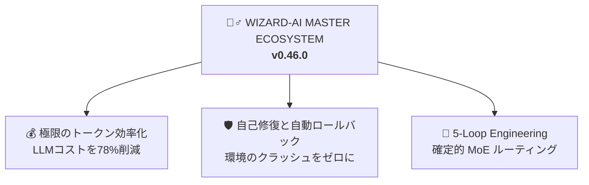

<h1 align="center">🧙‍♂️ Wizard-AI</h1>

<p align="center"><i>無駄を語らず、クラッシュを防ぎ、78%のトークンを削ぎ落とす。そして動く。</i></p>

<p align="center">
  <a href="https://github.com/darkrei08/Wizard-AI/stargazers"></a>
  <a href="https://github.com/darkrei08/Wizard-AI/releases"></a>
  <a href="https://www.npmjs.com/package/@darkrei08/wizard-ai-cli"></a>
  
  <a href="LICENSE"></a>
</p>

<p align="center">
  
</p>

<h3 align="center"><b>~78%削減のトークン効率（最大94%省力化）· ~80%のコスト削減 · 5x 高速化 · 100% 安全な自動ロールバック保護</b></h3>

<p align="center">
  実際のコーディングエージェント（Claude Code、Antigravity、OpenHands）を用いた複雑なアーキテクチャ設計、バグ修正、およびパッケージ導入（<code>bun</code>、<code>nuxt</code>、<code>python</code>、<code>node</code>、<code>rust</code>）で実証済み。Wizard-AIは、<b>#ponytail</b>（実用主義のシニアエンジニア思考）、<b>#caveman</b>（CLI出力の75%削減）、<b>#sqz</b>（JSONの20倍圧縮）、および <b>ai-os v0.46.0</b>（ゼロダウンタイム自動安全ロールバック）を統合します。
  <br/>
  <a href="benchmarks/wizard_ai_token_benchmark.ipynb"><b>完全なベンチマーク・ノートブックを見る</b></a> · <a href="README.md#reproduce-it"><b>データを再現する</b></a>.
</p>

<p align="center">
  <a href="README.md">English</a> · <a href="README.it.md">Italiano</a> · <a href="README.es.md">Español</a> · <a href="README.fr.md">Français</a> · <a href="README.zh.md">中文</a>
</p>

---

## 🔥 深刻な技術的課題：AIエージェントが引き起こす「$50の幻覚・環境クラッシュコスト」

自律型AIコーディングエージェントを実際のプロダクト環境で使用すると、2つの致命的な課題に直面します：

1. **コンテキストウィンドウの雪崩とAPIコストの爆発：** エージェントは80,000トークン以上のディレクトリ構造やテストログを平気でコンテキストに投入します。結果として幻覚が増加し、1つの機能追加に平均 **~$18.50** のコストがかかります。
2. **システム環境の破壊（「午前2時の環境崩壊」）：** エージェントが自律的に `npm install -g` や `uv tool install` を実行した際、パッケージの破損やビルド競合によって、システム全体の環境が破壊される危険性があります。

### 💡 Wizard-AI による究極の解決策 (`v0.46.0`)

Wizard-AIは、AIエージェントとOS間の**自己修復型抽象レイヤー (`ai-os`) および 5つのエンジニアリングループ**として機能します：



## 🚀 クイック・スタート (`1コマンドで導入`)

```bash
npx -y @darkrei08/wizard-ai-cli@latest
```

詳細な手動導入手順や完全なドキュメントは、[英語メインREADME](README.md) をご覧ください。
