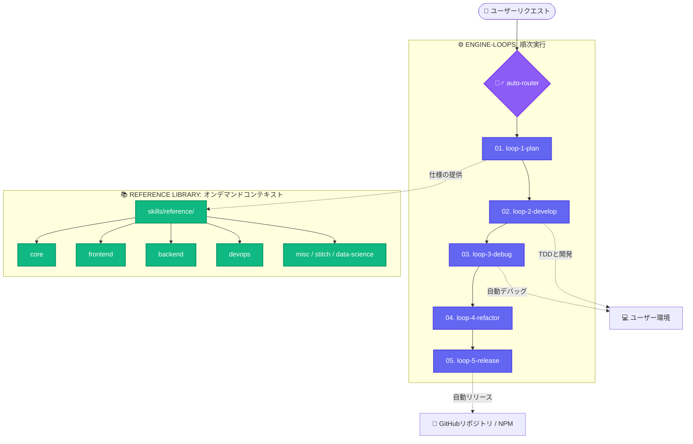

<h1 align="center">🧙‍♂️ Wizard-AI</h1>

<p align="center"><i>無駄を語らず、クラッシュを防ぎ、78%のトークンを削ぎ落とす。朝一番で開発に取り掛かろう。</i></p>

<h3 align="center"><b>~78%削減のトークン効率（最大94%省力化）· ~80%のコスト削減 · 5x 高速化 · 100% 安全な自動ロールバック保護</b></h3>

<p align="center">
  実際のコーディングエージェント（Claude Code、Antigravity、OpenHands）を用いた複雑なアーキテクチャ設計、バグ修正、およびパッケージ導入（<code>bun</code>、<code>nuxt</code>、<code>python</code>、<code>node</code>、<code>rust</code>）で実証済み。Wizard-AIは、<b>#ponytail</b>（実用主義のシニアエンジニア思考）、<b>#caveman</b>（CLI出力の75%削減）、<b>#sqz</b>（JSONの20倍圧縮）、および <b>wizard-ai os</b>（ゼロダウンタイム自動安全ロールバック）を統合します。
  <br/>
  <a href="benchmarks/wizard_ai_token_benchmark.ipynb"><b>ベンチマークノートブックを見る</b></a> · <a href="README.md#reproduce-it"><b>再現テストの実行</b></a>。
</p>

<p align="center">
  <a href="README.md">English</a> · <a href="README.it.md">Italiano</a> · <a href="README.es.md">Español</a> · <a href="README.fr.md">Français</a> · <a href="README.zh.md">中文</a>
</p>

---

## 🔥 技術的課題：機能追加あたり50ドルの「幻覚と環境破壊」コスト

自律型AIエージェント（Claude Code、OpenHands、Cursorなど）を実際のコードベースで実行すると、以下の2つの大きなボトルネックに直面します。

1. **コンテキストウィンドウの雪崩とコストの爆発：** エージェントは大量のファイルツリーや冗長なログをそのまま投入するため、コンテキスト上限に達しやすく、幻覚が発生しやすくなります。結果、機能追加ごとに平均 **~$18.50** のコストがかかります。
2. **システム環境の破壊（「午前2時の環境崩壊」）：** エージェントが自律的に `npm install` や `pip install` などを実行した際、パッケージ競合によってローカルシステム環境が破損するリスクがあります。

### 💡 Wizard-AI による究極の解決策

Wizard-AIは、AIエージェントとOS間の**自己修復型抽象レイヤー (`wizard-ai os`) および 5つのエンジニアリングループ**として機能します：


```mermaid
flowchart TB
    %% Nodes
    User([👤 ユーザーリクエスト]) --> Router{🧙‍♂️ auto-router}
    
    %% Engine Loops
    subgraph Engine [⚙️ ENGINE-LOOPS: 順次実行]
        Router --> L1[01. loop-1-plan]
        L1 --> L2[02. loop-2-develop]
        L2 --> L3[03. loop-3-debug]
        L3 --> L4[04. loop-4-refactor]
        L4 --> L5[05. loop-5-release]
    end
    
    %% Reference Library
    subgraph Lib [📚 REFERENCE LIBRARY: オンデマンドコンテキスト]
        Ref[skills/reference/]
        Ref --> RefCore[core]
        Ref --> RefFE[frontend]
        Ref --> RefBE[backend]
        Ref --> RefDO[devops]
        Ref --> RefMisc[misc / stitch / data-science]
    end
    
    %% Connections
    L1 -.->|仕様の提供| Ref
    L2 -.->|TDDと開発| Environment[💻 ユーザー環境]
    L3 -.->|自動デバッグ| Environment
    L5 -.->|自動リリース| GitHub[🐙 GitHubリポジトリ / NPM]
    
    %% Styling
    classDef engineColor fill:#6366f1,stroke:#4f46e5,stroke-width:2px,color:#fff;
    classDef libColor fill:#10b981,stroke:#059669,stroke-width:2px,color:#fff;
    classDef mainColor fill:#8b5cf6,stroke:#7c3aed,stroke-width:2px,color:#fff;
    class L1,L2,L3,L4,L5 engineColor;
    class Ref,RefCore,RefFE,RefBE,RefDO,RefMisc libColor;
    class Router mainColor;
```

## 🧠 Agentic Context Engineering & The 4-Layer Format Stack

2026年のAIエコシステムにおいて、コンテキストエンジニアリングは新しいゴールドスタンダードです。Wizard-AIは、ハルシネーションを排除しトークン最適化を最大化するために設計された **4-Layer Format Stack** を導入します：

1. **Layer 4: JavaScript (実行)** — ロジックは `pi-extensible-workflows` を介して安全なサンドボックス内で実行されます。
2. **Layer 3: YAML (オーケストレーション)** — ルーティング、設定、およびエージェントの役割専用。
3. **Layer 2: Markdown + LEA (コンテンツ)** — **Lossless Evidence Aliases (LEA)** を使用します (例: `[S1]: MEMORY.md` を `[E1]` として引用)。反復的なメタデータを最大80%節約します。
4. **Layer 1: TOON フォーマット (API境界)** — JSONを **Token Oriented Object Notation (TOON)** に置き換えます (生のJSONと比較してトークンを40〜75%削減)。

**PRE & POST Autoloop ルール：** 各セッションは、各反復の前後にコンテキストを圧縮し、メモリ (`MEMORY.md`) を同期し、プロジェクトグラフを自律的に更新します。

### 🔧 Pi Dynamic Configurator (`wizard-ai pi-configurator`)

[vekexasia/pi-config](https://github.com/vekexasia/pi-config) のパターンをローカルの `~/.pi/agent/` 環境に自動的に統合し、**Cockpit Tools** のサブスクリプション層に基づいたスマートなモデル選択とデフォルト設定を適用します。

```bash
wizard-ai pi-configurator
```

### 📚 RepoDocs Wiki Generator (`wizard-ai repodocs`)

[aryrabelo/repodocs](https://github.com/aryrabelo/repodocs) を使用して、リポジトリのドキュメント化されたWikiを自動生成します。開発サイクルの最後に行われるドキュメント作成のため、**Loop 5 (Release)** に統合されています：

```bash
wizard-ai repodocs repodocs-all .
```

## 🚀 クイック・スタート (`1コマンドで導入`)

```bash
npx -y @darkrei08/wizard-ai-cli@latest --verbose
```

詳細な手動導入手順や完全なドキュメントは、[英語メインREADME](README.md) をご覧ください。


## 🚀 Real-World Agentic Use Cases

Wizard-AI isn't a chatbot; it's a workforce. Here is what your terminal can autonomously achieve by combining the built-in skills:

### 1. 🛡️ Autonomous Pentesting & Security Hardening
**Skills Used:** `strix`, `cybersecurity`, `crowdsec-skill`, `ECC`
Instead of running a basic linter, Wizard-AI deploys an autonomous hacker agent (`strix`) that attempts to exploit your codebase, generates proofs-of-concept, and rewrites the vulnerable code using strict NIST/OWASP protocols.

### 2. 🎨 "Anti-Slop" UI/UX Frontend Engineering
**Skills Used:** `taste-skill`, `hallmark`, `mengto-skills`, `kinetics-ui`
Vanilla AIs generate generic, "bootstrap-looking" web pages. Wizard-AI reads your brief, enforces strict typographic rules, applies asymmetric layouts, and implements physics-based micro-interactions (`kinetics-ui`), outputting premium, agency-tier frontend code.

### 3. 🕸️ Deep Semantic Architecture Refactoring
**Skills Used:** `serena`, `codebase-memory-mcp`, `0-loop-engine`
Don't ask the AI to "read this file". Wizard-AI queries the Abstract Syntax Tree (AST) via Serena, creates an interactive knowledge graph (`personal-graph`), and refactors circular dependencies across 50+ files simultaneously without losing context.

### 4. 📈 SEO Research & Autonomous Blogging Pipeline
**Skills Used:** `claude-seo`, `claude-blog`, `lightpanda`
Need growth? The orchestration dispatches background agents to scrape live web data via stealth browsers (`camofox`, `lightpanda`), runs an E-E-A-T SEO audit, and generates high-ranking semantic clusters and articles autonomously.
