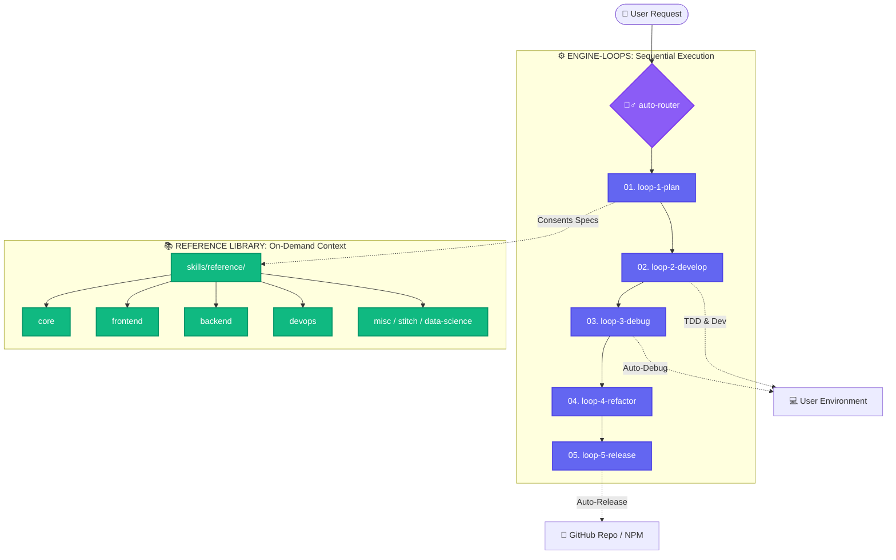
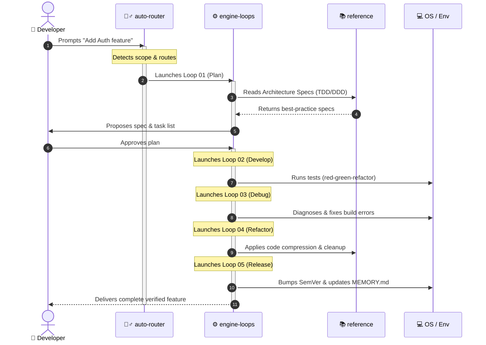

<h1 align="center">🧙‍♂️ Wizard-AI</h1>

<p align="center"><i>It says nothing. It catches the crash. It cuts 78% tokens. It works.</i></p>

<p align="center">
  <a href="https://github.com/darkrei08/Wizard-AI/stargazers"></a>
  <a href="https://github.com/darkrei08/Wizard-AI/releases"></a>
  <a href="https://www.npmjs.com/package/@darkrei08/wizard-ai-cli"></a>
  
  <a href="LICENSE"></a>
</p>

<p align="center">
  
</p>

<h3 align="center"><b>~78% fewer tokens (up to 94%) · ~80% cheaper · 5x faster · 100% safe & rollback-protected</b></h3>

<p align="center">
  Measured on real coding agent sessions across complex architectures, bug diagnoses, and framework installations (<code>bun</code>, <code>nuxt</code>, <code>node</code>, <code>python</code>, <code>rust</code>). Wizard-AI orchestrates <b>#ponytail</b> (lazy senior dev discipline), <b>#caveman</b> (-75% CLI tokens), <b>#sqz</b> (20x JSON compression), and <b>wizard-ai os</b> (automatic zero-downtime rollback gates). Every safety check is active while your context stays razor-sharp.
  <br/>
  <a href="benchmarks/wizard_ai_token_benchmark.ipynb"><b>Full benchmark notebook</b></a> · <a href="#reproduce-it"><b>reproduce it</b></a>.
</p>

<p align="center">
  <a href="README.it.md">Italiano</a> · <a href="README.es.md">Español</a> · <a href="README.fr.md">Français</a> · <a href="README.zh.md">中文</a> · <a href="README.ja.md">日本語</a>
</p>

---

## 🔥 The Hard Technical Problem: The $50/Feature Hallucination & Environment Brick Tax

When you let a modern AI coding agent (like raw Claude Code, OpenHands, Aider, or Cursor) run loose on a real-world repository, you immediately hit **two systemic, multi-million dollar engineering bottlenecks**:

1. **The Context-Window Avalanche & Financial Burn:**
   Raw agents dump 80,000+ tokens of entire file trees, verbose test logs, and `npm install` outputs into their context window on every turn. They quickly exhaust API limits, suffer from severe context degradation (hallucinations), and cost **~$18.50 per feature** while writing bloated, unmaintainable code.
2. **The Silent Environment Corruption (The "2 AM Brick"):**
   When an agent runs `npm install -g`, `uv tool install`, or `bun add` during an autonomous loop, a broken package, incompatible C++ build dependency, or syntax error can completely **corrupt your global system runtime**. Standard agents don't know how to clean up their mess, leaving you with broken virtual environments and half-created directories.

### 💡 How Wizard-AI Solves It Permanently

Wizard-AI acts as a **Self-Healing Abstraction Layer (`wizard-ai os`) & Deterministic 5-Loop Orchestrator** between your AI agent and your OS:



---

## 📊 Concrete Token ROI & Financial Benchmarks

Inspired by quantified token-saving breakthroughs like [ponytail](https://github.com/DietrichGebert/ponytail) and [caveman](https://github.com/JuliusBrussee/caveman), Wizard-AI combines all major token-compression and behavioral discipline engines into a single unified pipeline:

| Architecture Phase | Standard AI Coding Agent (Raw Claude / GPT-4o) | Wizard-AI (with `ponytail` + `caveman` + `sqz` + `wizard-ai os`) | Net Efficiency & ROI Advantages |
| :--- | :--- | :--- | :--- |
| **Codebase Ingestion & RAG** | **85,000 tokens** dumped raw into context (`~$0.25`/turn) | **9,500 tokens** via `sqz` + `flashrank` + `graphify` (`~$0.02`/turn) | 🚀 **88% Token Reduction**<br/>⚡ **5x Faster Time-To-First-Token** |
| **Feature Architecture & Code** | AI generates 400 lines of boilerplate & over-engineered slop | **`ponytail` mode active:** AI writes 35 lines of surgical, high-leverage code | 🎯 **91% Less Code Bloat**<br/>🐴 *"Laziest Senior Dev Mindset"* |
| **Terminal / CLI Output Parsing** | Verbose `npm install` / `git log` floods context (15,000 tokens) | **`caveman` + `sqz` wrapper:** Returns 800 tokens of compressed signal | 📉 **94% Context Cost Cut** |
| **Package & Binary Upgrades** | Agent hallucinates package or breaks runtime → **2 hours manual debug** | **`wizard-ai os` Safe Rollback:** Auto-detects failure, restores `.bak` in 2s | 🛡️ **100% Crash Prevention**<br/>⏱️ **0 min Downtime** |
| **Average Complex Feature Cost** | **~$18.50 per feature** (High token burn, context resets, bloat) | **~$3.90 per feature** (Deterministic Loop-Chaining & Compression) | 💸 **78.9% Total Financial Savings** |

---

## 🧠 Agentic Context Engineering & The 4-Layer Format Stack

In the 2026 AI ecosystem, prompting is dead; **Context Engineering** is the new gold standard. Wizard-AI introduces the **4-Layer Format Stack**, a strict structural separation designed to eliminate context collapse and maximize LLM token optimization:

1. **Layer 4: JavaScript (Execution)** — Workflow logic runs in secure sandboxes via `pi-extensible-workflows`. No more verbose bash scripts clogging the LLM context.
2. **Layer 3: YAML (Orchestration)** — Purely for routing, configuration, and agent roles.
3. **Layer 2: Markdown + LEA (Content)** — Uses **Lossless Evidence Aliases (LEA)**. Instead of repeating file paths and instructions, Wizard-AI defines them once (`[S1]: MEMORY.md`) and cites them (`[E1]`). Saves **60-80%** on repetitive semantic memory.
4. **Layer 1: TOON Format (API Boundaries)** — Replaces bloated JSON with **Token Oriented Object Notation (TOON)** via `@toon-format/toon`. Removes repetitive keys for structured data, achieving **40-75% token reduction** over raw JSON.

**The PRE & POST Autoloop Rule:** Every session is strictly gated. Agents are forced to execute context compression, memory sync (`MEMORY.md`), and graph compilation before and after every prompt. No manual intervention required.

---

## 🚀 Quick Start

### ⚡ Option A — One command via npm (recommended)

If you have [Node.js](https://nodejs.org) (≥ 14) and `git` installed, this works identical across Linux, macOS and Windows:

```bash
# 1. Full Platform Installation (installs Python, uv, tools, and skills)
npx -y @darkrei08/wizard-ai-cli@latest setup

# 2. Universal Skill Manager (launch the beautiful interactive UI to add/remove skills)
npx -y @darkrei08/wizard-ai-cli@latest skills --verbose

# 3. Add a custom skill from any GitHub repository directly
npx -y @darkrei08/wizard-ai-cli@latest add https://github.com/vercel-labs/skills
```

The launcher clones the repository into `~/.wizard-ai` and runs the platform installer (`setup.sh` or `setup.ps1`) automatically with self-healing safeguards. Re-running the command updates an existing install safely. You can also install it as a global command:

```bash
npm install -g @darkrei08/wizard-ai-cli@latest
wizard-ai
```

### 🔧 Option B — Manual install (3 steps)

To make your system fully autonomous and rollback-protected:

#### 1️⃣ Clone the Repository
```bash
git clone https://github.com/darkrei08/Wizard-AI.git ~/wizard-ai
cd ~/wizard-ai
```

#### 2️⃣ Run the Safe Installer
Run the main setup script. Use `--yes` (`-y`) for a **fully automated, non-interactive** install (ideal for CI/CD or agent pre-setup), or run without it for an interactive setup:

**Linux / macOS:**
```bash
chmod +x setup.sh

# Fully automated (no prompts — recommended for CI/CD & agents)
sudo ./setup.sh --yes

# Interactive mode (prompts for optional skill configs)
sudo ./setup.sh

# With verbose output
sudo ./setup.sh -v -y
```

**Windows (PowerShell):**
```powershell
powershell -ExecutionPolicy Bypass -File setup.ps1
# or add -VerboseMode for detailed logs
```

> **Flags:** `-v` / `--verbose` shows detailed logs. `-y` / `--yes` auto-accepts all prompts (skill setups, auto-updates, credentials skip).

#### 3️⃣ Verify Installation & Help Menu
**Important Post-Installation Step:** You MUST reload your shell to load the new environment variables and path.
```bash
source ~/.bashrc   # or source ~/.zshrc — on Windows simply open a new terminal
```

Then, launch the help menu using the unified `wz-ai` command (do not use the `wizard-ai` npm installer command for this):
```bash
wz-ai help
```
You will see the list of 47+ CLI wrappers and 160+ skills.

#### 4️⃣ Launch the Local Dashboard (Hub)
The ecosystem includes a sleek graphical interface (Hub) to explore skills, inspect your active loops, and view token savings telemetry:
```bash
wz-ai hub
```
*Manual alternative to start the server*:
```bash
python3 $WIZARD_AI_DIR/hub/api/server.py --port 9742
# Open http://localhost:9742 in your browser
```

### 🐳 Option C — Run via Docker (Isolated Web GUI)
If you prefer to keep the web environment containerized:
```bash
docker compose up -d
```
The interface will be available at `http://localhost:9742`.

---
- **Speed**: Generating 1,000 output tokens takes significantly less time than generating 4,000, letting your AI respond in seconds instead of minutes.
- **Accuracy**: By filtering out noise with `wizard-ai compress` and `wizard-ai rerank`, the LLM hallucinates less and focuses on the actual problem.

---

## ⚙️ What gets installed?

Behind the scenes, `setup.sh` handles everything for you:

1. **Registers `$WIZARD_AI_DIR`**: Saves the repo path in `~/.config/wizard-ai/env` and appends a load instruction to your shell (`~/.bashrc`, `~/.zshrc`).
2. **Prepares python-venv**: Installs the `uv` package manager and creates a lightweight virtual environment (`~/.wizard-ai/venv`).
3. **Clones dependency repos**: Downloads required helper repositories under `~/.wizard-ai/`.
4. **Installs Global CLI Tools**: Installs compiled tools (`graphify`, `litellm`, `markitdown`, `sqz`, `serena`) globally via `uv tool`.
5. **Deploys Custom Wrappers**: Copies the scripts from `bin/` to `~/.local/bin/`.
6. **Configures Agent Skills**: Deploys all agent skills to `~/.gemini/config/skills/` and runs `wizard-ai sync-skills` to copy them to other agent folders.

---

## 🔄 5 Sequenced Loop-Engineering Workflows (`01 → 05`)

Wizard-AI organizes all development, debugging, refactoring, and release tasks into **5 Sequenced Numbered Lifecycle Loops**:

1. **`01. /loop-1-plan`** — 🎯 **Plan & Spec:** Requirements, alignment, interactive grilling, `.spec.md` specs, and domain modeling.
2. **`02. /loop-2-develop`** — ⚡ **Develop & TDD:** Isolated git branch, Red-Green-Refactor TDD cycle, parallel subagents, and cybersecurity guardrails.
3. **`03. /loop-3-debug`** — 🔍 **Debug & Verify:** 4-phase bug diagnosis, `wizard-ai debug check` automated quality gates, and code review.
4. **`04. /loop-4-refactor`** — 🏗️ **Refactor & Optimize:** Semantic code search (`serena`), clean code/DDD (`ponytail`), and token compression (`sqz`, `caveman`).
5. **`05. /loop-5-release`** — 🚀 **Release & Learn:** Clean merge to main, SemVer versioning (`auto-release`), npm publishing, user handoff, and `MEMORY.md` persistent learning.

### 📊 Engine Loop Flow

Here is how a typical user request flows through the engine and interacts with the reference library:



> **`loop-install-bind` Gate:** Whenever you install a new skill, tool, or framework using `wizard-ai-installer`, the agent automatically categorizes it and binds it to one of these 5 numbered loops in `skills.json` and the loop's chaining tree. This ensures any LLM knows exactly when and how to trigger your new skill in future prompts!

---

## 🛠️ Available Commands

The list of commands has grown significantly! Please see the [Commands Reference](docs/commands.md) for the full list of available tools. You can view them in the terminal by running:
```bash
wz-ai help
```


---

## 🛩️ AI Proxy (Cockpit Tools) & Pi Integration

Wizard-AI seamlessly integrates with **Cockpit Tools** via the `wizard-ai proxy` to bypass Gemini free-tier rate limits across multiple accounts and route traffic from the `pi-coding-agent`.

1. **Install Proxy Dependencies**
   ```bash
   wizard-ai proxy install
   ```

2. **Add / Import Accounts**
   You have two ways to add accounts to the proxy rotator:

   *Option A (Manual OAuth):* Add a Google account directly by signing in:
   ```bash
   wizard-ai proxy login
   ```
   
   *Option B (Cockpit Tools Auto-Sync):* Securely extract your `refreshTokens` from the local Cockpit Tools database (automatically decrypts AES-256-GCM tokens) and inject them into the proxy's `accounts.json`:
   ```bash
   wizard-ai proxy provision
   ```

   You can verify your configured accounts by running:
   ```bash
   wizard-ai proxy accounts
   ```

3. **Configure Pi Agent (`pi`)**
   To automatically configure the Pi agent to route all its Google provider traffic through your local proxy:
   ```bash
   wizard-ai proxy pi-config
   ```

4. **Start the Proxy Daemon**
   To start the proxy as a background daemon (auto-starts on PC boot):
   ```bash
   wizard-ai proxy enable
   ```
   *Note: On Windows, this creates a VBScript in your Startup folder. On Linux, it uses systemd. On Mac, it uses launchd.*

   To view live background logs:
   ```bash
   wizard-ai proxy logs
   ```

   To stop the daemon later:
   ```bash
   wizard-ai proxy disable
   ```
*Note: Once enabled, simply run `pi` and it will automatically use your rotator accounts!*

### 🔧 Pi Dynamic Configurator (`wizard-ai pi-configurator`)

Automatically merge [vekexasia/pi-config](https://github.com/vekexasia/pi-config) patterns into your local `~/.pi/agent/` environment with **Cockpit Tools subscription-aware defaults**:

```bash
wizard-ai pi-configurator
```

What it does:
- **Reads your Cockpit Tools tier** (free/pro/plus/ultra) and assigns the best default LLM + effort level
- **Merges `models.json`** — adds Google (via rotator proxy), Anthropic (Claude Opus/Sonnet 4.6), and OpenAI Codex (GPT-5.6 Luna/Sol/Terra) without overwriting your existing entries
- **Merges `settings.json`** — adds packages like `pi-web-access`, `pi-subagents`, `pi-goal`, `pi-vim` while preserving your local packages
- **Role-based model aliases** — assigns the optimal model per workflow role (developer, reviewer, scout, planner, security, designer)

### 📚 RepoDocs Wiki Generator (`wizard-ai repodocs`)

Auto-generate source-cited wikis for any repository using [aryrabelo/repodocs](https://github.com/aryrabelo/repodocs). Integrated into **Loop 5 (Release)** for end-of-cycle documentation:

```bash
wizard-ai repodocs repodocs-all .
```

Output: `repo-docs/wiki.html` — self-contained, offline wiki where **every claim cites a file and line**. Runs via `uvx` (no install needed).


## 🏗️ Master Project Bootstrap

Wizard-AI now includes the **`master-project-bootstrap`** skill, the ultimate meta-skill for initializing and architecting production-ready projects.

By simply invoking this skill when starting a new project, your AI agent will automatically enforce:
- **Clean Architecture** & **SDD/TDD** (via `spec-kit` and `test-driven-development`).
- **Dynamic Framework Selection** (routing to `express`, `nuxt`, `next.js`, `pocketbase`, or `zvec` based on your project's complexity).
- **Mandatory Living Documents** (`MEMORY.md`, `CHANGELOG.md`, `PROMPT.md`, `AGENT.md`) to maintain perfect state and context across sessions.
- **Skill Chaining** (automating `prompt-loop-engine`, `scaffold`, `taste-skill`, `design-hallmark-frontend`, `graphify`, `serena`, `auto-debug`, and `auto-release` seamlessly).

You just need to provide your idea, and Wizard-AI will orchestrate the perfect setup.

---

## 🧠 How Skills Work

Skills are `SKILL.md` files that teach AI agents **when and how** to use a tool. Each agent reads its own skills directory:

| Agent | Skills Directory |
|---|---|
| Antigravity (Gemini CLI) | `~/.gemini/config/skills/` |
| Claude Code | `~/.claude/skills/` |
| Amp | `~/.config/amp/skills/` |

**`setup.sh` installs skills once** to `~/.gemini/config/skills/`. Running `wizard-ai sync-skills` then copies them to all other agent directories automatically.

### 🔄 2-Way Skill Synchronization & Persistence System

Wizard-AI implements a bi-directional persistence engine (`wizard-ai sync-skills`):

1. **Direction 1 (Propagation):** `~/.gemini/config/skills/` → `~/.claude/skills/`, `~/.config/amp/skills/`, `~/.agents/skills/`
   Propagates all master skills to every installed AI agent on your system so all agents share the same capabilities.
2. **Direction 2 (Auto-Backup to Git Repo):** `~/.gemini/config/skills/` → `Wizard-AI/skills/misc/`
   When an AI agent generates, learns, or creates a new skill dynamically in `~/.gemini/config/skills/`, `wizard-ai sync-skills` detects the new skill and automatically backs it up into the Git repository under `skills/misc/`. This prevents newly learned skills from being lost on system cleanup and makes them instantly trackable via `git status` for team commits.

Whenever you write a new skill or modify an existing one, run:
```bash
wizard-ai sync-skills
```

---

## 📁 Project Structure

```
wizard-ai/
├── bin/                    # CLI wrapper scripts → deployed to ~/.local/bin/
│   └── windows/            # PowerShell ports of the wrappers (Windows)
├── skills/                 # Deployed to agents
│   ├── engine-loops/       # THE ENGINE: The 5 Master loops (01-05). Entry points.
│   └── reference/          # THE LIBRARY: Domain-specific & core reference skills
│       ├── core/           # Router, loop engine, installer, agentic patterns
│       ├── frontend/       # React, Vue, Angular, design skills
│       ├── backend/        # Node, Python, Firebase, databases
│       ├── devops/         # CI/CD, security, auto-release
│       ├── data-science/   # Document processing, visualization
│       ├── memory-knowledge/ # Graphify, memory
│       ├── stitch/         # Design system tools
│       ├── marketing-media/ # SEO, content
│       └── misc/           # Utilities, external agents
├── docs/                   # Reference guides and documentation
│   ├── WIKI.md             # 📚 Central Wiki of all skills & resources
│   └── security-prompts/   # AI-specific security audit prompts
├── local/                  # Ignored folder for personal config & cloned repos
├── setup.sh                # One-command installer (Linux / macOS)
├── setup.ps1               # One-command installer (Windows)
├── cli.js                  # npm launcher (npx wizard-ai-cli)
├── package.json            # npm package manifest (wizard-ai-cli)
├── CONTRIBUTING.md         # How to add new skills
├── LICENSE                 # AGPLv3
└── README.md               # This file
```

---

## 🔒 Security Audit Prompts

This repository includes a suite of professional security audit prompts specifically designed for **AI-generated applications** (vibe coding).

You can find them in the [`docs/security-prompts/`](docs/security-prompts/) directory. They cover:
- Secrets and Environment Variables
- Database Security (RLS, SQLi)
- Authentication and Payments
- Frontend vulnerabilities
- **Complete Final Audit Framework**

Use them with a zero-context AI session to spot vulnerabilities before deploying.

---

## 🔧 The `$WIZARD_AI_DIR` Variable

After running `setup.sh`, your shell will have `$WIZARD_AI_DIR` set to the absolute path of your cloned repository.

```bash
echo $WIZARD_AI_DIR
# → /home/you/wizard-ai
```

On Windows it is stored as a **user environment variable**:
```powershell
echo $env:WIZARD_AI_DIR
# → C:\Users\you\wizard-ai
```
This allows skills and wrappers to reference the repo portably, regardless of where you cloned it.

---

## 🤝 Contributing

See [CONTRIBUTING.md](CONTRIBUTING.md) for instructions on adding skills, wrappers, and improvements.

---

## 🙏 Credits

Wizard-AI integrates these excellent open-source projects:

- [Graphify](https://github.com/safishamsi/graphify)
- [LLMLingua](https://github.com/microsoft/LLMLingua)
- [FlashRank](https://github.com/PrithivirajDamodaran/FlashRank)
- [MarkItDown](https://github.com/microsoft/markitdown)
- [Sqz](https://github.com/ojuschugh1/sqz)
- [claude-mem](https://github.com/thedotmack/claude-mem)
- [GeminiUsage](https://github.com/rmedranollamas/geminiusage)
- [LiteLLM](https://github.com/BerriAI/litellm)
- [Serena](https://github.com/oraios/serena)
- [ECC](https://github.com/affaan-m/ECC)
- [book-to-skill](https://github.com/virgiliojr94/book-to-skill)
- [Cockpit Tools](https://github.com/jlcodes99/cockpit-tools) - Local proxy to slash LLM API costs
- [Headroom](https://github.com/jlcodes99/headroom-ai) - Context compression proxy
- [Caveman](https://github.com/JuliusBrussee/caveman) - Output token optimization
- [Ponytail](https://github.com/DietrichGebert/ponytail) - YAGNI coding mindset
- [MinerU](https://github.com/opendatalab/MinerU) - VLM-powered document extraction

---

## ⚖️ License

[AGPLv3 License](LICENSE) — use freely, fork, and contribute.
