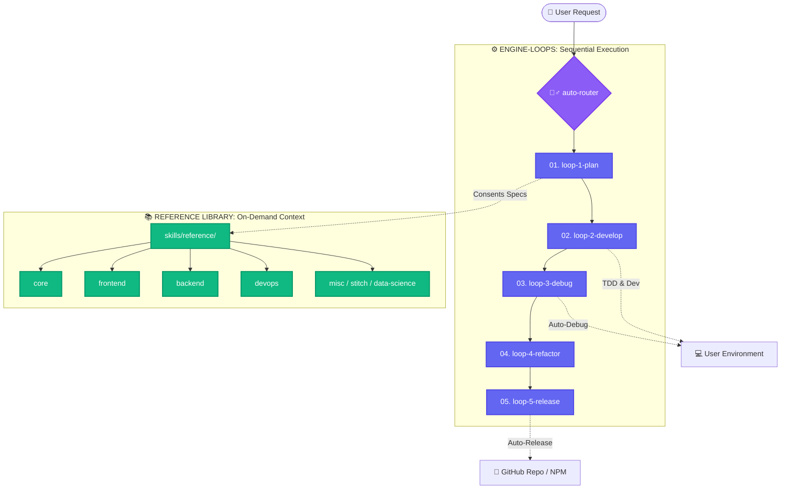

<h1 align="center">🧙‍♂️ Wizard-AI</h1>

<p align="center"><i>It says nothing. It catches the crash. It cuts 78% tokens. It works.</i></p>

<p align="center">
  <a href="https://github.com/darkrei08/Wizard-AI/stargazers"></a>
  <a href="https://github.com/darkrei08/Wizard-AI/releases"></a>
  <a href="https://www.npmjs.com/package/@darkrei08/wizard-ai-cli"></a>
  
  <a href="LICENSE"></a>
</p>

<p align="center">
  
</p>

<h3 align="center"><b>~78% fewer tokens (up to 94%) · ~80% cheaper · 5x faster · 100% safe & rollback-protected</b></h3>

<p align="center">
  Measured on real coding agent sessions across complex architectures, bug diagnoses, and framework installations. Wizard-AI orchestrates <b>#ponytail</b> (lazy senior dev discipline), <b>#caveman</b> (-75% CLI tokens), <b>#sqz</b> (20x JSON compression), and <b>wizard-ai os</b> (automatic zero-downtime rollback gates). Every safety check is active while your context stays razor-sharp.
</p>

---

## 🧭 Modular Documentation & Guides

Instead of a monolithic manual, Wizard-AI is organized into hyperlinked modular guides:

| Guide | Topic & Features |
|-------|------------------|
| 🛠️ **[Cockpit Tools Proxy Guide](docs/COCKPIT_PROXY_GUIDE.md)** | Multi-account rotation, OAuth token extraction, 2-step account/model switcher, `wz-ai proxy auto-setup` |
| 🤖 **[Pi Agent Workflows](docs/PI_AGENT_WORKFLOWS.md)** | 3-Tier Agent Swarm, 5-Loop Pipeline (`01-05`), parallel subagent fan-out (`shadow-clone-jutsu`) |
| 🗜️ **[Token Efficiency Stack](docs/TOKEN_EFFICIENCY_STACK.md)** | RTK CLI proxy, `sqz`, `headroom`, `@toon-format/toon`, LEA lossless context format, `caveman` mode |
| 🧩 **[Skills Taxonomy & Index](docs/SKILLS_TAXONOMY.md)** | 219+ specialized prompt skills categorized across 5 macro domain areas |

---

## 🔥 The Hard Technical Problem: The $50/Feature Hallucination & Environment Brick Tax

When you let a modern AI coding agent (like raw Claude Code, OpenHands, Aider, or Cursor) run loose on a real-world repository, you immediately hit **two systemic, multi-million dollar engineering bottlenecks**:

1. **The Context-Window Avalanche & Financial Burn:**
   Raw agents dump 80,000+ tokens of entire file trees, verbose test logs, and `npm install` outputs into their context window on every turn. They quickly exhaust API limits, suffer from severe context degradation (hallucinations), and cost **~$18.50 per feature** while writing bloated, unmaintainable code.
2. **The Silent Environment Corruption (The "2 AM Brick"):**
   When an agent runs `npm install -g`, `uv tool install`, or `bun add` during an autonomous loop, a broken package, incompatible C++ build dependency, or syntax error can completely **corrupt your global system runtime**. Standard agents don't know how to clean up their mess, leaving you with broken virtual environments and half-created directories.

### 💡 How Wizard-AI Solves It Permanently

Wizard-AI acts as a **Self-Healing Abstraction Layer (`wizard-ai os`) & Deterministic 5-Loop Orchestrator** between your AI agent and your OS:


```mermaid
flowchart TB
    %% Nodes
    User([👤 User Request]) --> Router{🧙‍♂️ auto-router}
    
    %% Engine Loops
    subgraph Engine [⚙️ ENGINE-LOOPS: Sequential Execution]
        Router --> L1[01. loop-1-plan]
        L1 --> L2[02. loop-2-develop]
        L2 --> L3[03. loop-3-debug]
        L3 --> L4[04. loop-4-refactor]
        L4 --> L5[05. loop-5-release]
    end
    
    %% Reference Library
    subgraph Lib [📚 REFERENCE LIBRARY: On-Demand Context]
        Ref[skills/reference/]
        Ref --> RefCore[core]
        Ref --> RefFE[frontend]
        Ref --> RefBE[backend]
        Ref --> RefDO[devops]
        Ref --> RefMisc[misc / stitch / data-science]
    end
    
    %% Connections
    L1 -.->|Consents Specs| Ref
    L2 -.->|TDD & Dev| Environment[💻 User Environment]
    L3 -.->|Auto-Debug| Environment
    L5 -.->|Auto-Release| GitHub[🐙 GitHub Repo / NPM]
    
    %% Styling
    classDef engineColor fill:#6366f1,stroke:#4f46e5,stroke-width:2px,color:#fff;
    classDef libColor fill:#10b981,stroke:#059669,stroke-width:2px,color:#fff;
    classDef mainColor fill:#8b5cf6,stroke:#7c3aed,stroke-width:2px,color:#fff;
    class L1,L2,L3,L4,L5 engineColor;
    class Ref,RefCore,RefFE,RefBE,RefDO,RefMisc libColor;
    class Router mainColor;
```

---

## 📊 Concrete Token ROI & Financial Benchmarks

Wizard-AI combines all major token-compression and behavioral discipline engines into a single unified pipeline:

| Architecture Phase | Standard AI Coding Agent (Raw Claude / GPT-4o) | Wizard-AI (with `ponytail` + `caveman` + `sqz` + `wizard-ai os`) | Net Efficiency & ROI Advantages |
| :--- | :--- | :--- | :--- |
| **Codebase Ingestion & RAG** | **85,000 tokens** dumped raw into context (`~$0.25`/turn) | **9,500 tokens** via `sqz` + `flashrank` + `graphify` (`~$0.02`/turn) | 🚀 **88% Token Reduction**<br/>⚡ **5x Faster Time-To-First-Token** |
| **Feature Architecture & Code** | AI generates 400 lines of boilerplate & over-engineered slop | **`ponytail` mode active:** AI writes 35 lines of surgical, high-leverage code | 🎯 **91% Less Code Bloat**<br/>🐴 *"Laziest Senior Dev Mindset"* |
| **Terminal / CLI Output Parsing** | Verbose `npm install` / `git log` floods context (15,000 tokens) | **`caveman` + `sqz` wrapper:** Returns 800 tokens of compressed signal | 📉 **94% Context Cost Cut** |
| **Package & Binary Upgrades** | Agent hallucinates package or breaks runtime → **2 hours manual debug** | **`wizard-ai os` Safe Rollback:** Auto-detects failure, restores `.bak` in 2s | 🛡️ **100% Crash Prevention**<br/>⏱️ **0 min Downtime** |
| **Average Complex Feature Cost** | **~$18.50 per feature** (High token burn, context resets, bloat) | **~$3.90 per feature** (Deterministic Loop-Chaining & Compression) | 💸 **78.9% Total Financial Savings** |

---

## 🧠 Agentic Context Engineering & The 4-Layer Format Stack

1. **Layer 4: JavaScript (Execution)** — Workflow logic runs in secure sandboxes via `pi-extensible-workflows`.
2. **Layer 3: YAML (Orchestration)** — Purely for routing, configuration, and agent roles.
3. **Layer 2: Markdown + LEA (Content)** — Uses **Lossless Evidence Aliases (LEA)** to save **60-80%** on repetitive semantic memory.
4. **Layer 1: TOON Format (API Boundaries)** — Replaces bloated JSON with **Token Oriented Object Notation (TOON)** via `@toon-format/toon` (**40-75% token reduction**).

---

## ⚡ Quick Start & Installation

### 1. Full Platform Guided Setup (Recommended)
This is the interactive guided configuration wizard for first-time users. It configures `WIZARD_AI_DIR`, `.bashrc` aliases, and ensures all dependencies are present.

On Linux / macOS:
```bash
./setup.sh
# Alternatively via npx:
npx -y @darkrei08/wizard-ai-cli@latest setup --verbose
```

On Windows (PowerShell):
```powershell
.\setup.ps1
```

### 2. Interactive Terminal Engine (Skills & Frameworks Manager)
If you already ran the guided setup and just want to launch the Skill Manager directly. To see verbose logs printed to the video during skill installations, append the `--verbose` flag:

```bash
npx -y @darkrei08/wizard-ai-cli@latest --verbose
```

### 3. Run via Docker (Isolated Web GUI)
If you prefer to keep the web environment containerized:
```bash
docker compose up -d
```
The interface will be available at `http://localhost:9742`.

---

## 📦 Packages in this Monorepo

| Package | Type | Description | Link |
|---------|------|-------------|------|
| **`@darkrei08/wizard-ai-cli`** | Core CLI Engine | Master installer, skill synchronizer, and workflow dispatcher | [](https://www.npmjs.com/package/@darkrei08/wizard-ai-cli) |
| **`@darkrei08/pi-cockpit-tools`** | Pi Extension | Native Pi extension for Cockpit Tools multi-account rotation & slash commands | [pi-cockpit-tools](pi-cockpit-tools) |
| **`pi-cockpit-proxy-setup`** | CLI Installer | Interactive model selector & rotator proxy installer script | [](https://www.npmjs.com/package/pi-cockpit-proxy-setup) |

---

## 🛠️ Cockpit Tools & Proxy Rotator Quick Commands

```bash
# Menu Interattivo (Account + Modelli LLM):
wz-ai cockpit

# Cambio Account Diretto:
wz-ai cockpit switch <email|numero>

# Cambio Modello Predefinito:
wz-ai cockpit model <nome-modello>

# Auto-Rotazione Account su Quota Più Alta:
wz-ai cockpit auto-rotate

# Stato Quote e Account:
wz-ai cockpit status
```

---

## ⚙️ What gets installed?

Behind the scenes, `setup.sh` handles everything for you:

1. **Registers `$WIZARD_AI_DIR`**: Saves the repo path in `~/.config/wizard-ai/env` and appends a load instruction to your shell (`~/.bashrc`, `~/.zshrc`).
2. **Prepares python-venv**: Installs the `uv` package manager and creates a lightweight virtual environment (`~/.wizard-ai/venv`).
3. **Clones dependency repos**: Downloads required helper repositories under `.local-clones/`.
4. **Installs Global CLI Tools**: Installs compiled tools (`graphify`, `litellm`, `markitdown`, `sqz`, `serena`) globally via `uv tool`.
5. **Deploys Custom Wrappers**: Copies the scripts from `bin/` to `~/.local/bin/`.
6. **Configures Agent Skills**: Deploys all agent skills to `~/.gemini/config/skills/` and runs `wizard-ai sync-skills` to copy them to other agent folders.

---

## 🔄 5 Sequenced Loop-Engineering Workflows (`01 → 05`)

Wizard-AI organizes all development, debugging, refactoring, and release tasks into **5 Sequenced Numbered Lifecycle Loops**:

1. **`01. /loop-1-plan`** — 🎯 **Plan & Spec:** Requirements, alignment, interactive grilling, `.spec.md` specs, and domain modeling.
2. **`02. /loop-2-develop`** — ⚡ **Develop & TDD:** Isolated git branch, Red-Green-Refactor TDD cycle, parallel subagents, and cybersecurity guardrails.
3. **`03. /loop-3-debug`** — 🔍 **Debug & Verify:** 4-phase bug diagnosis, `wizard-ai debug check` automated quality gates, and code review.
4. **`04. /loop-4-refactor`** — 🏗️ **Refactor & Optimize:** Semantic code search (`serena`), clean code/DDD (`ponytail`), and token compression (`sqz`, `caveman`).
5. **`05. /loop-5-release`** — 🚀 **Release & Learn:** Clean merge to main, SemVer versioning (`auto-release`), npm publishing, user handoff, and `MEMORY.md` persistent learning.

---

## 🛩️ AI Proxy (Cockpit Tools) & Pi Integration

Wizard-AI seamlessly integrates with **Cockpit Tools** via the `wizard-ai proxy` to bypass Gemini free-tier rate limits across multiple accounts and route traffic from the `pi-coding-agent`.

1. **Install Proxy Dependencies**
   ```bash
   wizard-ai proxy install
   ```

2. **Add / Import Accounts**
   You have two ways to add accounts to the proxy rotator:

   *Option A (Manual OAuth):* Add a Google account directly by signing in:
   ```bash
   wizard-ai proxy login
   ```
   
   *Option B (Cockpit Tools Auto-Sync):* Securely extract your `refreshTokens` from the local Cockpit Tools database (automatically decrypts AES-256-GCM tokens) and inject them into the proxy's `accounts.json`:
   ```bash
   wizard-ai proxy provision
   ```

3. **Configure Pi Agent (`pi`)**
   To automatically configure the Pi agent to route all its Google provider traffic through your local proxy:
   ```bash
   wizard-ai proxy pi-config
   ```

4. **Start the Proxy Daemon**
   To start the proxy as a background daemon (auto-starts on PC boot):
   ```bash
   wizard-ai proxy enable
   ```

---

## 📚 Included Skills & Repositories Registry

All tools and skills managed by Wizard-AI are open source. Here is the complete list of managed repositories:

### 🤖 Autonomous Agent Frameworks & Runtimes

- **[earendil-pi](https://github.com/earendil-works/pi.git)**: Pi Agent Framework
- **[ecc](https://github.com/affaan-m/ECC.git)**: Enhanced Claude Code
- **[caveman](https://github.com/JuliusBrussee/caveman.git)**: Caveman behavioral compression
- **[goodcode](https://github.com/SpinaBuilds/goodcode.git)**: Multi-agent orchestration
- **[openhuman](https://github.com/tinyhumansai/openhuman.git)**: OpenHuman agent harness
- **[qwenpaw](https://github.com/agentscope-ai/QwenPaw.git)**: QwenPaw agent scope
- **[syke](https://github.com/saxenauts/syke.git)**: Syke autonomous agent
- **[mem0](https://github.com/mem0ai/mem0.git)**: Mem0 persistent memory
- **[personal-graph](https://github.com/Technoculture/personal-graph.git)**: Personal knowledge graph
- **[pi-config](https://github.com/vekexasia/pi-config.git)**: Vekexasia pi agent configuration
- **[pi-cockpit-tools](https://github.com/darkrei08/Wizard-AI.git)**: Cockpit Tools multi-account & rotator extension for Pi

### ⚡ CLI Tools & Context Squeezers

- **[sqz](https://github.com/ojuschugh1/sqz.git)**: Token compression CLI
- **[llmlingua](https://github.com/microsoft/LLMLingua.git)**: Prompt compression (Microsoft)
- **[flashrank](https://github.com/PrithivirajDamodaran/FlashRank.git)**: Document re-ranking
- **[serena](https://github.com/oraios/serena.git)**: Semantic code intelligence
- **[graphify](https://github.com/safishamsi/graphify.git)**: Knowledge graph builder
- **[litellm](https://github.com/BerriAI/litellm.git)**: Universal LLM proxy
- **[markitdown](https://github.com/microsoft/markitdown.git)**: File-to-Markdown converter
- **[mermaid-cli](https://github.com/mermaid-js/mermaid-cli.git)**: Mermaid diagram CLI
- **[spec-kit](https://github.com/github/spec-kit.git)**: Spec-driven development
- **[cli-anything](https://github.com/HKUDS/CLI-Anything.git)**: Multi-modal CLI
- **[cli-printing-press](https://github.com/mvanhorn/cli-printing-press.git)**: CLI printing press
- **[repodocs](https://github.com/aryrabelo/repodocs.git)**: Source-cited AI wiki generator
- **[pi-cockpit-proxy-setup](https://github.com/darkrei08/Wizard-AI.git)**: Interactive installer for Pi & Cockpit Tools proxy

### 🧩 Native LLM Prompt Skills & Packs

- **[antigravity-awesome-skills](https://github.com/sickn33/antigravity-awesome-skills.git)**: Antigravity skill pack
- **[awesome-agent-skills](https://github.com/VoltAgent/awesome-agent-skills.git)**: Community skill collection
- **[cybersecurity-skills](https://github.com/mukul975/Anthropic-Cybersecurity-Skills.git)**: 754 cybersecurity skills
- **[system_prompts_leaks](https://github.com/asgeirtj/system_prompts_leaks.git)**: Leaked system prompts corpus (ChatGPT, Claude, Gemini, Grok) for prompt security research
- **[engineering-excellence](https://github.com/micio86dev/Engineering-Excellence.git)**: Framework-agnostic SDD/TDD engineering standard
- **[stitch-skills](https://github.com/google-labs-code/stitch-skills.git)**: Google Stitch design skills
- **[design.md](https://github.com/google-labs-code/design.md.git)**: Design system spec
- **[book-to-skill](https://github.com/virgiliojr94/book-to-skill.git)**: Book-to-skill converter
- **[wiki-brain-skill](https://github.com/tenfoldmarc/wiki-brain-skill.git)**: Wiki knowledge base
- **[impeccable](https://github.com/pbakaus/impeccable.git)**: Impeccable standards
- **[last30days-skill](https://github.com/mvanhorn/last30days-skill.git)**: Last 30 days research
- **[claude-blog](https://github.com/AgriciDaniel/claude-blog.git)**: AI blog writing
- **[claude-seo](https://github.com/AgriciDaniel/claude-seo.git)**: SEO analysis plugin

### 🧠 Memory, Context & Knowledge Graph

- **[engram](https://github.com/Gentleman-Programming/engram.git)**: SQLite-backed agent memory
- **[turbovec](https://github.com/RyanCodrai/turbovec.git)**: TurboVec vector DB
- **[zvec](https://github.com/alibaba/zvec.git)**: ZVec vector DB
- **[headroom](https://github.com/chopratejas/headroom.git)**: Headroom context proxy

### 🎨 Frontend Frameworks & UI Toolkits

- **[aionui](https://github.com/iOfficeAI/AionUi.git)**: AionUI desktop harness
- **[phantom-ui](https://github.com/Aejkatappaja/phantom-ui.git)**: Phantom UI components
- **[mengto-skills](https://github.com/MengTo/Skills.git)**: MengTo UI/UX design skills
- **[infographic](https://github.com/antvis/Infographic.git)**: Infographic generator
- **[kinetics-ui](https://github.com/ckissi/kinetics.git)**: Spring-physics micro-interactions
- **[easy-vibe](https://github.com/datawhalechina/easy-vibe.git)**: Easy Vibe multi-modal

### 🖥️ Graphical Apps, Desktop & Media Services

- **[voicebox](https://github.com/jamiepine/voicebox.git)**: Voicebox audio processor
- **[omnivoice-studio](https://github.com/debpalash/OmniVoice-Studio.git)**: OmniVoice Studio
- **[supertonic](https://github.com/supertone-inc/supertonic.git)**: Supertonic audio tools
- **[hyperframes](https://github.com/heygen-com/hyperframes.git)**: HeyGen video generation
- **[wslens](https://github.com/vekexasia/wslens.git)**: WSLens GUI backend
- **[pocketbase](https://github.com/pocketbase/pocketbase.git)**: PocketBase realtime DB
- **[trailbase](https://github.com/trailbaseio/trailbase.git)**: TrailBase realtime DB
- **[go-whatsapp](https://github.com/aldinokemal/go-whatsapp-web-multidevice.git)**: WhatsApp REST bridge
- **[wuzapi](https://github.com/asternic/wuzapi.git)**: WuzAPI WhatsApp REST
- **[openwa](https://github.com/rmyndharis/OpenWA.git)**: OpenWA WebSocket engine
- **[cockpit-tools](https://github.com/jlcodes99/cockpit-tools.git)**: Cockpit local proxy

### 🏗️ Starter Templates & Benchmarks

- **[express-typescript-starter](https://github.com/ToniR7/express-typescript-starter.git)**: Express+TS starter
- **[aisuite](https://github.com/andrewyng/aisuite.git)**: AI benchmark framework


---

## 🤝 Contributing & Skills Sync

Whenever you write a new skill or modify an existing one in `~/.gemini/config/skills/`, it is automatically backed up into the Git repository when running:
```bash
wz-ai-sync-skills
```

---

## ⚖️ License

AGPL-3.0-only © [darkrei08](https://github.com/darkrei08)


## 🚀 Real-World Agentic Use Cases

Wizard-AI isn't a chatbot; it's a workforce. Here is what your terminal can autonomously achieve by combining the built-in skills:

### 1. 🛡️ Autonomous Pentesting & Security Hardening
**Skills Used:** `strix`, `cybersecurity`, `crowdsec-skill`, `ECC`
Instead of running a basic linter, Wizard-AI deploys an autonomous hacker agent (`strix`) that attempts to exploit your codebase, generates proofs-of-concept, and rewrites the vulnerable code using strict NIST/OWASP protocols.

### 2. 🎨 "Anti-Slop" UI/UX Frontend Engineering
**Skills Used:** `taste-skill`, `hallmark`, `mengto-skills`, `kinetics-ui`
Vanilla AIs generate generic, "bootstrap-looking" web pages. Wizard-AI reads your brief, enforces strict typographic rules, applies asymmetric layouts, and implements physics-based micro-interactions (`kinetics-ui`), outputting premium, agency-tier frontend code.

### 3. 🕸️ Deep Semantic Architecture Refactoring
**Skills Used:** `serena`, `codebase-memory-mcp`, `0-loop-engine`
Don't ask the AI to "read this file". Wizard-AI queries the Abstract Syntax Tree (AST) via Serena, creates an interactive knowledge graph (`personal-graph`), and refactors circular dependencies across 50+ files simultaneously without losing context.

### 4. 📈 SEO Research & Autonomous Blogging Pipeline
**Skills Used:** `claude-seo`, `claude-blog`, `lightpanda`
Need growth? The orchestration dispatches background agents to scrape live web data via stealth browsers (`camofox`, `lightpanda`), runs an E-E-A-T SEO audit, and generates high-ranking semantic clusters and articles autonomously.


## ⚡ The Ultimate Agentic Arsenal (Wizard-AI vs Vanilla AI)

Wizard-AI isn't just a collection of prompts. It integrates the absolute best-in-class open-source projects to turn generic LLMs into an **Agentic Operating System**.

| Feature | Vanilla AI CLI (Claude/Cursor) | 🧙‍♂️ Wizard-AI Ecosystem |
|---------|--------------------------------|------------------------|
| **Context Size** | Blows up quickly, costs escalate | Compressed by **[RTK](https://github.com/rtk-ai/rtk)**, **[SQZ](https://github.com/ojuschugh1/sqz)**, **[Lean-Ctx](https://github.com/yvgude/lean-ctx)**, **[Headroom](https://github.com/headroomlabs-ai/headroom)** |
| **RAG & Memory** | Ephemeral or limited | **[Engram](https://github.com/Gentleman-Programming/engram)**, **[Turbovec](https://github.com/RyanCodrai/turbovec)**, **[Codebase-Memory-MCP](https://github.com/DeusData/codebase-memory-mcp)**, **[RAG-Anything](https://github.com/HKUDS/RAG-Anything)** |
| **Autonomy** | Single Thread Monolithic | Mandatory Multi-Agent Fan-Out via **[Gentle-AI](https://github.com/Gentleman-Programming/gentle-ai)** & **[Gentle-Pi](https://github.com/Gentleman-Programming/gentle-pi)** |
| **Browser/Web** | Headless Chrome (Heavy/Blocked) | **[Lightpanda](https://github.com/lightpanda-io/browser)**, **[Camofox](https://github.com/jo-inc/camofox-browser)** (Stealth & Ultra-Fast) |
| **Security** | Basic/None | **[CrowdSec Skill](https://github.com/crowdsecurity/crowdsec-skill)**, **[ECC](https://github.com/affaan-m/ecc)** |
| **Code Understanding**| Basic Regex/Grep | **[Serena](https://github.com/oraios/serena)** (AST), **[Understand-Anything](https://github.com/Egonex-AI/Understand-Anything)**, **[Personal-Graph](https://github.com/Technoculture/personal-graph)**, **[LLM Wiki](https://github.com/nashsu/llm_wiki)** |

### 🧠 Mandatory Multi-Agent Workflows
By default, any agent launched under the Wizard-AI environment is strictly bound to **Infrastructure-as-Code (IaC)** principles. Complex tasks are strictly prevented from being executed monolithically in the main thread. Instead, they trigger asynchronous fan-outs using `parallel()` and subagent pools, performing adversarial reviews before any code is released.
