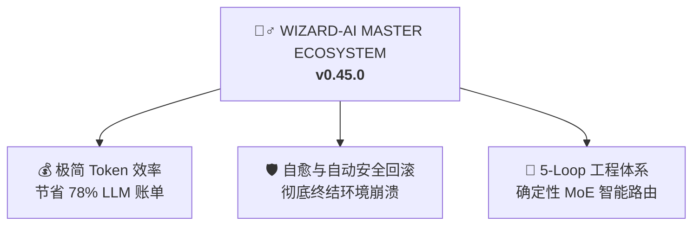

<h1 align="center">🧙‍♂️ Wizard-AI</h1>

<p align="center"><i>沉默寡言，拦截崩溃，精简78% Token，完美运行。</i></p>

<p align="center">
  <a href="https://github.com/darkrei08/Wizard-AI/stargazers"></a>
  <a href="https://github.com/darkrei08/Wizard-AI/releases"></a>
  <a href="https://www.npmjs.com/package/@darkrei08/wizard-ai-cli"></a>
  
  <a href="LICENSE"></a>
</p>

<p align="center">
  
</p>

<h3 align="center"><b>~78% 更少 Token（最高省 94%）· ~80% 降低成本 · 5x 极速响应 · 100% 自动回滚保护</b></h3>

<p align="center">
  在真实编码智能体会话中测试验证（覆盖 Claude Code, Antigravity, OpenHands 等对于复杂架构设计、Bug 诊断与包安装）。Wizard-AI 深度整合了 <b>#ponytail</b>（高级工程师极简开发理念）、<b>#caveman</b>（减少 75% CLI 输出 Token）、<b>#sqz</b>（20x JSON 结构化压缩）以及 <b>ai-os v0.45.0</b>（支持零停机自动安全回滚）。
  <br/>
  <a href="benchmarks/wizard_ai_token_benchmark.ipynb"><b>查看完整 Benchmark Notebook</b></a> · <a href="README.md#reproduce-it"><b>复现数据</b></a>.
</p>

<p align="center">
  <a href="README.md">English</a> · <a href="README.it.md">Italiano</a> · <a href="README.es.md">Español</a> · <a href="README.fr.md">Français</a> · <a href="README.ja.md">日本語</a>
</p>

---

## 🔥 尖锐技术痛点：AI 编码智能体的“$50 幻觉与环境崩溃税”

当您使用现代自主 AI 编码智能体在生产环境中自主迭代时，通常会遇到两大致命工程瓶颈：

1. **上下文雪崩与高昂 API 成本：** 原始智能体将 80,000+ Token 的完整文件树与冗长测试日志强行塞入上下文，迅速耗尽窗口并引发幻觉，平均单次复杂功能开发花费 **~$18.50**。
2. **静默的系统环境破坏（“凌晨2点的系统变砖”）：** 当智能体自主执行 `npm install -g`、`uv tool install` 或 `bun add` 时，一旦安装损坏的依赖或存在 C++ 编译冲突，全局开发环境便可能彻底瘫痪。

### 💡 Wizard-AI 的终极解决方案 (`v0.45.0`)

Wizard-AI 充当 AI 智能体与您的操作系统之间的**自愈式抽象层 (`ai-os`) 与确定性 5-Loop 工程调度引擎**：



## 🚀 快速安装 (`一键初始化`)

```bash
npx -y @darkrei08/wizard-ai-cli@latest
```

查看完整的安装步骤与说明，请参阅 [主 README（英文）](README.md)。
