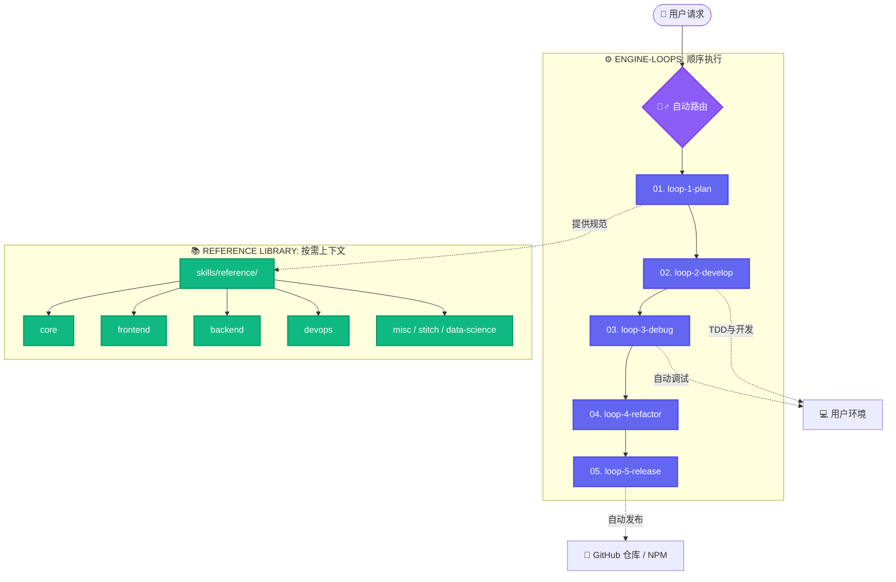

<h1 align="center">🧙‍♂️ Wizard-AI</h1>

<p align="center"><i>沉默寡言，拦截崩溃，精简78% Token，完美运行。</i></p>

<h3 align="center"><b>~78% 更少 Token（最高省 94%）· ~80% 降低成本 · 5x 极速响应 · 100% 自动回滚保护</b></h3>

<p align="center">
  在真实编码智能体会话中测试验证（覆盖 Claude Code, Antigravity, OpenHands 等对于复杂架构设计、Bug 诊断与包安装）。Wizard-AI 深度整合了 <b>#ponytail</b>（高级工程师极简开发理念）、<b>#caveman</b>（减少 75% CLI 输出 Token）、<b>#sqz</b>（20x JSON 结构化压缩）以及 <b>wizard-ai os</b>（支持零停机自动安全回滚）。
  <br/>
  <a href="benchmarks/wizard_ai_token_benchmark.ipynb"><b>完全版评测 Jupyter Notebook</b></a> · <a href="README.md#reproduce-it"><b>复现测试数据</b></a>。
</p>

<p align="center">
  <a href="README.md">English</a> · <a href="README.it.md">Italiano</a> · <a href="README.es.md">Español</a> · <a href="README.fr.md">Français</a> · <a href="README.ja.md">日本語</a>
</p>

---

## 🔥 技术难题：单特性 50 美元的「幻觉税」与系统环境损坏

当您允许一个自律型 AI 智能体（例如 Claude Code、OpenHands、Aider 或 Cursor）在真实项目仓库中运行时，您会立刻遭遇两大系统级瓶颈：

1. **上下文窗口暴增与 API 账单飙升：** 智能体在每轮对话中都会将 80,000+ Token 的完整文件树、测试日志和 `npm install` 输出全部塞满上下文。这会迅速耗尽 API 限制，导致严重的上下文失效（幻觉），且平均每开发一个特性要花费 **~$18.50**。
2. **静默式环境损坏（“凌晨两点的崩溃”）：** 智能体在循环中自动执行安装依赖时，一旦遇到受损包或语法错误，可能彻底损坏您的系统级运行时环境。

### 💡 Wizard-AI 的终极解决方案

Wizard-AI 充当 AI 智能体与您的操作系统之间的**自愈式抽象层 (`wizard-ai os`) 与确定性 5-Loop 工程调度引擎**：



## 🧠 Agentic Context Engineering & The 4-Layer Format Stack

在 2026 年的 AI 生态系统中，上下文工程是新的黄金标准。Wizard-AI 引入了 **4-Layer Format Stack**，旨在消除幻觉并最大化 Token 优化：

1. **Layer 4: JavaScript (执行)** — 逻辑通过 `pi-extensible-workflows` 在安全的沙盒中运行。
2. **Layer 3: YAML (编排)** — 仅用于路由、配置和 Agent 角色。
3. **Layer 2: Markdown + LEA (内容)** — 使用 **Lossless Evidence Aliases (LEA)** (如 `[S1]: MEMORY.md` 引用为 `[E1]`)。在重复元数据上节省高达 80%。
4. **Layer 1: TOON 格式 (API 边界)** — 用 **Token Oriented Object Notation (TOON)** 替换 JSON (与原始 JSON 相比减少 40-75% 的 token)。

**PRE & POST Autoloop 规则：** 每次会话在每次迭代前后都会自动压缩上下文、同步记忆 (`MEMORY.md`) 并更新项目图。

### 🔧 Pi Dynamic Configurator (`wizard-ai pi-configurator`)

将 [vekexasia/pi-config](https://github.com/vekexasia/pi-config) 模式自动集成到您的本地 `~/.pi/agent/` 环境中，并根据 **Cockpit Tools** 订阅级别提供智能模型选择和默认设置：

```bash
wizard-ai pi-configurator
```

### 📚 RepoDocs Wiki Generator (`wizard-ai repodocs`)

使用 [aryrabelo/repodocs](https://github.com/aryrabelo/repodocs) 自动为任何仓库生成带有引用源的 Wiki。集成在 **Loop 5 (Release)** 中，用于开发周期结束时的文档生成：

```bash
wizard-ai repodocs repodocs-all .
```

## 🚀 快速安装 (`一键初始化`)

```bash
npx -y @darkrei08/wizard-ai-cli@latest
```

查看完整的安装步骤与说明，请参阅 [主 README（英文）](README.md)。
