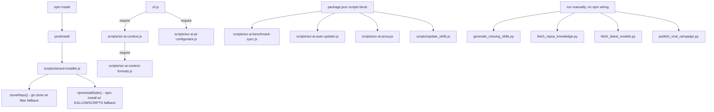

# Component: scripts

## Relevant source files
- scripts/wizard-installer.js
- scripts/wz-ai-context.js
- scripts/wz-ai-context-formats.js
- scripts/wz-ai-pi-configurator.js
- scripts/wz-ai-benchmark-sync.js
- scripts/wz-ai-auto-updater.js
- scripts/wz-ai-proxy.js
- scripts/update_skills.js
- scripts/generate_missing_skills.py
- scripts/fetch_repos_knowledge.py
- scripts/fetch_latest_models.py
- scripts/publish_viral_campaign.py
- cli.js
- package.json

## Overview

`scripts/` holds standalone utilities that sit outside the `cli.js` command tree. They fall into three groups by how they are triggered: npm lifecycle infrastructure (`wizard-installer.js`, run from `postinstall`), a context/provider-configuration library that `cli.js` imports directly (`wz-ai-context.js`, `wz-ai-context-formats.js`, `wz-ai-pi-configurator.js`), a set of Node maintenance scripts wired as separate `npm run` entries (`wz-ai-benchmark-sync.js`, `wz-ai-auto-updater.js`, `wz-ai-proxy.js`, `update_skills.js`), and Python developer/growth tooling with no `package.json` wiring at all (`generate_missing_skills.py`, `fetch_repos_knowledge.py`, `fetch_latest_models.py`, `publish_viral_campaign.py`), run manually.
Sources: [package.json:L1-L40](package.json#L1-L40), [cli.js:L1-L60](cli.js#L1-L60)

## Install-time infrastructure: `wizard-installer.js`

`package.json` runs this file as the package's `postinstall` script, so it executes once on every `npm install`.
Sources: [package.json:L8-L8](package.json#L8-L8)

The file's `main()` entry point parses `process.argv` flags (`--uninstall`/`-u`, `--repair`/`-r`, `--check`/`-c`) and otherwise falls through to a full install, invoking itself when loaded as the Node entry module (`require.main === module`).
Sources: [scripts/wizard-installer.js:L1189-L1246](scripts/wizard-installer.js#L1189-L1246)

`runInstall()` is the top-level orchestration function called by `main()`: it checks the Node version, resolves/creates the install directory, clones or updates the wizard-ai repo, installs npm dependencies, copies config templates, and prints a completion message.
Sources: [scripts/wizard-installer.js:L920-L980](scripts/wizard-installer.js#L920-L980)

Two helpers exist specifically to work around known environment failures (matching the `fix: git clone filter smudge error and npm EALLOWSCRIPTS...` history in the repo):
- `cloneRepo()` clones with `git clone --filter=blob:none`, and on a filter/smudge error retries a full clone without the `--filter` flag.
- `npmInstallSafe()` runs `npm install`, and on an `EALLOWSCRIPTS` failure retries with `--ignore-scripts`.

Sources: [scripts/wizard-installer.js:L133-L179](scripts/wizard-installer.js#L133-L179), [scripts/wizard-installer.js:L186-L219](scripts/wizard-installer.js#L186-L219)

## AI-context library (imported by `cli.js`)

Three files form a library that `cli.js` `require()`s directly rather than shelling out to; they generate and keep AI-assistant configuration files in sync.

**`wz-ai-context.js`** generates and merges assistant context files (e.g. `CLAUDE.md`/`AGENTS.md`-style documents) for a project, using the format registry below to decide file names and merge strategy per assistant.
Sources: [scripts/wz-ai-context.js:L1-L120](scripts/wz-ai-context.js#L1-L120)

**`wz-ai-context-formats.js`** exports a `FORMATS` registry mapping each supported AI coding assistant (Claude, Copilot, Cursor, Windsurf, Gemini, etc.) to its context file path and embedding/merge rules; `wz-ai-context.js` iterates this registry when writing or updating files.
Sources: [scripts/wz-ai-context-formats.js:L1-L120](scripts/wz-ai-context-formats.js#L1-L120)

**`wz-ai-pi-configurator.js`** configures per-provider integration ("PI") settings — reading/writing tool-specific settings files (Claude Code's `settings.json`, Gemini config, Codex config, etc.) for things like status line, permissions, and hooks.
Sources: [scripts/wz-ai-pi-configurator.js:L1-L120](scripts/wz-ai-pi-configurator.js#L1-L120)

`cli.js` requires both `wz-ai-context.js` and `wz-ai-pi-configurator.js` so their functions back CLI subcommands rather than being invoked as separate processes.
Sources: [cli.js:L1-L60](cli.js#L1-L60)

## Standalone Node maintenance scripts

These four are not required by `cli.js`; each is invoked as its own process (via `npm run` in `package.json` or `node scripts/<file>.js` directly).

| Script | Responsibility |
|---|---|
| `wz-ai-benchmark-sync.js` | Fetches external model-benchmark rankings and syncs them into a local benchmarks data file used elsewhere in the repo. |
| `wz-ai-auto-updater.js` | Checks the npm registry for a newer published version of the package, compares it to the local `package.json` version, and can trigger a global reinstall. |
| `wz-ai-proxy.js` | Runs a lightweight local HTTP(S) proxy that forwards LLM API traffic (e.g. to `api.anthropic.com`) for local development/routing use cases. |
| `update_skills.js` | Scans the skills directory, checks each skill file's frontmatter metadata, and updates/downloads content that is out of date. |

Sources: [scripts/wz-ai-benchmark-sync.js:L1-L60](scripts/wz-ai-benchmark-sync.js#L1-L60), [scripts/wz-ai-auto-updater.js:L1-L60](scripts/wz-ai-auto-updater.js#L1-L60), [scripts/wz-ai-proxy.js:L1-L60](scripts/wz-ai-proxy.js#L1-L60), [scripts/update_skills.js:L1-L60](scripts/update_skills.js#L1-L60)

`wz-ai-benchmark-sync.js` exposes discrete functions for fetching remote rankings and writing them to disk, callable both as a library and from its own CLI entry point.
Sources: [scripts/wz-ai-benchmark-sync.js:L1-L184](scripts/wz-ai-benchmark-sync.js#L1-L184)

`wz-ai-auto-updater.js` compares semver strings from the npm registry against the installed version and only proceeds with an update when a newer version is found.
Sources: [scripts/wz-ai-auto-updater.js:L1-L112](scripts/wz-ai-auto-updater.js#L1-L112)

`wz-ai-proxy.js` starts an HTTP server that forwards requests to a configurable upstream target host, acting as a pass-through for model API calls.
Sources: [scripts/wz-ai-proxy.js:L1-L316](scripts/wz-ai-proxy.js#L1-L316)

`update_skills.js` reads a `SKILLS_DIR`, parses each skill file's frontmatter for version/date metadata, and re-fetches/rewrites files it determines are stale.
Sources: [scripts/update_skills.js:L1-L99](scripts/update_skills.js#L1-L99)

None of these four scripts are `require()`d by `cli.js`; `package.json`'s `scripts` block is the mechanism that exposes them as `npm run` targets.
Sources: [package.json:L1-L40](package.json#L1-L40)

## Python developer/growth tooling (unwired)

The four `.py` files have no entry in `package.json` and are not referenced by any JS file in the repo — they are run manually as developer or growth-ops tooling, separate from the npm package's runtime.

| Script | Responsibility |
|---|---|
| `generate_missing_skills.py` | Scans the skills directory for gaps against a target topic list and calls an LLM API to generate `SKILL.md` content for missing entries. |
| `fetch_repos_knowledge.py` | Clones/fetches a set of reference repositories and extracts their documentation into per-repo JSON files as a knowledge source. |
| `fetch_latest_models.py` | Queries provider APIs/docs (Anthropic, OpenAI, Google) to refresh a local list of current model IDs. |
| `publish_viral_campaign.py` | Publishes marketing/growth campaign content to external platforms. |

Sources: [scripts/generate_missing_skills.py:L1-L60](scripts/generate_missing_skills.py#L1-L60), [scripts/fetch_repos_knowledge.py:L1-L60](scripts/fetch_repos_knowledge.py#L1-L60), [scripts/fetch_latest_models.py:L1-L60](scripts/fetch_latest_models.py#L1-L60), [scripts/publish_viral_campaign.py:L1-L60](scripts/publish_viral_campaign.py#L1-L60)

`generate_missing_skills.py` diffs an existing skills directory against a desired topic set and, for each gap, calls an LLM to produce a new skill file written back to that directory.
Sources: [scripts/generate_missing_skills.py:L1-L89](scripts/generate_missing_skills.py#L1-L89)

`fetch_repos_knowledge.py` iterates a list of reference repositories, fetches their contents, and writes extracted documentation/knowledge as JSON output for downstream tooling (such as skill generation).
Sources: [scripts/fetch_repos_knowledge.py:L1-L91](scripts/fetch_repos_knowledge.py#L1-L91)

`fetch_latest_models.py` requests model listings from provider endpoints and writes an updated registry of model identifiers used elsewhere in the repo's tooling.
Sources: [scripts/fetch_latest_models.py:L1-L219](scripts/fetch_latest_models.py#L1-L219)

`publish_viral_campaign.py` builds and posts campaign content to external platforms as part of growth/marketing automation, unrelated to the CLI's runtime behavior.
Sources: [scripts/publish_viral_campaign.py:L1-L316](scripts/publish_viral_campaign.py#L1-L316)

## How the pieces connect

Sources: [package.json:L1-L40](package.json#L1-L40), [cli.js:L1-L60](cli.js#L1-L60), [scripts/wizard-installer.js:L1189-L1246](scripts/wizard-installer.js#L1189-L1246)
