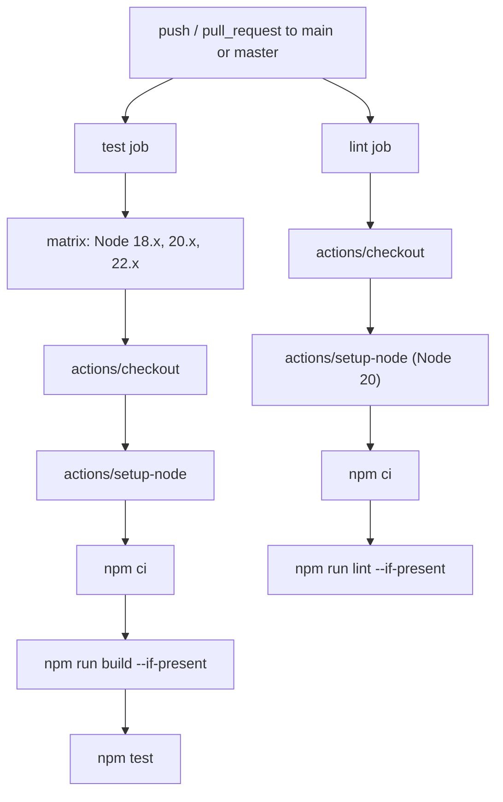
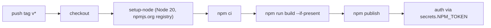

# Development & Testing

## Relevant source files

- CONTRIBUTING.md
- .github/workflows/ci.yml
- .github/workflows/auto-merge.yml
- .github/workflows/npm-publish.yml

## Contributing workflow

Contributions follow a standard fork-and-branch model: fork the repository, clone the fork, install dependencies with `npm install`, and create a feature branch before making changes.

Sources: [CONTRIBUTING.md:L19-L24](CONTRIBUTING.md#L19-L24)

Changes are expected to include clear commit messages, tests for new functionality, and updated documentation, with all tests passing before submission. Pull requests are opened against the `main` branch and require review before merging.

Sources: [CONTRIBUTING.md:L57-L69](CONTRIBUTING.md#L57-L69)

Style guidance calls for following the existing code style, using meaningful variable names, and commenting complex logic. Bug reports should include reproduction steps, expected vs. actual behavior, and environment details such as Node version and OS.

Sources: [CONTRIBUTING.md:L71-L89](CONTRIBUTING.md#L71-L89)

## Running the project locally

| Task | Command |
|---|---|
| Install dependencies | `npm install` |
| Run tests | `npm test` |
| Run linter | `npm run lint` |

Sources: [CONTRIBUTING.md:L36-L50](CONTRIBUTING.md#L36-L50)

## CI pipeline

The `CI` workflow (`.github/workflows/ci.yml`) runs on every push and pull request targeting `main` or `master`.

Sources: [.github/workflows/ci.yml:L1-L37](.github/workflows/ci.yml#L1-L37)

The `test` job runs on `ubuntu-latest` across a matrix of Node.js versions `18.x`, `20.x`, and `22.x`, installing dependencies with `npm ci`, running a build if a `build` script is present, then executing `npm test`.

Sources: [.github/workflows/ci.yml:L9-L23](.github/workflows/ci.yml#L9-L23)

The `lint` job runs separately on `ubuntu-latest` with a single Node 20 setup, installing dependencies with `npm ci` and running `npm run lint` if a `lint` script is present.

Sources: [.github/workflows/ci.yml:L25-L37](.github/workflows/ci.yml#L25-L37)

## Auto-merge

The `Auto-merge PRs` workflow (`.github/workflows/auto-merge.yml`) triggers on `pull_request_target` events of type `opened`, `synchronize`, `reopened`, and `labeled`, and requests `contents: write`, `pull-requests: write`, and `checks: read` permissions.

Sources: [.github/workflows/auto-merge.yml:L1-L10](.github/workflows/auto-merge.yml#L1-L10)

The `automerge` job only runs when the pull request carries the `automerge` label. It waits for status checks via `fkirc/skip-duplicate-actions@v4`, then enables auto-merge with `gh pr merge --auto --merge`, using the PR URL and `GITHUB_TOKEN` from the workflow environment.

Sources: [.github/workflows/auto-merge.yml:L12-L23](.github/workflows/auto-merge.yml#L12-L23)

## Publishing to npm

The `Publish to npm` workflow (`.github/workflows/npm-publish.yml`) triggers on pushes of tags matching `v*`.

Sources: [.github/workflows/npm-publish.yml:L1-L6](.github/workflows/npm-publish.yml#L1-L6)

The `publish` job requests `contents: read`, `id-packages: write`, and `packages: write` permissions, checks out the repository, sets up Node 20 with the npm registry at `https://registry.npmjs.org`, installs dependencies with `npm ci`, runs a build if present, and publishes with `npm publish`, authenticating via `NPM_TOKEN` from repository secrets.

Sources: [.github/workflows/npm-publish.yml:L8-L29](.github/workflows/npm-publish.yml#L8-L29)

Sources: [.github/workflows/npm-publish.yml:L14-L29](.github/workflows/npm-publish.yml#L14-L29)
