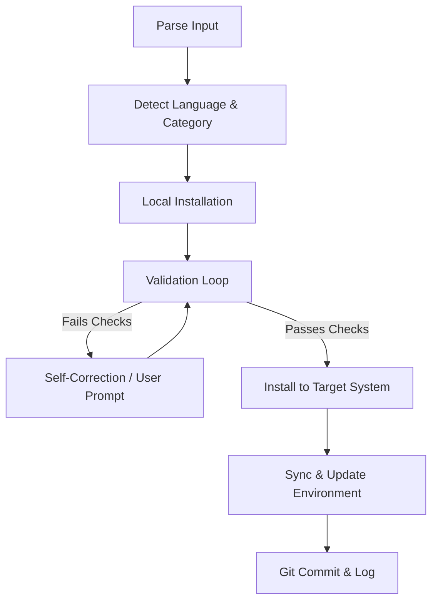

# Specification: Iterative Skill & Framework Installation Workflow (Loop Engineering)

This document specifies the design for a new, automated command `ai-install` that handles the installation, categorization, validation, syncing, and update of skills and frameworks in the Wizard-AI environment using a continuous validation loop.

## Goal

Provide a robust CLI utility (`ai-install`) that automates the lifecycle of adding a new skill or framework:
1. **Interactive/Iterative Discovery**: Prompt for parameters, automatically detect the language (Python, Node, Go, Bash), and assign the correct category in the repository (`core`, `frontend`, etc.).
2. **Loop Engineering (Iterative Validation)**: Install the skill locally, check the files (e.g., frontmatter validity, absolute path violation), and run custom validation scripts in a loop until clean, attempting self-repair if errors are found.
3. **Target System Installation & Global Sync**: Update the global configurations (`~/.gemini/config/skills`, etc.) and run `ai-sync-skills` to distribute the skill to all active agents (Claude Code, Amp).
4. **Environment Update**: Run the global update script (`ai-update`) to ensure all other skills are refreshed and the environment is synchronized.

---

## Technical Architecture & Workflow

The `ai-install` command will implement the following state machine:

### 1. Parse Input & Categorization
- Usage: `ai-install --name <skill-name> --path <local-path-or-git-url> --category <category>`
- If parameters are missing, prompt the user interactively (e.g., choose category from the list in `skills.json`).
- If category is not specified, run auto-detection or default to `misc`.

### 2. Local Installation
- Clone git repositories to `~/.ai-skills/<name>`.
- Install dependencies using `uv` (for Python) or `npm` (for Node.js).
- Create a template wrapper script in `bin/ai-<name>` and make it executable.

### 3. Iterative Validation Loop (Loop Engineering)
- Validate `SKILL.md` frontmatter (requires `name`, `description`).
- Search for absolute path violations (reject hardcoded usernames or system paths like `/home/`).
- Validate `package.json` or other runtime descriptors if it is a framework.
- If checks fail:
  - Run automatic corrections (e.g., replace absolute paths with relative equivalents).
  - Re-run validation. Loop until all checks pass (up to 3 attempts), then proceed. If it still fails, prompt the user.

### 4. Target System Installation & Sync
- Copy the newly validated skill flatly to `~/.gemini/config/skills/<name>`.
- Run `ai-sync-skills` to propagate the skill to other agents.
- Register the new skill wrapper in `bin/ai-help` so it appears in the dashboard.
- Append description to `docs/WIKI.md`.

### 5. Global Environment Update
- Execute `ai-update` to verify that the whole environment is clean and all external repositories are up to date.

---

## Verification Plan

### Automated Tests
- Create a test skill directory (`skills/misc/test-dummy-skill`) with some absolute path errors.
- Run `ai-install --name test-dummy-skill --path ./skills/misc/test-dummy-skill` and verify that:
  - The validation loop catches the errors.
  - The self-repair function corrects them.
  - The skill is successfully synced to the global config folder.
  - The cleanup is performed correctly.

### Manual Verification
- Verify that running the installer updates `ai-help` and doesn't pollute the repository's `skills/` folder with flat duplicate directories.
