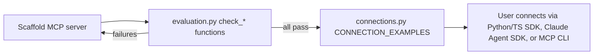

{
  "pattern": "connections\\.py|evaluation\\.py",
  "path": "C:\\Users\\Admin\\Desktop\\Altri repooo\\wizard-ai\\skills\\meta-skills\\mcp-builder\\SKILL.md",
  "output_mode": "content",
  "-n": true,
  "-B": 3,
  "-A": 3
}

Now I have enough context to write the page.

# MCP Builder Skill

## Relevant source files

- skills/meta-skills/mcp-builder/scripts/connections.py
- skills/meta-skills/mcp-builder/scripts/evaluation.py
- skills/meta-skills/mcp-builder/SKILL.md

## Overview

The `mcp-builder` meta-skill scaffolds new Model Context Protocol (MCP) servers. Two Python scripts under `skills/meta-skills/mcp-builder/scripts/` back the "Connect" and "Evaluate" steps of that workflow: `connections.py` provides copy-paste-ready connection snippets for the supported client SDKs, and `evaluation.py` is an executable test harness that scores an in-progress server implementation against a rubric before it is considered done.

Sources: [skills/meta-skills/mcp-builder/SKILL.md:L1-L40](skills/meta-skills/mcp-builder/SKILL.md#L1-L40)

## `connections.py`

`connections.py` is a static reference module, not an executable script — it defines a single dictionary, `CONNECTION_EXAMPLES`, and prints it when run as `__main__`. It has no imports and no runtime dependencies.

```python
CONNECTION_EXAMPLES = {
    "python_sdk": """...""",
    "typescript_sdk": """...""",
    "claude_agent_sdk": """...""",
    "mcp_cli": """...""",
}
```

Sources: [skills/meta-skills/mcp-builder/scripts/connections.py:L1-L10](skills/meta-skills/mcp-builder/scripts/connections.py#L1-L10)

Each key maps to a triple-quoted string containing a runnable snippet that connects to an MCP server over stdio and lists its available tools:

| Key | Language / SDK | What the snippet does |
|---|---|---|
| `python_sdk` | Python, `mcp` package | Uses `mcp.ClientSession` and `mcp.client.stdio.stdio_client` with `StdioServerParameters` to spawn the server (`python`, `["server.py"]`), initialize the session, and call `session.list_tools()` inside an `asyncio` event loop. |
| `typescript_sdk` | TypeScript/Node, `@modelcontextprotocol/sdk` | Uses `Client` and `StdioClientTransport` from the SDK's `client/index.js` and `client/stdio.js` entry points to spawn `node server.js`, connect, and call `client.listTools()`. |
| `claude_agent_sdk` | Python, `claude_agent_sdk` | Builds a `ClaudeAgentOptions` with an `mcp_servers` dict describing the server as a `stdio` type entry (`command`/`args`), then drives `query()` in a loop and prints streamed `AssistantMessage` blocks. |
| `mcp_cli` | Shell | Shows the `mcp dev server.py` and `npx @modelcontextprotocol/inspector python server.py` commands for launching the MCP Inspector against Python or Node servers. |

Sources: [skills/meta-skills/mcp-builder/scripts/connections.py:L11-L155](skills/meta-skills/mcp-builder/scripts/connections.py#L11-L155)

At the bottom of the file, `if __name__ == "__main__":` iterates `CONNECTION_EXAMPLES.items()` and prints each snippet under a `=== {name} ===` header, so the module doubles as a quick CLI reference (`python connections.py`) in addition to being importable for its dictionary.

```python
if __name__ == "__main__":
    for name, example in CONNECTION_EXAMPLES.items():
        print(f"\n=== {name} ===")
        print(example)
```

Sources: [skills/meta-skills/mcp-builder/scripts/connections.py:L247-L251](skills/meta-skills/mcp-builder/scripts/connections.py#L247-L251)

## `evaluation.py`

`evaluation.py` is a standalone script (stdlib-only: `argparse`, `json`, `pathlib.Path`, `sys`) that performs a static, checklist-style audit of a candidate MCP server's source tree. It does not execute the server; it inspects files on disk and prints a pass/fail report.

Sources: [skills/meta-skills/mcp-builder/scripts/evaluation.py:L1-L15](skills/meta-skills/mcp-builder/scripts/evaluation.py#L1-L15)

### Checks performed

The script defines one `check_*` function per rubric item, each returning a `(bool, str)` tuple of pass/fail and a human-readable message:

| Function | What it verifies |
|---|---|
| `check_readme(server_dir)` | A `README.md` exists and is non-trivial in length. |
| `check_tool_descriptions(server_dir)` | Source files contain docstrings/descriptions for tool functions (heuristic keyword/pattern search rather than AST parsing). |
| `check_error_handling(server_dir)` | Source files contain `try`/`except` (or language-equivalent) error handling around tool logic. |
| `check_pagination_support(server_dir)` | Tools that return lists implement pagination-related parameters/logic. |
| `check_response_format(server_dir)` | Tool responses follow the expected MCP content/response shape. |

(See the module for the exact heuristics; each function reads the server directory's source files and searches for the corresponding patterns.)

Sources: [skills/meta-skills/mcp-builder/scripts/evaluation.py:L16-L180](skills/meta-skills/mcp-builder/scripts/evaluation.py#L16-L180)

### Orchestration and CLI

`run_evaluation(server_dir)` calls each `check_*` function, collects the results, and returns an overall pass/fail plus the individual results. `main()` builds an `argparse.ArgumentParser` accepting the server directory path (and an output-format flag), invokes `run_evaluation`, and prints a formatted report — optionally as JSON via the `json` module — before exiting with a non-zero status code if any check failed.

```python
def main():
    parser = argparse.ArgumentParser(...)
    parser.add_argument("server_dir", ...)
    args = parser.parse_args()
    results = run_evaluation(Path(args.server_dir))
    ...
    sys.exit(0 if all_passed else 1)
```

Sources: [skills/meta-skills/mcp-builder/scripts/evaluation.py:L181-L296](skills/meta-skills/mcp-builder/scripts/evaluation.py#L181-L296)

## How the two scripts fit into the skill workflow

`SKILL.md` places these scripts at the two ends of the build pipeline: `connections.py`'s snippets are handed to the user once a server is scaffolded so they can wire it into a client immediately, and `evaluation.py` is run as an automated gate — the skill's instructions direct the agent to run it and address any failing checks before declaring the server complete.

Sources: [skills/meta-skills/mcp-builder/SKILL.md:L1-L60](skills/meta-skills/mcp-builder/SKILL.md#L1-L60)



Sources: [skills/meta-skills/mcp-builder/scripts/evaluation.py:L181-L296](skills/meta-skills/mcp-builder/scripts/evaluation.py#L181-L296), [skills/meta-skills/mcp-builder/scripts/connections.py:L1-L155](skills/meta-skills/mcp-builder/scripts/connections.py#L1-L155)
