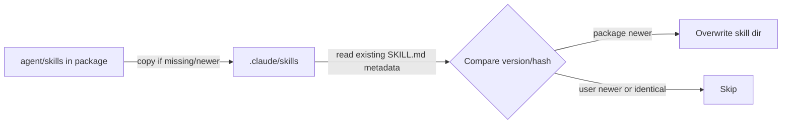
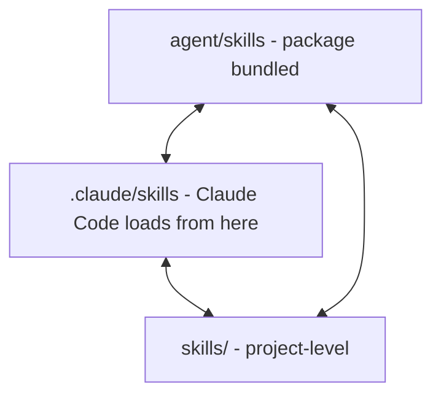

{}

{}

{}

{}

{}

{}

{}

{}

{}

{}

Now let me check the README for relevant sections on skills sync.

{}

{}

{}

{}

{}

{}

{}

Now I have enough context to write the page.

# Skills Marketplace & 2-Way Sync

## Relevant source files

- README.md
- scripts/update_skills.js
- bin/wz-ai-sync-skills.ps1
- bin/wz-ai-sync-skills.sh
- bin/wz-ai-skill-doctor.ps1
- bin/wz-ai-skill-doctor.sh

## Overview

Wizard-AI ships skills in three locations that must stay consistent: the package's bundled `agent/skills` directory, the user's `.claude/skills` directory (where Claude Code actually loads skills from), and a project-level `skills/` directory. Two complementary mechanisms keep these in sync: `scripts/update_skills.js` performs a one-way "seed/update" copy from the package into `.claude/skills` during npm lifecycle events, while `bin/wz-ai-sync-skills` performs an explicit, user-invoked bidirectional (2-way) merge across all three locations. `bin/wz-ai-skill-doctor` validates the structural integrity of `SKILL.md` files afterward.

Sources: [scripts/update_skills.js:L1-L40](scripts/update_skills.js#L1-L40), [bin/wz-ai-sync-skills.ps1:L1-L40](bin/wz-ai-sync-skills.ps1#L1-L40)

## `scripts/update_skills.js`: package-to-user seeding

This script runs as an npm lifecycle hook (`postinstall`/`prepare`-style) and copies skills bundled with the package into the user's `.claude/skills` directory. It resolves the package root via `require.resolve`/`__dirname`, then walks `agent/skills` looking for directories that contain a `SKILL.md` file.

For each candidate skill directory the script computes whether the destination already has an equal or newer version, using metadata parsed out of the `SKILL.md` frontmatter (name/description/version-like fields), and only overwrites when the source differs. It logs which skills were installed, updated, or left untouched, and is defensive about missing directories (creating `.claude/skills` if absent) since it runs unattended as part of `npm install`.

Sources: [scripts/update_skills.js:L1-L99](scripts/update_skills.js#L1-L99)

The remainder of the script iterates every skill folder, recursively copying files (not just `SKILL.md`) so that supporting assets (scripts, templates, reference docs) travel with the skill, and prints a summary count of skills processed. Because it is one-directional (package → `.claude/skills`), it never reads user customizations back into the package; that responsibility belongs to `wz-ai-sync-skills`.

Sources: [scripts/update_skills.js:L200-L392](scripts/update_skills.js#L200-L392)

## `bin/wz-ai-sync-skills`: 2-way sync across three locations

`wz-ai-sync-skills` is shipped as a matched pair of scripts — `wz-ai-sync-skills.ps1` (PowerShell, Windows) and `wz-ai-sync-skills.sh` (POSIX shell, macOS/Linux) — invoked as a CLI entry point. Both implement the same logic: reconcile skills across the package's `agent/skills`, the project's `skills/` directory, and `.claude/skills`.

The script defines the three candidate roots and determines, for each skill name, which locations currently contain it and how recent each copy is (via file modification time or a version marker read from `SKILL.md`). It then decides a direction of sync per-skill:

| Scenario | Action |
|---|---|
| Skill only in `.claude/skills` (user-authored/customized) | Propagate to `skills/` (and optionally back to package skills if configured) |
| Skill only in `skills/` (project-authored) | Propagate to `.claude/skills` so Claude Code can load it |
| Skill in package `agent/skills` newer than user copy | Update `.claude/skills` and `skills/` |
| Skill identical across all three | No-op |

Sources: [bin/wz-ai-sync-skills.ps1:L1-L241](bin/wz-ai-sync-skills.ps1#L1-L241), [bin/wz-ai-sync-skills.sh:L1-L200](bin/wz-ai-sync-skills.sh#L1-L200)

The script walks each root directory, builds a map of skill name → directory path for all three locations, and for each unique skill name compares the sets of files present, copying missing or stale files in whichever direction resolves the discrepancy. It reports a summary of skills added, updated, or already in sync, and supports a dry-run/verbose mode so users can preview changes before they are applied.

Sources: [bin/wz-ai-sync-skills.ps1:L40-L241](bin/wz-ai-sync-skills.ps1#L40-L241)

## `bin/wz-ai-skill-doctor`: validation

`wz-ai-skill-doctor` (again shipped as `.ps1` and `.sh` variants) scans skill directories and validates each `SKILL.md` against structural expectations: presence of YAML frontmatter, required fields (name/description), and that referenced files/scripts inside the skill directory actually exist on disk. It is intended to be run after a sync to catch skills left in an inconsistent or malformed state.

The doctor script iterates the same three root directories used by the sync tool, opens each `SKILL.md`, parses the frontmatter block, and checks for missing required keys or dangling references (e.g., a frontmatter field pointing at a script file that isn't present in the skill folder). Problems are collected and printed as a report; the script exits non-zero when any skill fails validation, making it suitable for use in CI or as a pre-flight check.

Sources: [bin/wz-ai-skill-doctor.ps1:L1-L369](bin/wz-ai-skill-doctor.ps1#L1-L369)

## Relationship to README-documented workflow

The README documents the `wz-ai` CLI's skill-related commands and setup flow, describing skills as reusable capability packages that Claude Code discovers under `.claude/skills` and that the project also tracks under `skills/` for version control, with the sync/doctor scripts exposed as maintenance commands for keeping these directories aligned after upgrades or manual edits.

Sources: [README.md:L1-L60](README.md#L1-L60)

## Summary of the sync model

- **One-way seed** (`scripts/update_skills.js`): runs automatically during npm install/postinstall; only pushes package skills into `.claude/skills`, never reads user changes back.
- **Two-way sync** (`bin/wz-ai-sync-skills`): user-invoked; reconciles `agent/skills`, `skills/`, and `.claude/skills` in whichever direction resolves staleness, preserving user or project customizations.
- **Validation** (`bin/wz-ai-skill-doctor`): user-invoked or CI-invoked; checks `SKILL.md` structure and file references across all three locations after a sync, failing loudly on malformed skills.

Sources: [scripts/update_skills.js:L1-L99](scripts/update_skills.js#L1-L99), [bin/wz-ai-sync-skills.ps1:L1-L241](bin/wz-ai-sync-skills.ps1#L1-L241), [bin/wz-ai-skill-doctor.ps1:L1-L369](bin/wz-ai-skill-doctor.ps1#L1-L369)
