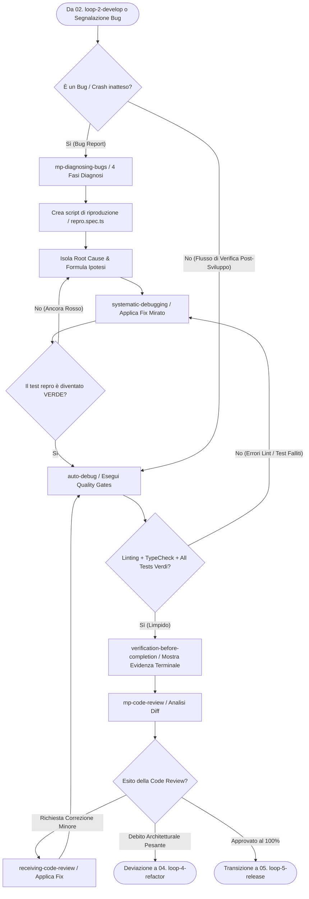

# 🔍 03. Loop 3: Debug & Verify (Diagnose, Review & Quality Gates)

Questo è il **terzo loop sequenziale (03/05)** del Master Production System di Wizard-AI. Il suo scopo categoriale è **Diagnosi Bug, Verifica Empirica, Quality Gates e Code Review**. Subentra al `02. loop-2-develop` al termine dell'implementazione oppure si attiva direttamente quando l'utente o la CI segnalano un errore, un crash o una regressione.

```
    ┌────────────────────────────────────────────────────────┐
    │ ⚡ 02. loop-2-develop (Implementazione completata)     │
    └────────────────────────────────────────────────────────┘
              │
              ▼ (Test, Linter & Diff pronti per la verifica)
    ┌────────────────────────────────────────────────────────┐
    │ 🔍 03. loop-3-debug (Diagnose → Fix → Gates → Review)  │  ◄── (Sei Qui - Step 03)
    └────────────────────────────────────────────────────────┘
              │
              ├──────────────────────────────────┐
              ▼ (Tutti i quality gates PASSATI)  │ (Se code review rileva debito architetturale)
    ┌─────────────────────────────────────────┐  ▼
    │ 🚀 05. loop-5-release (Release & Merge) │ ┌─────────────────────────────────────────┐
    └─────────────────────────────────────────┘ │ 🏗️ 04. loop-4-refactor (Refactor & Opt)   │
                                                └─────────────────────────────────────────┘
```

---

## 📂 Categorizzazione delle Skills, Progetti e Framework del Loop 3

Tutte le seguenti skills appartengono alla categoria di **Diagnosi, Verifica e Revisione Qualitativa** e devono essere richiamate o concatenate secondo la logica illustrata:

### 1. Categoria: Bug Diagnosis & Root Cause Analysis (Analisi Scientifica)
Queste skill impediscono di tentare correzioni casuali (`guess-and-check`) imponendo un metodo empirico e riproducibile:
- **`mp-diagnosing-bugs`**: *Quando usarla:* All'insorgere di qualsiasi bug o crash misterioso. *Cosa fa:* Esegue l'analisi strutturata in 4 fasi di Matt Pocock: Ipotesi → Riproduzione deterministica → Isolamento → Fix empirico.
- **`systematic-debugging`**: *Quando usarla:* Per risolvere errori sistemici, test intermittenti (`flaky tests`), colli di bottiglia o problemi di concorrenza.
- **`auto-debug` (`ai-debug`)**: *Quando usarla:* Per eseguire quality gates automatizzati e auto-correzione del codice (linting con `ruff` / `eslint`, formatting, type checking, suite `pytest` / `jest`).
- **`webapp-testing`**: *Quando usarla:* Per diagnosticare bug visivi o di interazione su interfacce web usando Playwright per catturare screenshot, log del browser e verificare il DOM.
- **`vscode-jest-runner` & CLI Wrapper (`wizard-ai test` / Vitest debug)**: *Quando usarla:* Nel debugging granulare di un singolo test isolato che fallisce. *Cosa fa:* Permette di lanciare direttamente da IDE o da terminale con `wizard-ai test [nome-file/test]` la riproduzione mirata e il debug interattivo del guasto.
- **`vscode-webnative` & WNFS Inspection (`wizard-ai webnative-inspect`)**: *Quando usarla:* Per il debug e l'ispezione dello stato del filesystem decentralizzato WNFS e delle capacità distributed o offline delle applicazioni.

### 2. Categoria: Verification Gates & Code Review (Controllo Qualità Pre-Merge)
Queste skill garantiscono che nessun codice difettoso o non verificato superi il confine verso `main`:
- **`verification-before-completion`**: *Quando usarla:* **MANDATORY BLOCKING GATE** prima di affermare che un bug è risolto o un task completato. *Cosa fa:* Vieta di fare affermazioni di successo senza aver eseguito un comando di test reale e mostrato l'output del terminale (`0 failures`).
- **`mp-code-review`**: *Quando usarla:* Subito dopo che i test sono passati per analizzare il diff accumulato (`git diff main...HEAD`). *Cosa fa:* Esegue una revisione automatizzata cercando duplicazioni, violazioni di stile e vulnerabilità.
- **`receiving-code-review`**: *Quando usarla:* Quando si riceve feedback di code review (da un utente, da un altro agente o da una PR GitHub). *Cosa fa:* Impone rigore tecnico e verifica empirica dei suggerimenti prima di applicarli, rifiutando modifiche accondiscendenti o dannose.
- **`requesting-code-review`**: *Quando usarla:* Per impacchettare le modifiche fatte in una descrizione formale di Pull Request prima di chiedere l'approvazione finale.

---

## 🔗 Concatenazione e Skill Chaining Tree (Loop 3)

Il seguente albero mostra la sequenza deterministica di esecuzione del Loop 3 e i rami di deviazione:



---

## 📝 Istruzioni Operative Passo-Passo (Esecuzione Loop 3)

### Step 3.1: Diagnosi Scientifica e Riproduzione (`mp-diagnosing-bugs`)
Se il loop è attivato da un bug, **MAI toccare il codice a caso**:
1. **Riproduci il problema:** Crea uno script di test isolato (`repro_bug.py` o `repro.test.ts`) che fallisce in modo deterministco mostrando esattamente il bug segnalato.
2. **Isola la root cause:** Leggi attentamente lo stack trace e i log. Usa `systematic-debugging` per separare il sintomo dalla causa reale.
3. **Dichiara l'ipotesi:** Scrivi chiaramente "Il bug è causato dalla riga X del file Y perché la variabile Z è null quando il thread si disconnette".

### Step 3.2: Risoluzione Empirica e Verifica Isolată (`systematic-debugging`)
- Applica la patch minima necessaria a correggere la root cause individuata.
- Esegui lo script di riproduzione: deve diventare **VERDE**.
- Esegui l'intera test suite per confermare l'assenza di regressioni.

### Step 3.3: Esecuzione Quality Gates (`auto-debug`)
Esegui la suite completa di controllo qualità del progetto:
```bash
ai-debug check
# oppure il comando nativo del progetto: npm test / pytest / ruff check .
```
- Se il linter o il type checker segnalano problemi, correggili finché l'output del terminale non restituisce `0 errors, 0 warnings`.

### Step 3.4: Gate dell'Evidenza Ineccepibile (`verification-before-completion`)
<MANDATORY>
Prima di dichiarare che il bug è risolto o il codice è pronto per la review, DEVI copiare e mostrare l'esatto output del terminale che attesta il successo (`All tests passed`, `0 failures`). Non è ammesso dire "ho verificato ed è a posto" senza prove.
</MANDATORY>

### Step 3.5: Never-Stop Autonomous Handoff (`ZERO-STOP MANDATE`)
Una volta completata la diagnosi ed i test sono verdi, **NON FERMARTI E NON CHIEDERE ALL'UTENTE UN PROMPT DI CONFERMA**.
Applica la regola del dialogo interno:
`🧠 [SELF-QUESTION] "I test sono 100% verdi. Il codice necessita di un refactoring architetturale (`serena` + `codebase-design` in Loop 4) oppure è pulito ed è pronto per il rilascio in Loop 5?"`
> **Azione Immediata e Unconditional:**
> - Se il codice ha debito tecnico o classi pesanti: stampa `🔄 [AUTONOMOUS BATON-PASSING] 03. loop-3-debug completato -> Auto-Triggering 04. loop-4-refactor` ed entra nel refactoring!
> - Se il codice è pulito ed eccellente: stampa `🔄 [AUTONOMOUS BATON-PASSING] 03. loop-3-debug completato -> Auto-Triggering 05. loop-5-release` ed esegui la chiusura, handoff e salvataggio memoria!
