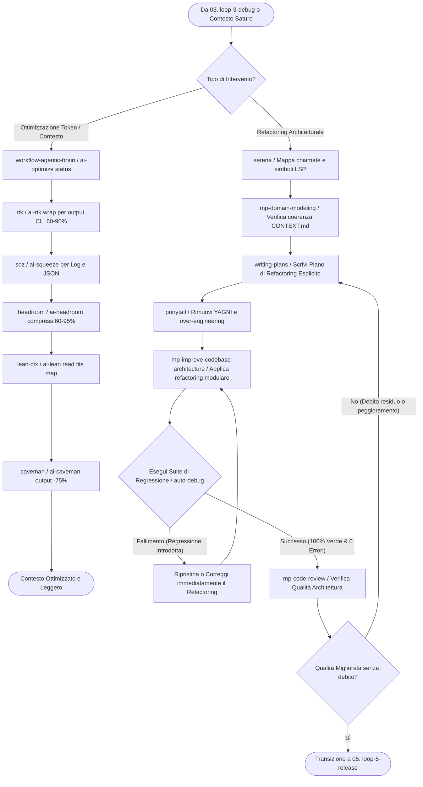

# 🏗️ 04. Loop 4: Refactor & Optimize (Architecture, Clean & Token Savings)

Questo è il **quarto loop sequenziale (04/05)** del Master Production System di Wizard-AI. Il suo scopo categoriale è **Refactoring Architetturale, Riduzione del Debito Tecnico, Clean Code e Ottimizzazione del Contesto/Token LLM**. Subentra al `03. loop-3-debug` quando la code review evidenzia accoppiamento eccessivo o colli di bottiglia, oppure si attiva quando il consumo di token/memoria della sessione deve essere drasticamente ridotto.

```
    ┌────────────────────────────────────────────────────────┐
    │ 🔍 03. loop-3-debug (Review ha mostrato debito arch.)  │
    └────────────────────────────────────────────────────────┘
              │
              ▼ (Analisi semantica e mappa dipendenze)
    ┌────────────────────────────────────────────────────────┐
    │ 🏗️ 04. loop-4-refactor (Serena → Refactor → Squeeze)   │  ◄── (Sei Qui - Step 04)
    └────────────────────────────────────────────────────────┘
              │
              ├──────────────────────────────────┐
              ▼ (Architettura pulita & Test OK)  │ (Se regressioni o perdita qualità)
    ┌─────────────────────────────────────────┐  ▼
    │ 🚀 05. loop-5-release (Merge & Deploy)  │ ┌─────────────────────────────────────────┐
    └─────────────────────────────────────────┘ │ 🎯 01. loop-1-plan (Nuovo piano di ref) │
                                                └─────────────────────────────────────────┘
```

---

## 📂 Categorizzazione delle Skills, Progetti e Framework del Loop 4

Tutte le seguenti skills appartengono alla categoria di **Ristrutturazione del Codice e Risparmio Computazionale** e devono essere richiamate o concatenate secondo la logica illustrata:

### 1. Categoria: Architectural Refactoring & Clean Code (Pulizia Strutturale)
Queste skill riorganizzano il codice per renderlo modulare, coeso e disaccoppiato senza alterarne il comportamento esterno:
- **`mp-improve-codebase-architecture`**: *Quando usarla:* All'avvio di un refactoring di modulo o servizio. *Cosa fa:* Analizza le dipendenze interne, separa le responsabilità (SRP) e riduce l'accoppiamento verso un'architettura a strati pulita.
- **`serena`**: *Quando usarla:* Obbligatoria prima di rinominare simboli o spostare file su larga scala. *Cosa fa:* Esegue ricerca semantica profonda e navigazione symbol/LSP per mappare esattamente dove una funzione o classe viene richiamata in tutta la codebase.
- **`ponytail` (`ai-ponytail`)**: *Quando usarla:* Quando il codice mostra segnali di over-engineering, design pattern speculativi o gerarchie di classi inutilmente complesse. *Cosa fa:* Applica la mentalità del "senior dev pigro", eliminando astrazioni premature (`YAGNI`) e riducendo le righe di codice.
- **`mp-migrate-to-shoehorn`**: *Quando usarla:* Per migrazioni graduali di architettura (es. passaggio a un nuovo pattern o framework) in modo incrementale senza interrompere il servizio in produzione.
- **`mp-domain-modeling`**: *Quando usarla:* Per disaccoppiare la logica di business dalla persistenza o dalla UI ridefinendo le entità del dominio.

### 2. Categoria: Token & Context Optimization (Risparmio Risorse LLM)
Queste skill controllano e comprimono i payload inviati e ricevuti dal modello per evitare di intasare la context window. Ogni skill ha un **CLI wrapper esatto** da invocare:
- **`workflow-agentic-brain` (`ai-optimize`)**: *Quando usarla:* Come Master Optimizer quando la sessione supera il 60% della context window o quando si debbono elaborare file enormi. *Cosa fa:* Orchestra dinamicamente le skill di compressione sottostanti. *CLI:* `ai-optimize status` / `ai-optimize pipeline <file>`.
- **`caveman` (`ai-caveman`)**: *Quando usarla:* Quando l'agente deve generare lunghe analisi o log. *Cosa fa:* Riduce del ~75% i token in uscita dall'agente rimuovendo parole di riempimento pur mantenendo assoluta accuratezza sintattica e tecnica. *CLI:* `ai-caveman` (mostra le regole da iniettare come system prompt).
- **`sqz` (`ai-squeeze`)**: *Quando usarla:* Prima di passare all'LLM l'output di comandi del terminale prolissi, build log giganti o file JSON di grandi dimensioni. *Cosa fa:* Comprime e riassume il payload mantenendo solo gli errori o i dati strutturali salienti. *CLI:* `command | ai-squeeze`.
- **`llmlingua` (`ai-compress`)**: *Quando usarla:* Per comprimere prompt storici o documenti RAG estesi fino a 20x. *CLI:* `ai-compress --file <file> --ratio 0.5 --verbose`.
- **`lean-ctx` (`ai-lean` / `ai-lean-ctx`)**: *Quando usarla:* Per governare l'intelligenza di visibilità del contesto, potando file già letti e non più rilevanti. *CLI:* `ai-lean read <file> map` / `ai-lean read <file> signatures` / `ai-lean status`.
- **`headroom` (`ai-headroom`)**: *Quando usarla:* Per gestire il proxying e la compressione del contesto riducendo la latenza delle chiamate API. *CLI:* `ai-headroom compress` / `cat <file> | ai-headroom compress --ratio 0.4` / `ai-headroom proxy --port 8000`.
- **`flashrank` (`ai-rerank`)**: *Quando usarla:* Durante la ricerca di documenti o frammenti di codice per ri-ordinare e mettere i frammenti più rilevanti nei primissimi token del prompt. *CLI:* `ai-rerank --query "<domanda>" --passages <file.json> --top-k 5`.
- **`rtk` (`ai-rtk`)**: *Quando usarla:* Per comprimere automaticamente l'output dei comandi shell (git, npm, ls, grep, kubectl) del 60-90% prima che entrino nel contesto. Binario Rust singolo, zero dipendenze, <10ms. *CLI:* `ai-rtk wrap <command>` / `ai-rtk init --global`.

---

## 🔗 Concatenazione e Skill Chaining Tree (Loop 4)

Il seguente albero mostra la sequenza deterministica di esecuzione del Loop 4 e il controllo anti-regressione:



---

## 📝 Istruzioni Operative Passo-Passo (Esecuzione Loop 4)

### Step 4.1: Analisi Preliminare e Mappatura Semantica (`serena`)
- **VIETATO toccare il codice per un refactoring strutturale "alla cieca".**
- Esegui `serena` per esplorare l'albero delle dipendenze del modulo target. Identifica chi chiama la classe/funzione e dove si trovano i colli di bottiglia architetturali.

### Step 4.2: Redazione del Piano di Refactoring Esplicito (`writing-plans` + `ponytail`)
- Scrivi in `task.md` il piano esplicito di refactoring:
  - Specifica quali interfacce verranno disaccoppiate e quali file monstre verranno divisi.
  - Applica `ponytail` per marcare per l'eliminazione qualsiasi classe o metodo speculativo che non è usato dall'applicazione corrente.

### Step 4.2b: Pipeline CLI di Ottimizzazione Token (5 Fasi — `ai-optimize`)
Quando il contesto è saturo o il loop richiede compressione, esegui le 5 fasi con i **comandi CLI esatti**:

```bash
# Fase 1: Verifica lo stato di tutti i tool
ai-optimize status

# Fase 2: Converti file binari in Markdown (se necessario)
ai-convert documento.pdf

# Fase 3: Re-ranking per rilevanza (se molti documenti)
ai-rerank --query "<domanda>" --passages docs.json --top-k 5 --compact

# Fase 4: Compressione Token (scegli il tool più adatto)
ai-compress --file contesto.txt --ratio 0.5 --verbose           # LLMLingua (20x)
cat output_lungo.json | ai-squeeze                               # sqz (JSON/log)
cat contesto.txt | ai-headroom compress --ratio 0.4              # Headroom (60-95%)

# Fase 5: Compressione output CLI automatica
ai-rtk wrap git log --oneline -100                               # RTK (60-90%)
ai-rtk wrap npm test 2>&1 | ai-squeeze                          # RTK + sqz cascata

# Context Guarding: lettura intelligente dei file
ai-lean read src/main.py map                                     # Solo struttura (~13 token)
ai-lean read src/main.py signatures                              # Solo firme funzioni
ai-lean read src/main.py diff                                    # Solo righe cambiate

# Output Reduction: attiva compressione output agente
ai-caveman                                                       # Mostra regole (-75% token output)
```

**Regola di cascata CLI:** I tool possono essere concatenati con pipe:
```bash
# Pipeline completa: convert → rerank → compress
ai-convert doc.pdf | ai-rerank -q "auth flow" -k 5 --compact | ai-compress --ratio 0.3

# Pipeline CLI: rtk → squeeze → headroom
ai-rtk wrap kubectl get pods -A -o json | ai-squeeze | ai-headroom compress
```

### Step 4.3: Esecuzione del Refactoring Protetto da Test (`mp-improve-codebase-architecture`)
- **Regola di Ferro del Refactoring:** Assicurati che i test siano verdi *prima* di iniziare ogni singola modifica atomica.
- Sposta i metodi o dividi le classi un passo alla volta.
- Dopo ogni modifica, esegui la suite di test rapida (`pytest` / `npm test`). Se un test si rompe, fermati e correggilo prima di procedere.

### Step 4.4: Verifica di Regressione e Gate Architetturale (`auto-debug` + `mp-code-review`)
- Esegui l'intera suite di regressione e di linting con `auto-debug`.
- Esegui `mp-code-review` sul diff del refactoring.
  - Se la review mostra che il refactoring ha complicato la leggibilità o introdotto dipendenze occulte, la pull request viene bloccata e il loop torna allo Step 4.2.
  - Se il diff mostra una riduzione netta delle righe di codice, coesione elevata e test verdi al 100%, il refactoring è approvato.

### Step 4.5: Never-Stop Autonomous Handoff verso Loop 5 (`ZERO-STOP MANDATE`)
Una volta completato il refactoring e la pulizia dei token (`sqz` / `lean-ctx`), **NON FERMARTI E NON CHIEDERE ALL'UTENTE UN PROMPT DI CONFERMA**.
Applica la regola del dialogo interno:
`🧠 [SELF-QUESTION] "Architettura ottimizzata e test 100% verdi. Quali verifiche finali e salvataggio memoria (`session-manager` + `mp-handoff`) devo eseguire nel Loop 5 prima di concludere?"`
> **Azione Immediata e Unconditional:** Stampa il banner `🔄 [AUTONOMOUS BATON-PASSING] 04. loop-4-refactor completato -> Auto-Triggering 05. loop-5-release` ed entra immediatamente nel rilascio e salvataggio memoria!
