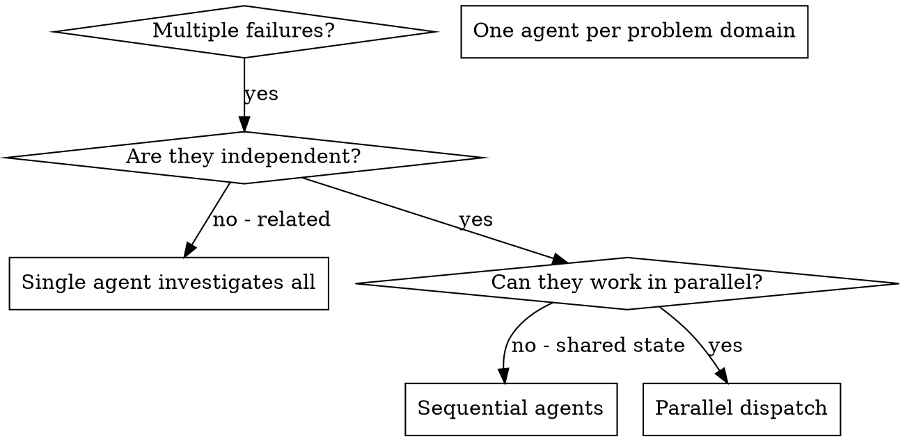
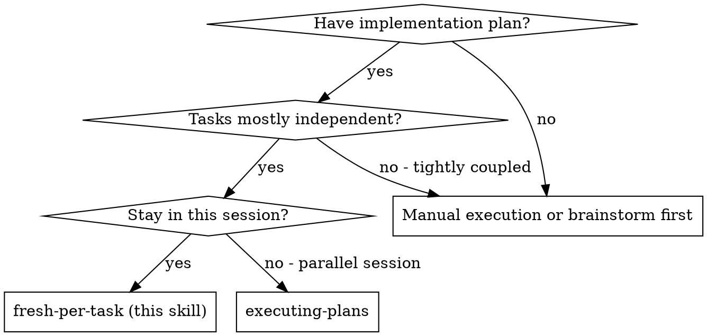
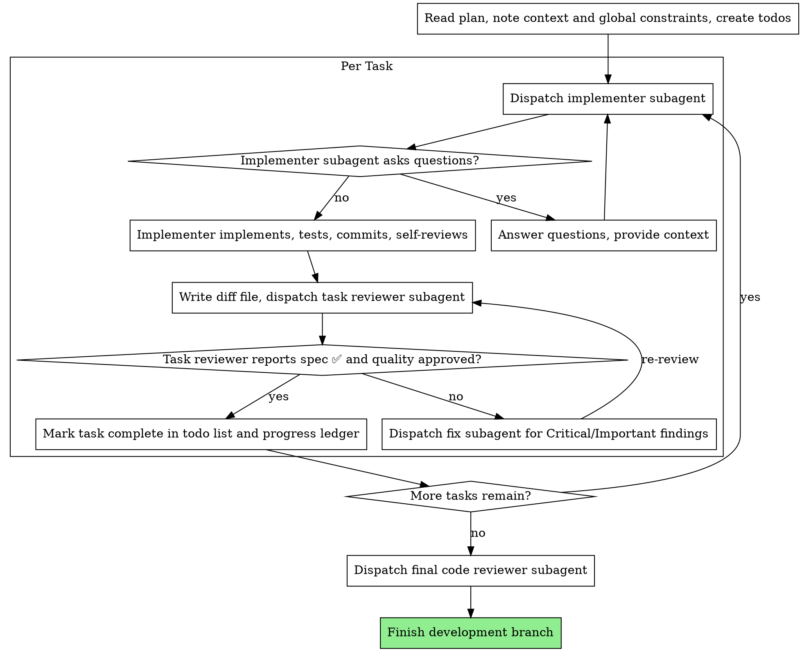

# Wizard-AI Orchestration

One core mechanic — isolated-context subagent dispatch with precisely crafted
instructions — parametrized by **rigor level** instead of five separate
skills. This replaces `3-shadow-clone-parallelism`, `4-swarm-manager`,
`subagent-driven-development`, `5-goodcode-orchestrator`, and `cavecrew`.

## Core mechanic (applies to every rigor level)

You delegate tasks to specialized agents with isolated context. By precisely
crafting their instructions and context, you ensure they stay focused and
succeed at their task. They should never inherit your session's context or
history — you construct exactly what they need. This also preserves your own
context for coordination work.

**Core principle:** dispatch one agent per independent problem domain, with a
full brief (role, scope, acceptance criteria, output contract), and never
trust a subagent's report without verifying it yourself.

## Decision table — which rigor level to pick

| Situation | Rigor level | Absorbs |
|---|---|---|
| 2+ unrelated failures/tasks, no shared state, one-shot fan-out | **light** | `3-shadow-clone-parallelism` |
| Complex plan spanning multiple domains (frontend + backend + infra), needs a lead delegating to specialists | **hierarchical** | `4-swarm-manager` |
| You have `implementation_plan.md`/`task.md` with a checklist of tasks to execute end-to-end, same session | **fresh-per-task** | `subagent-driven-development` |
| Audit, deep review, multi-source research, design exploration, large migration — completeness beats latency, token cost not a constraint | **exhaustive** | `5-goodcode-orchestrator` |
| *(modifier, not a level)* You want any of the above with ~60% smaller tool-result injected into main context | **+ compressed-output** | `cavecrew` |

Not substantial enough to delegate at all (single quick fix, known root
cause, mechanical edit from output you just read) → work solo, don't invoke
this skill.

---

## Rigor: light (2+ independent tasks, one-shot fan-out)

### When to use



**Use when:**
- 3+ test files failing with different root causes
- Multiple subsystems broken independently
- Each problem can be understood without context from others
- No shared state between investigations

**Don't use when:**
- Failures are related (fix one might fix others)
- Need to understand full system state
- Agents would interfere with each other

### The pattern

1. **Identify independent domains** — group failures/tasks by what's broken. Each domain is independent: fixing tool approval doesn't affect abort tests.
2. **Create focused agent tasks** — each agent gets a specific scope (one test file/subsystem), a clear goal, constraints (don't change other code), and an expected output (summary of what was found/fixed).
3. **Dispatch in parallel** — issue all dispatches in the same response; they run concurrently. Multiple dispatch calls in one response = parallel execution. One per response = sequential.
4. **Review and integrate** — read each summary, verify fixes don't conflict, run the full test suite, integrate all changes.

### Agent prompt structure

Good agent prompts are: **focused** (one clear problem domain), **self-contained** (all context needed to understand the problem), **specific about output** (what should the agent return?).

```markdown
Fix the 3 failing tests in src/agents/agent-tool-abort.test.ts:

1. "should abort tool with partial output capture" - expects 'interrupted at' in message
2. "should handle mixed completed and aborted tools" - fast tool aborted instead of completed
3. "should properly track pendingToolCount" - expects 3 results but gets 0

These are timing/race condition issues. Your task:

1. Read the test file and understand what each test verifies
2. Identify root cause - timing issues or actual bugs?
3. Fix by:
   - Replacing arbitrary timeouts with event-based waiting
   - Fixing bugs in abort implementation if found
   - Adjusting test expectations if testing changed behavior

Do NOT just increase timeouts - find the real issue.

Return: Summary of what you found and what you fixed.
```

### Common mistakes

**❌ Too broad:** "Fix all the tests" - agent gets lost
**✅ Specific:** "Fix agent-tool-abort.test.ts" - focused scope

**❌ No context:** "Fix the race condition" - agent doesn't know where
**✅ Context:** Paste the error messages and test names

**❌ No constraints:** Agent might refactor everything
**✅ Constraints:** "Do NOT change production code" or "Fix tests only"

**❌ Vague output:** "Fix it" - you don't know what changed
**✅ Specific:** "Return summary of root cause and changes"

### When NOT to use

- **Related failures:** fixing one might fix others — investigate together first
- **Need full context:** understanding requires seeing entire system
- **Exploratory debugging:** you don't know what's broken yet
- **Shared state:** agents would interfere (editing same files, using same resources)

### Verification

After agents return: review each summary; check for conflicts (did agents edit same code?); run full suite; spot-check (agents can make systematic errors).

### Key benefits

Parallelization (multiple investigations happen simultaneously), focus (each agent has narrow scope, less context to track), independence (agents don't interfere with each other), speed (N problems solved in the time of 1).

---

## Rigor: hierarchical (department-head → worker delegation)

Applies to complex tasks broken down during planning that span multiple
domains and need a lead orchestrator managing specialized workers.

### The agent hierarchy

1. **Orchestrator Agent (you)** — the primary agent that communicates with the user, creates the `implementation_plan.md`, and tracks progress in `task.md`.
2. **Specialized subagents** — independent agent instances spawned by the orchestrator (via the **fresh-per-task** rigor level below, or native platform tools).

### The delegation loop

When executing a complex plan, follow this loop:

1. **Task definition** — for each task in `task.md`, prepare a strict, highly specific prompt. Specify exactly what files to edit, what tests to write, and what the success criteria are. Mention specific skills/frameworks the subagent must load (e.g. "use the `react` and `taste-skill` frameworks").
2. **Spawning subagents** — launch the subagent(s). If tasks are independent (e.g. building 3 separate React components), spawn in parallel. If sequential (e.g. build the database schema, then the API), wait for the first to complete. Do NOT let subagents communicate with the user directly.
3. **Verification & review** — once a subagent finishes, the orchestrator MUST review the work. Run tests/build to ensure the subagent didn't break anything. If flawed, spawn a debugging subagent or fix it yourself.
4. **Integration** — after successful review, mark the task complete in `task.md`. Ensure all context generated by the subagent is summarized into session memory to prevent context bloat.

### Core rules

- **Never do all the work yourself** if the task is complex — delegate.
- **Never trust subagent output blindly** — always run verification commands before reporting success to the user.

---

## Rigor: fresh-per-task (one implementer subagent per plan task + review cadence)

Execute a plan by dispatching a fresh implementer subagent per task, a task
review (spec compliance + code quality) after each, and a broad
whole-branch review at the end.

**Narration:** between tool calls, narrate at most one short line — the
ledger and the tool results carry the record.

**Continuous execution:** do not pause to check in with your human partner
between tasks. Execute all tasks from the plan without stopping. The only
reasons to stop are: BLOCKED status you cannot resolve, ambiguity that
genuinely prevents progress, or all tasks complete. "Should I continue?"
prompts and progress summaries waste their time — they asked you to execute
the plan, so execute it.

### When to use



**vs. Executing Plans (parallel session):** same session (no context switch);
fresh subagent per task (no context pollution); review after each task
(spec compliance + code quality), broad review at the end; faster iteration
(no human-in-loop between tasks).

### The process



### Pre-flight plan review

Before dispatching Task 1, scan the plan once for conflicts: tasks that
contradict each other or the plan's Global Constraints; anything the plan
explicitly mandates that the review rubric treats as a defect (a test that
asserts nothing, verbatim duplication of a logic block).

Present everything found to your human partner as one batched question —
each finding beside the plan text that mandates it, asking which governs —
before execution begins, not one interrupt per discovery mid-plan. If the
scan is clean, proceed without comment. The review loop remains the net for
conflicts that only emerge from implementation.

### Model selection

Use the least powerful model that can handle each role to conserve cost and
increase speed.

**Mechanical implementation tasks** (isolated functions, clear specs, 1-2
files): use a fast, cheap model. Most implementation tasks are mechanical
when the plan is well-specified.

**Integration and judgment tasks** (multi-file coordination, pattern
matching, debugging): use a standard model.

**Architecture and design tasks**: use the most capable available model. The
final whole-branch review is one of these — dispatch it on the most capable
available model, not the session default.

**Review tasks**: choose the model with the same judgment, scaled to the
diff's size, complexity, and risk. A small mechanical diff does not need the
most capable model; a subtle concurrency change does.

**Always specify the model explicitly when dispatching a subagent.** An
omitted model inherits your session's model — often the most capable and
most expensive — which silently defeats this section.

**Turn count beats token price.** Wall-clock and context cost scale with how
many turns a subagent takes, and the cheapest models routinely take 2-3× the
turns on multi-step work — costing more overall. Use a mid-tier model as the
floor for reviewers and for implementers working from prose descriptions.
When the task's plan text contains the complete code to write, the
implementation is transcription plus testing: use the cheapest tier for that
implementer. Single-file mechanical fixes also take the cheapest tier.

**Task complexity signals (implementation tasks):**
- Touches 1-2 files with a complete spec → cheap model
- Touches multiple files with integration concerns → standard model
- Requires design judgment or broad codebase understanding → most capable model

### Handling implementer status

Implementer subagents report one of four statuses. Handle each appropriately:

**DONE:** generate the review package (`scripts/review-package BASE HEAD` —
it prints the unique file path it wrote; BASE is the commit recorded before
dispatching the implementer — never `HEAD~1`, which silently drops all but
the last commit of a multi-commit task), then dispatch the task reviewer
with the printed path.

**DONE_WITH_CONCERNS:** the implementer completed the work but flagged
doubts. Read the concerns before proceeding. If about correctness or scope,
address before review. If observations (e.g. "this file is getting large"),
note them and proceed to review.

**NEEDS_CONTEXT:** the implementer needs information that wasn't provided.
Provide the missing context and re-dispatch.

**BLOCKED:** the implementer cannot complete the task. Assess the blocker:
1. If it's a context problem, provide more context and re-dispatch with the same model
2. If the task requires more reasoning, re-dispatch with a more capable model
3. If the task is too large, break it into smaller pieces
4. If the plan itself is wrong, escalate to the human

**Never** ignore an escalation or force the same model to retry without
changes. If the implementer said it's stuck, something needs to change.

### Handling reviewer ⚠️ items

The task reviewer may report "⚠️ Cannot verify from diff" items —
requirements that live in unchanged code or span tasks. These do not block
the rest of the review, but you must resolve each one yourself before
marking the task complete: you hold the plan and cross-task context the
reviewer lacks. If you confirm an item is a real gap, treat it as a failed
spec review — send it back to the implementer and re-review.

### Constructing reviewer prompts

Per-task reviews are task-scoped gates. The broad review happens once, at
the final whole-branch review. When you fill a reviewer template:

- Do not add open-ended directives like "check all uses" or "run race tests if useful" without a concrete, task-specific reason
- Do not ask a reviewer to re-run tests the implementer already ran on the same code — the implementer's report carries the test evidence
- Do not pre-judge findings for the reviewer — never instruct a reviewer to ignore or not flag a specific issue. If you believe a finding would be a false positive, let the reviewer raise it and adjudicate it in the review loop. If the prompt you are writing contains "do not flag," "don't treat X as a defect," "at most Minor," or "the plan chose" — stop: you are pre-judging, usually to spare yourself a review loop.
- The global-constraints block you hand the reviewer is its attention lens. Copy the binding requirements verbatim from the plan's Global Constraints section or the spec: exact values, exact formats, and the stated relationships between components ("same layout as X", "matches Y"). The reviewer's template already carries the process rules (YAGNI, test hygiene, review method) — the constraints block is for what THIS project's spec demands.
- Hand the reviewer its diff as a file: run `scripts/review-package BASE HEAD` and pass the reviewer the file path it prints (or, without bash: `git log --oneline`, `git diff --stat`, and `git diff -U10` for the range, redirected to one uniquely named file). The output never enters your own context, and the reviewer sees the commit list, stat summary, and full diff with context in one Read call. Use the BASE recorded before dispatching the implementer — never `HEAD~1`, which silently truncates multi-commit tasks.
- A dispatch prompt describes one task, not the session's history. Do not paste accumulated prior-task summaries ("state after Tasks 1-3") into later dispatches — a real session's dispatch hit 42k chars of which 99% was pasted history. A fresh subagent needs its task, the interfaces it touches, and the global constraints. Nothing else.
- Dispatch fix subagents for Critical and Important findings. Record Minor findings in the progress ledger as you go, and point the final whole-branch review at that list so it can triage which must be fixed before merge. A roll-up nobody reads is a silent discard.
- A finding labeled plan-mandated — or any finding that conflicts with what the plan's text requires — is the human's decision, like any plan contradiction: present the finding and the plan text, ask which governs. Do not dismiss the finding because the plan mandates it, and do not dispatch a fix that contradicts the plan without asking.
- The final whole-branch review gets a package too: run `scripts/review-package MERGE_BASE HEAD` (MERGE_BASE = the commit the branch started from, e.g. `git merge-base main HEAD`) and include the printed path in the final review dispatch, so the final reviewer reads one file instead of re-deriving the branch diff with git commands.
- Every fix dispatch carries the implementer contract: the fix subagent re-runs the tests covering its change and reports the results. Name the covering test files in the dispatch — a one-line fix does not need the whole suite. Before re-dispatching the reviewer, confirm the fix report contains the covering tests, the command run, and the output; dispatch the re-review once all three are present.
- If the final whole-branch review returns findings, dispatch ONE fix subagent with the complete findings list — not one fixer per finding. Per-finding fixers each rebuild context and re-run suites; a real session's final-review fix wave cost more than all its tasks combined.

### File handoffs

Everything you paste into a dispatch prompt — and everything a subagent
prints back — stays resident in your context for the rest of the session and
is re-read on every later turn. Hand artifacts over as files:

- **Task brief:** before dispatching an implementer, run `scripts/task-brief PLAN_FILE N` — it extracts the task's full text to a uniquely named file and prints the path. Compose the dispatch so the brief stays the single source of requirements. Your dispatch should contain: (1) one line on where this task fits in the project; (2) the brief path, introduced as "read this first — it is your requirements, with the exact values to use verbatim"; (3) interfaces and decisions from earlier tasks that the brief cannot know; (4) your resolution of any ambiguity you noticed in the brief; (5) the report-file path and report contract. Exact values (numbers, magic strings, signatures, test cases) appear only in the brief.
- **Report file:** name the implementer's report file after the brief (brief `…/task-N-brief.md` → report `…/task-N-report.md`) and put it in the dispatch prompt. The implementer writes the full report there and returns only status, commits, a one-line test summary, and concerns.
- **Reviewer inputs:** the task reviewer gets three paths — the same brief file, the report file, and the review package — plus the global constraints that bind the task.
- Fix dispatches append their fix report (with test results) to the same report file and return a short summary; re-reviews read the updated file.

### Durable progress

Conversation memory does not survive compaction. In real sessions,
controllers that lost their place have re-dispatched entire completed task
sequences — the single most expensive failure observed. Track progress in a
ledger file, not only in todos.

- At skill start, check for a ledger: `cat "$(git rev-parse --git-path sdd)/progress.md"`. Tasks listed there as complete are DONE — do not re-dispatch them; resume at the first task not marked complete.
- When a task's review comes back clean, append one line to the ledger in the same message as your other bookkeeping: `Task N: complete (commits <base7>..<head7>, review clean)`.
- The ledger is your recovery map: the commits it names exist in git even when your context no longer remembers creating them. After compaction, trust the ledger and `git log` over your own recollection.

### Prompt templates

- `implementer-prompt.md` — dispatch implementer subagent
- `task-reviewer-prompt.md` — dispatch task reviewer subagent (spec compliance + code quality)
- Final whole-branch review: use the standard code-reviewer template

(These template files live alongside the original `subagent-driven-development`
skill; port them into this skill's directory when this draft is promoted.)

### Example workflow

```
You: I'm using fresh-per-task orchestration to execute this plan.

[Read plan file once: docs/superpowers/plans/feature-plan.md]
[Create todos for all tasks]

Task 1: Hook installation script

[Run task-brief for Task 1; dispatch implementer with brief + report paths + context]

Implementer: "Before I begin - should the hook be installed at user or system level?"

You: "User level (~/.config/superpowers/hooks/)"

Implementer: "Got it. Implementing now..."
[Later] Implementer:
  - Implemented install-hook command
  - Added tests, 5/5 passing
  - Self-review: Found I missed --force flag, added it
  - Committed

[Run review-package, dispatch task reviewer with the printed path]
Task reviewer: Spec ✅ - all requirements met, nothing extra.
  Strengths: Good test coverage, clean. Issues: None. Task quality: Approved.

[Mark Task 1 complete]

Task 2: Recovery modes

[Run task-brief for Task 2; dispatch implementer with brief + report paths + context]

Implementer: [No questions, proceeds]
Implementer:
  - Added verify/repair modes
  - 8/8 tests passing
  - Self-review: All good
  - Committed

[Run review-package, dispatch task reviewer with the printed path]
Task reviewer: Spec ❌:
  - Missing: Progress reporting (spec says "report every 100 items")
  - Extra: Added --json flag (not requested)
  Issues (Important): Magic number (100)

[Dispatch fix subagent with all findings]
Fixer: Removed --json flag, added progress reporting, extracted PROGRESS_INTERVAL constant

[Task reviewer reviews again]
Task reviewer: Spec ✅. Task quality: Approved.

[Mark Task 2 complete]

...

[After all tasks]
[Dispatch final code-reviewer]
Final reviewer: All requirements met, ready to merge

Done!
```

### Advantages

**vs. Manual execution:** subagents follow TDD naturally; fresh context per
task (no confusion); parallel-safe (subagents don't interfere); subagent can
ask questions (before AND during work).

**vs. Executing Plans:** same session (no handoff); continuous progress (no
waiting); review checkpoints automatic.

**Efficiency gains:** controller curates exactly what context is needed;
bulk artifacts move as files, not pasted text; subagent gets complete
information upfront; questions surfaced before work begins (not after).

**Quality gates:** self-review catches issues before handoff; task review
carries two verdicts: spec compliance and code quality; review loops ensure
fixes actually work; spec compliance prevents over/under-building; code
quality ensures implementation is well-built.

**Cost:** more subagent invocations (implementer + reviewer per task);
controller does more prep work (extracting all tasks upfront); review loops
add iterations; but catches issues early (cheaper than debugging later).

### Red flags

**Never:**
- Start implementation on main/master branch without explicit user consent
- Skip task review, or accept a report missing either verdict (spec compliance AND task quality are both required)
- Proceed with unfixed issues
- Dispatch multiple implementation subagents in parallel (conflicts)
- Make a subagent read the whole plan file (hand it its task brief instead)
- Skip scene-setting context (subagent needs to understand where task fits)
- Ignore subagent questions (answer before letting them proceed)
- Accept "close enough" on spec compliance (reviewer found spec issues = not done)
- Skip review loops (reviewer found issues = implementer fixes = review again)
- Let implementer self-review replace actual review (both are needed)
- Tell a reviewer what not to flag, or pre-rate a finding's severity in the dispatch prompt ("treat it as Minor at most") — the plan's example code is a starting point, not evidence that its weaknesses were chosen
- Dispatch a task reviewer without a diff file — generate it first (`scripts/review-package BASE HEAD`) and name the printed path in the prompt
- Move to next task while the review has open Critical/Important issues
- Re-dispatch a task the progress ledger already marks complete — check the ledger (and `git log`) after any compaction or resume

**If subagent asks questions:** answer clearly and completely, provide additional context if needed, don't rush them into implementation.

**If reviewer finds issues:** implementer (same subagent) fixes them, reviewer reviews again, repeat until approved, don't skip the re-review.

**If subagent fails task:** dispatch fix subagent with specific instructions, don't try to fix manually (context pollution).

---

## Rigor: exhaustive (recon → baseline → role-cast → fan-out → adversarial verify → dedup)

Optimize for the **most exhaustive, correct answer — not the fastest or
cheapest.** On every substantial task, orchestrate a fan-out of specialized
subagents with **roles defined a priori**, then **adversarially verify**
every finding before you commit to it. Token cost is not a constraint
(within the host's hard limits). Lean toward orchestrating and verifying
unless the work is trivial or already verified.

**The value is the script, not the spawning.** Any modern agent can spawn a
subagent — that is commodity. What makes the output exhaustive and correct
is that *before* spawning you wrote down, for each worker: its role, its
exact task, what to look for, the acceptance criteria, and what NOT to do.
Generic "go look at this" workers reproduce none of the value.

### When to use / when not

| Use it | Skip it (work solo) |
|---|---|
| Audits, deep code reviews, security passes | Trivial or conversational turns |
| Multi-source research, fact-checking | Single quick fix with a known root cause |
| Design exploration (compare N approaches) | A mechanical edit dictated by output you just read |
| Large migrations / broad sweeps | Anything where latency clearly beats completeness |
| Any task where "did I miss something?" is the real risk | Work that's already verified |

If the task is not substantial, do not orchestrate — answer directly.
Orchestration on a trivial task is pure waste.

### Host adapter — read first

This skill never assumes a specific tool. Wherever it says **"spawn a
subagent"**, use your host's native parallel-task mechanism:

| Host | "spawn a subagent" maps to |
|---|---|
| Claude Code | the `Agent`/Task tool (or the `Workflow` tool for deterministic, code-driven orchestration) |
| OpenAI Codex | subagents (spawn explicitly per task, or `spawn_agents_on_csv` for batches; ~6 parallel) |
| Cursor | background / parallel agents (git-worktree isolated) |
| OpenCode / OpenHands | the subagent / parallel-task feature (works with local models via the harness) |
| **No spawn mechanism** (bare chat, weak local model) | **degrade to SEQUENTIAL multi-pass:** run the same protocol one worker at a time, role by role. Quality drops, the method holds. |

Two host-level truths to respect:
- **The engine is the host's, the script is yours.** A skill cannot orchestrate by itself; it instructs the model to call the host's spawn tool. So these phases are *instructions you follow*, not a runtime.
- **Deterministic guarantees are not portable.** On a code-driven host (Claude Code `Workflow`) loops, schema validation and round counts are enforced by code. On a model-driven host they become *instructions* — state them forcefully and self-check that you actually did them.

### Model tiering (map tiers to your host)

Match the model to the job; don't burn the top tier on grunt work.

- **Orchestrator** → strongest available model (you). Casting, routing, verification calls, synthesis.
- **Workers** → mid tier (capable + cost-effective, e.g. Sonnet-class). The parallel finders/analysts.
- **Baseline / mechanical** → cheapest tier (e.g. Haiku-class). Objective fact-gathering only.

Never spawn top-tier workers for parallel finding — cost without benefit. On
hosts without model selection, ignore this section.

### The orchestration loop (procedure)

**Phase 0 — Frame & recon.** Restate the goal in one line. Decide: is this
substantial? If not → answer solo, stop. If yes, do **light recon** of the
target before casting roles (this is what makes the cast good): shape & size
of the target (codebase size/languages/stack; or the research landscape; or
the design constraints); high-risk surfaces present (auth, payments, CI
workflows, frontend, external integrations); **declared critical areas** —
read project conventions (e.g. a `CLAUDE.md` "critical areas" section) and
record them; findings there will be weighted up.

Pick the shape: **review** (dimensions → verify) · **research** (multi-modal
sweep → deep-read → synthesize) · **design** (N approaches → judge →
synthesize) · **migrate** (discover sites → transform → verify).

**Phase 1 — Baseline (one cheap worker, first).** Before the analytical
fan-out, spawn **one cheap-tier worker** to gather objective ground truth, so
analysts don't re-derive it and findings anchor to facts: code → linter,
type-check, test run, dependency audit, git stats; research → the canonical
sources / current landscape; design → the hard constraints & requirements.
Feed its output into every Phase 3 worker's brief. Skippable for tiny
targeted scopes — if you skip it, say so (no silent caps).

**Phase 2 — Cast roles by routing (write the script).** Choose roles **from
the recon, not a fixed list**. Routing examples (adapt): CI workflows
present → add an agentic-actions role; frontend present → add a UX role;
many type definitions → add a types role; auth/payments in scope → always
full security coverage. For each role, write a full brief (see *Role brief
template*): role, objective, scope, what to look for, acceptance criteria,
what NOT to do, output format. **No generic workers — if you can't write the
brief, you can't spawn it.** State the cast to the user in one line before
fanning out.

**Phase 3 — Fan out (pipeline by default).** Spawn the workers. **Default to
a pipeline**: each item flows through all stages independently (find →
verify), no barrier between stages — item A can verify while item B is still
being found; wall-clock = slowest single chain, not sum-of-stages. Use a
**barrier** (wait for a whole stage) *only* when the next stage genuinely
needs the full prior set at once (dedup across everything, early-exit if
zero found, "compare against the other findings"). Pass each worker the
**full brief + baseline summary** — subagents do not inherit your context.

**Phase 4 — Adversarially verify (don't trust the finders).** Every
candidate finding must survive verification before it counts. Spawn
independent skeptics (see *Verifier brief template*), each prompted to
**refute**, defaulting to "refuted" when uncertain. Kill the finding if a
majority refute it. When a finding can fail in more than one way, give each
verifier a **distinct lens** (correctness / security / performance /
does-it-actually-reproduce) instead of N identical skeptics — diversity
catches what redundancy can't.

**Phase 5 — Loop until dry.** Discovery has unknown size. Re-spawn finders
until **K consecutive rounds (K≥2) surface nothing new.** Deduplicate each
round **against everything seen** (not just against confirmed findings) —
otherwise rejected items reappear every round and the loop never converges.
A single "run once" or "top-N" misses the tail.

**Phase 6 — Dedup, score & synthesize.**
1. **Dedup (2-pass):** *strict* — group by `(location-bucket, category)`; ≥2 from different workers → merge & mark cross-validated. *semantic* — among the remainder, group by proximity + overlapping domain. On merge: keep highest severity, union recommendations, bump confidence.
2. **Weight by criticality:** a finding in a declared critical area bumps severity +1 (cap at top; no cascading). Mark the bump transparently.
3. **Priority score:** `severity_rank × blast_radius × confidence_rank`; sort desc.
4. **Completeness critic:** one final worker whose only job is *"what's missing?"* — a modality not searched, a claim left unverified, a source/file not read. Its output is the next round's work if non-trivial.
5. **Synthesize + persist:** write a structured report (host-agnostic: a markdown report, plus structured JSON if useful) and print a short chat summary. **Declare every coverage cap** (top-N, sampling, skipped area, skipped baseline). Silent truncation reads as "covered everything" — never do it. **Don't synthesize beyond the data** — the narrative reflects findings, it doesn't add unbacked claims.

**Phase 7 — Multi-phase work.** For understand → design → implement →
review, run this loop **once per phase**, reading each phase's result before
launching the next. Stay in the loop between rounds; do not chain phases
blindly.

### Quality patterns (compose as the task needs)

- **Adversarial verify** — N independent skeptics per finding, each told to refute; kill on majority. The default defense against plausible-but-wrong.
- **Perspective-diverse verify** — when a claim has multiple failure modes, give each verifier a different lens instead of cloning skeptics.
- **Judge panel** — generate N independent attempts from different angles, score with parallel judges, synthesize from the winner while grafting the best of the runners-up. Beats one-attempt-iterated when the solution space is wide.
- **Loop-until-dry** — keep finding until K dry rounds; dedup vs all-seen.
- **Multi-modal sweep** — parallel workers each searching a *different way* (by container, by content, by entity, by time); each blind to the others.
- **Completeness critic** — a dedicated "what did we miss?" pass.
- **No silent caps** — if you bound coverage, log what was dropped.
- **Dedup-before-verify** — when verification is expensive, dedup the full set first (this one genuinely needs a barrier).

Scale to the request: "find any bugs" → a few finders, single-vote verify.
"Thoroughly audit / be comprehensive" → larger finder pool, 3–5-vote
adversarial pass, completeness critic, synthesis. These patterns aren't
exhaustive — compose new harnesses (tournament brackets, self-repair loops,
staged escalation) when the task calls for it.

### Modes (optional, like full-audit)

- `full` — the whole target (default).
- `targeted <scope>` — restrict to a path/module/topic.
- `differential <base>` — only the delta vs a baseline (e.g. changed files vs `main`), plus a one-hop reach. Findings outside scope but reachable from it are reported in a separate "out-of-scope (reachable)" section.

### Role brief template (the script — fill before spawning)

```
ROLE: [e.g. "Security worker — injection & authz"]
OBJECTIVE: [one sentence: what this worker is responsible for finding/producing]
SCOPE: [exact paths / files / sources. "Everything" is not a scope.]
BASELINE: [the objective facts from Phase 1 this worker should rely on]
LOOK FOR: [concrete, enumerated. e.g. "unparameterized queries, missing authz
           checks on mutations, IDOR on :id routes, secrets in source"]
ACCEPTANCE CRITERIA: [what a valid finding/output must include — location,
           evidence snippet, severity, why it's real]
DO NOT: [out-of-scope work, speculation without evidence, restructuring,
         duplicating another role's job]
OUTPUT FORMAT: [structured fixed fields/schema so results merge cleanly]
VERIFY, DON'T TRUST: read the actual code/source and confirm independently;
         report nothing you have not verified yourself.
```

### Verifier brief template (refute by default)

```
You are verifying a claim, not extending it. Try to REFUTE this finding:
  [finding: location + description + claimed evidence]
LENS: [correctness | security | performance | does-it-actually-reproduce]
Read the real code/source. Build the strongest case that this is wrong,
a false positive, already handled, or out of scope.
Default to REFUTED if you are not confident it is real.
Return: { real: true|false, reason: "...", counter_evidence: "..." }
```

### Baseline brief template (cheap worker, Phase 1)

```
ROLE: Baseline / ground-truth runner.
TASK: gather objective facts only — do not analyze or opine.
  [code]      run linter, type-check, test suite, dependency audit; collect
              git stats (churn, recent commits to in-scope files).
  [research]  list the canonical/primary sources and the current landscape.
  [design]    extract hard constraints, requirements, and non-negotiables.
OUTPUT: a compact structured summary (counts, pass/fail, source list).
        No recommendations. This feeds every analytical worker.
```

### Failure handling

- A worker fails (timeout, malformed output after 1 stricter-prompt retry, crash) → record it in `failed[]`, continue with the rest. After retry, normalize known fields manually; else mark that worker `partial`.
- More than half the workers fail → declare the run **partial** and say so in the report.
- Zero findings from all workers → a valid result: "no significant issues found." Never manufacture findings to look thorough.
- No spawn mechanism on the host → sequential multi-pass, same protocol, stated openly.

### Rules

1. **Exhaustiveness over speed.** Latency and token cost are not constraints here (only the host's hard limits are).
2. **A-priori roles, always.** Never spawn a generic worker. If you can't write its brief, you can't spawn it.
3. **Nothing counts until verified.** No finding enters the synthesis without surviving an adversarial pass.
4. **Dedup against all-seen, not against confirmed** — or loop-until-dry never converges.
5. **No silent caps.** Any bound on coverage is declared in the output.
6. **Pass full briefs.** Subagents are context-isolated; never assume they see your session.
7. **Tier your models.** Cheap baseline, mid-tier workers, strong orchestrator. No top-tier grunt work.
8. **Read-only by default.** Unless the task is implementation, workers analyze and report; they don't mutate. For parallel implementation, isolate workers (per-file ownership or worktrees) to avoid write conflicts.
9. **No nesting.** This skill must never invoke itself; a worker must not re-run the exhaustive rigor level.
10. **State the cast.** One line to the user before fanning out: shape, number of roles, verification plan.
11. **Don't synthesize beyond the data.** The narrative reflects findings; it adds no unbacked claims.

### Portability caveats (be honest about these)

- **The script travels intact; realized quality scales with the worker model.** A perfect brief executed by a weak local model yields less than the same brief on a frontier model — the instructions port, the obedience doesn't.
- **Model-driven hosts approximate, they don't enforce.** Codex/Cursor/OpenCode decide *when* to spawn from your prompt; they don't run a guaranteed pipeline/loop/schema like Claude Code's `Workflow`. Restate process guarantees forcefully and self-check them.
- **Per-host spawn behaviour is "verify on your host."** Whether a given agent reliably spawns from a skill instruction (vs an explicit human ask) is best confirmed by running it once, not assumed.

### Provenance

Orchestration *pattern* and *quality protocol* distilled from Claude Code's
native `/ultracode` (the `Workflow` tool's exhaustive-orchestration mode).
The deterministic `Workflow` engine is Claude-Code-specific and is **not**
reproduced here — only the portable method is. The recon → baseline →
routed-roles → dedup/score → synthesize → failure-handling machinery and the
"refute, don't trust the report" verification stance are generalized from
mature multi-agent audit and review pipelines.

---

## Modifier: compressed-output (caveman-compressed subagent presets)

Applies on top of any rigor level above — not a 6th rigor level. Three
subagent presets that emit caveman output. Same job as vanilla
Explore/edit-style agents/reviewer; the difference is the tool-result they
return is compressed, so main context shrinks per delegation.

### When to use this modifier vs vanilla

| Task | Use |
|---|---|
| "Where is X defined / what calls Y / list uses of Z" | compressed-output investigator preset |
| Same but you also want suggestions/architecture commentary | vanilla `Explore` |
| Surgical edit, ≤2 files, scope obvious | compressed-output builder preset |
| New feature / 3+ files / cross-cutting refactor | main thread, or hierarchical rigor level |
| Review diff, branch, or file for bugs | compressed-output reviewer preset |
| Deep code review with rationale + alternatives | vanilla `Code Reviewer` |
| One-line answer you already know | main thread, no subagent |

Rule of thumb: **if you'd want the subagent's output in 1/3 the tokens, use
the compressed-output modifier. If you'd want prose, use vanilla.**

### Why this exists (the real win)

Subagent tool results get injected into main context verbatim. A vanilla
`Explore` that returns 2k tokens of prose costs 2k tokens of main-context
budget every time. The same finding from a compressed investigator preset
returns ~700 tokens. Across 20 delegations in one session that's the
difference between context exhaustion and finishing the task.

### Output contracts

What main thread can rely on per preset:

**investigator**
```
<Header>:
- path:line — `symbol` — short note
totals: <counts>.
```
Or `No match.` Always file-path-first, line-number-attached, backticked
symbols. Safe to grep with `path:\d+`.

**builder**
```
<path:line-range> — <change ≤10 words>.
verified: <re-read OK | mismatch @ path:line>.
```
Or one of: `too-big.` / `needs-confirm.` / `ambiguous.` / `regressed.`
(terminal first token).

**reviewer**
```
path:line: <emoji> <severity>: <problem>. <fix>.
totals: N🔴 N🟡 N🔵 N❓
```
Or `No issues.` Findings sorted file → line ascending.

### Chaining patterns

**Locate → fix → verify** (most common):
1. investigator preset returns site list.
2. Main thread picks 1-2 sites, hands paths to builder preset.
3. reviewer preset audits the diff.

**Parallel scout** (when investigation is broad): spawn 2-3 investigator
calls in one message (different angles: defs vs callers vs tests). Aggregate
in main thread.

**Single-shot edit** (when site is already known): skip investigator. Hand
exact path:line to builder preset directly.

### What NOT to do

- Don't use the builder preset when you don't already know the file. Spawn investigator first or main thread will eat tokens passing context.
- Don't chain investigator → builder for a 5-file refactor. Builder will return `too-big.` and you'll have wasted a turn.
- Don't ask the reviewer preset for "general feedback" — it returns findings only, no architecture opinions. Use vanilla `Code Reviewer` for that.
- Don't expect prose. Compressed-output is structured, sometimes terse to the point of cryptic. If a human will read it directly, paraphrase.

### Auto-clarity (inherited)

Subagents drop caveman → normal English for security warnings,
irreversible-action confirmations, and any output where fragment ambiguity
could be misread. Resume caveman after.
