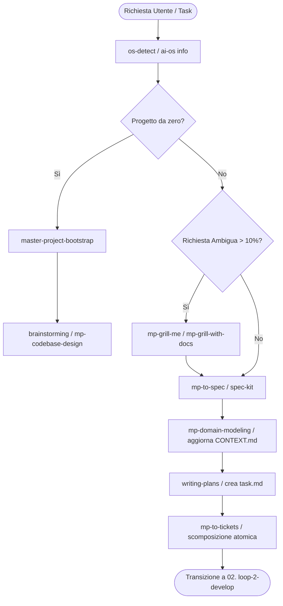

# 🎯 01. Loop 1: Plan & Spec (Brainstorm, Align & Specification)

Questo è il **primo loop sequenziale (01/05)** del Master Production System di Wizard-AI. Il suo scopo categoriale è **Requisiti, Allineamento, Specifica e Architettura**. Deve essere invocato **prima** di scrivere o modificare qualsiasi codice produttivo per eliminare ambiguità, definire i contratti e preparare il piano d'azione.

```
[Richiesta Utente / Idea Vaga]
              │
              ▼
    ┌────────────────────────────────────────────────────────┐
    │ 🎯 01. loop-1-plan (Brainstorm → Grill → Spec → Plan)  │  ◄── (Sei Qui - Step 01)
    └────────────────────────────────────────────────────────┘
              │
              ▼ (Specifiche .spec.md & Piano approvato in task.md)
    ┌────────────────────────────────────────────────────────┐
    │ ⚡ 02. loop-2-develop (Branching → TDD → Implement)    │
    └────────────────────────────────────────────────────────┘
```

---

## 📂 Categorizzazione delle Skills, Progetti e Framework del Loop 1

Tutte le seguenti skills appartengono alla categoria di **Pianificazione e Design Architetturale** e devono essere richiamate o concatenate secondo la logica illustrata:

### 1. Categoria: Core Alignment & Grilling (Chiarimento Requisiti)
Queste skill servono quando la richiesta dell'utente è vaga (`underspecified`), incompleta o aperta a multiple interpretazioni:
- **`brainstorming`**: *Quando usarla:* Prima di creare nuove feature o modificare comportamenti core. *Cosa fa:* Esplora l'intento, propone 2-3 alternative architetturali con trade-off chiari, fa domande UNA ALLA VOLTA e richiede approvazione esplicita del design prima del piano.
- **`mp-grill-me`**: *Quando usarla:* Quando l'utente ha un'idea generale o un requisito ambiguo e deve essere "intervistato" a fondo. *Cosa fa:* Pone serie di domande mirate per estrarre requisiti funzionali e non-funzionali nascosti.
- **`mp-grill-with-docs`**: *Quando usarla:* Quando il progetto ha già documentazione (`CONTEXT.md`, `ADR`, `DESIGN.md`) e la nuova feature deve essere allineata ai contratti esistenti. *Cosa fa:* Confronta la richiesta con i documenti di architettura e solleva incongruenze.
- **`mp-grilling`**: *Quando usarla:* Come pattern base per investigare specifiche incomplete prima di agire.
- **`mp-ask-matt`**: *Quando usarla:* Per decisioni di design di librerie o API TypeScript/JavaScript complesse, applicando i principi concettuali di Matt Pocock.

### 2. Categoria: Specifiche Formali & Ticketing (Decomposizione)
Queste skill servono una volta chiariti i requisiti per creare il contratto formale e la lista di compiti (TODO list):
- **`writing-plans`**: *Quando usarla:* Obbligatoria per compiti multi-step. *Cosa fa:* Scrive un piano dettagliato in `task.md` / `implementation_plan.md` con file path esatti, snippet di codice previsti, criteri di verifica e checklist di esecuzione `[ ]`.
- **`mp-to-spec`**: *Quando usarla:* Per trasformare le risposte di un grilling o una discussione in un documento di specifica rigoroso (`.spec.md`).
- **`mp-to-tickets`**: *Quando usarla:* Per spezzettare una specifica o un piano in ticket di lavoro atomici da 2-5 minuti l'uno, pronti per essere eseguiti dai subagent nel Loop 2.
- **`mp-triage`**: *Quando usarla:* Per classificare, prioritizzare e assegnare tag a bug report, richieste o issue prima di pianificarne la risoluzione.
- **`spec-kit`**: *Quando usarla:* Toolkit di Specification-Driven Development (SDD) per garantire che ogni requisito nella specifica sia verificabile meccanicamente tramite test.

### 3. Categoria: Architettura, Scaffolding & Domain Modeling
Queste skill servono per impostare o evolvere la struttura del progetto, l'OS e il linguaggio di dominio:
- **`mp-codebase-design`**: *Quando usarla:* Prima di creare nuove cartelle, moduli o dipendenze incrociate. *Cosa fa:* Applica il principio "Design It Twice", definendo i confini dei moduli, i flussi di dati e riducendo l'accoppiamento.
- **`mp-domain-modeling`**: *Quando usarla:* Quando si introduce logica di business o terminologia specifica di un dominio. *Cosa fa:* Definizione dell'Ubiquitous Language, Bounded Contexts ed entità all'interno del file globale `CONTEXT.md`.
- **`mp-research`**: *Quando usarla:* Quando si deve investigare una nuova libreria, un API esterna o un pattern prima di sceglierlo nel piano.
- **`master-project-bootstrap`**: *Quando usarla:* Quando l'utente chiede di creare un progetto partendo da zero ("crea una nuova app"). *Cosa fa:* Impone Clean Architecture, impalcatura di cartelle, setup test e documentazione `Living Documents`.
- **`os-detect` (`ai-os`)**: *Quando usarla:* **MANDATORY PRE-GATE** prima di installare qualsiasi libreria, tool di sistema o dipendenza in pianificazione. *Cosa fa:* Rileva Arch, Ubuntu, macOS, WSL o Windows per usare il package manager nativo corretto.

---

## 🔗 Concatenazione e Skill Chaining Tree (Loop 1)

Il seguente albero mostra esattamente la sequenza di esecuzione e come le skill si concatenano nel Loop 1:



---

## 📝 Istruzioni Operative Passo-Passo (Esecuzione Loop 1)

### Step 1.1: Pre-Check Ambientale (`os-detect`)
Esegui `ai-os info` o verifica il contesto di sistema per assicurarti di conoscere il sistema operativo, i runtime disponibili (Node, Python, Deno, Bun) e le dipendenze prima di formulare ipotesi di design.

### Step 1.2: Allineamento e Sgarbugliamento (`brainstorming` / `mp-grill-me`)
- Valuta la chiarezza dei requisiti. Se ci sono punti oscuri o scelte architetturali aperte, avvia `brainstorming` (o `mp-grill-me`).
- Fai domande chiare, presenta opzioni (A vs B vs C) con pro e contro. Non dare per scontate scelte non espresse dall'utente.

### Step 1.3: Redazione Specifica e Modello di Dominio (`mp-to-spec` + `mp-domain-modeling`)
- Se il task introduce nuovi concetti o domini, aggiorna o crea il file `CONTEXT.md` (o il file `.spec.md`) specificando i termini del linguaggio condiviso (Ubiquitous Language).
- Definisci contratti di interfaccia chiari (tipi TypeScript, modelli Pydantic, schemi DB).

### Step 1.4: Scrittura del Piano d'Azione (`writing-plans` + `mp-to-tickets`)
- Genera il file `task.md` (o `implementation_plan.md`) nel contesto dell'agente.
- Il piano **DEVE** contenere:
  1. Elenco dei file da modificare/creare con path assoluti.
  2. Spiegazione tecnica atomica di cosa farà ogni funzione.
  3. Lista dei test da creare (per il TDD nel Loop 2).
  4. Checklist progressiva `[ ]` scomposta in task da 2-5 minuti.

### Step 1.5: Handoff Sequenziale verso Loop 2
Una volta che l'utente ha approvato il piano (o una volta completata la verifica interna), esegui il passaggio di consegne al loop di sviluppo:
> **Azione:** Inizia l'esecuzione sequenziale passando al **`02. loop-2-develop`**.
