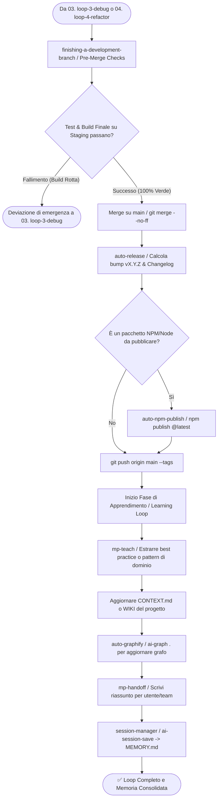

# 🚀 05. Loop 5: Release & Learn (Deliver, Teach & Persistent Memory)

Questo è il **quinto e ultimo loop sequenziale (05/05)** del Master Production System di Wizard-AI. Il suo scopo categoriale è **Merge su Main, Rilascio Semantico (SemVer), Pubblicazione, Handoff e Apprendimento Persistente (Learning & Knowledge Loop)**. Subentra al `03. loop-3-debug` (o al `04. loop-4-refactor`) una volta completata e verificata la qualità del codice.

```
    ┌────────────────────────────────────────────────────────┐
    │ 🔍 03. loop-3-debug o 🏗️ 04. loop-4-refactor           │
    └────────────────────────────────────────────────────────┘
              │
              ▼ (Test 100% Verdi & Quality Gates Superati)
    ┌────────────────────────────────────────────────────────┐
    │ 🚀 05. loop-5-release (Merge → SemVer → Publish → Mem) │  ◄── (Sei Qui - Step 05)
    └────────────────────────────────────────────────────────┘
              │
              ├──────────────────────────────────┐
              ▼ (Release vX.Y.Z pubblicata)      │ (Se build di rilascio o test falliscono)
    ┌─────────────────────────────────────────┐  ▼
    │ ✅ CICLO COMPLETATO & MEMORIA SALVATA  │ ┌─────────────────────────────────────────┐
    └─────────────────────────────────────────┘ │ 🐛 03. loop-3-debug (Diagnosi Build)    │
                                                └─────────────────────────────────────────┘
```

---

## 📂 Categorizzazione delle Skills, Progetti e Framework del Loop 5

Tutte le seguenti skills appartengono alla categoria di **Rilascio, Consegna, Handoff e Memoria Persistente** e devono essere richiamate o concatenate secondo la logica illustrata:

### 1. Categoria: Merge Strategy & Semantic Release (Consegna e Tagging)
Queste skill gestiscono la fusione sicura in produzione, l'incremento di versione e la pubblicazione su registry esterni:
- **`finishing-a-development-branch`**: *Quando usarla:* Come primo step per chiudere il branch di lavoro (`feature/...` o `fix/...`). *Cosa fa:* Esegue gli ultimi controlli di pre-merge, assicura la coerenza della history e fa il merge (no-ff o squash) sul branch di rilascio `main`.
- **`auto-release` (`ai-release`)**: *Quando usarla:* Subito dopo il merge su `main`. *Cosa fa:* Calcola il bump del Semantic Versioning (`MAJOR.MINOR.PATCH`), aggiorna `CHANGELOG.md`, crea il commit di versione, il tag Git (`vX.Y.Z`) e la GitHub Release.
- **`auto-trigger-release`**: *Quando usarla:* Attivata come intercettore automatico per avviare il flusso di rilascio senza input manuale quando un task è completato.
- **`auto-npm-publish` (`ai-npm-setup`)**: *Quando usarla:* Se il progetto è una libreria o un pacchetto NPM/Node. *Cosa fa:* Sincronizza la versione di `package.json`, verifica i token di autenticazione e pubblica il pacchetto su registro globale npm (`@darkrei08/wizard-ai-cli`).

### 2. Categoria: Knowledge Handoff & Teaching (Documentazione e Apprendimento)
Queste skill (che inglobano l'ex `loop-learn`) trasformano il lavoro svolto in conoscenza cristallizzata per l'utente, il team o gli agenti futuri:
- **`mp-handoff`**: *Quando usarla:* Alla chiusura della sessione o quando si passa il task a un altro subagent o al team umano. *Cosa fa:* Redige un documento formale di handoff riassumendo decisioni prese, file modificati e prossimi passi aperti.
- **`mp-teach`**: *Quando usarla:* Quando nel task si sono affrontati concetti tecnici non banali, librerie nuove o pattern architetturali avanzati. *Cosa fa:* Spiega strutturalmente i concetti all'utente o li fissa nella wiki interna.
- **`mp-loop-me`**: *Quando usarla:* Per spiegare e guidare l'utente attraverso un ciclo di istruzioni interattive.
- **`internal-comms`**: *Quando usarla:* Per generare report di stato, aggiornamenti per la leadership aziendale, changelog narrativi o newsletter interne di progetto.
- **`slack-gif-creator`**: *Quando usarla:* Per creare GIF animate per celebrare il deploy su Slack o mostrare una demo della nuova UI.

### 3. Categoria: Persistent Memory & Knowledge Graph (Memoria a Lungo Termine)
Queste skill garantiscono il **Loop-First Approach**: ogni ciclo deve arricchire la memoria per rendere il ciclo successivo più intelligente del precedente:
- **`session-manager` (`ai-session-save`)**: *Quando usarla:* **MANDATORY POST-GATE** alla fine esatta di ogni sessione. *Cosa fa:* Scrive lo snapshot finale in `MEMORY.md`, salvando i pattern di successo, le decisioni prese e le preferenze dell'utente per le future sessioni.
- **`claude-mem`**: *Quando usarla:* Per salvare e indicizzare memorie semantiche persistenti e recuperarle cross-session.
- **`auto-graphify` (`ai-graph .`)**: *Quando usarla:* Dopo aver modificato la struttura dei file o le classi. *Cosa fa:* Rigenera la mappa semantica e il knowledge graph all'interno di `graphify-out/`.
- **`book-to-skill`**: *Quando usarla:* Quando la sessione ha studiato documentazione esterna, manuali PDF o specifiche tecniche, trasformandole in nuove skill salvate nella cartella `skills/`.

---

## 🔗 Concatenazione e Skill Chaining Tree (Loop 5)

Il seguente albero mostra la sequenza deterministica di esecuzione del Loop 5 (Release + Learn):



---

## 📝 Istruzioni Operative Passo-Passo (Esecuzione Loop 5)

### Step 5.1: Chiusura Branch e Verifica Finale (`finishing-a-development-branch`)
- Esegui un check finale della suite di test e del build (`npm run build` o `pytest`).
- Se il build finale fallisce, interrompi il merge e devia immediatamente al **`03. loop-3-debug`**.
- Se il build passa al 100%, esegui il merge su `main` preservando la storia:
  ```bash
  git checkout main
  git pull origin main
  git merge --no-ff feature/nome-branch -m "feat: merge feature/nome-branch to main"
  ```

### Step 5.2: Bump Semantic Versioning e Release (`auto-release` + `auto-npm-publish`)
- Determina il tipo di bump:
  - `patch`: bugfix e patch minori (`0.43.0` → `0.43.1`).
  - `minor`: nuove funzionalità o skill aggiunte (`0.43.0` → `0.44.0`).
  - `major`: breaking changes architetturali (`0.43.0` → `1.0.0`).
- Esegui la creazione della release:
  ```bash
  ai-release patch  # (oppure minor/major)
  ```
- Se è configurata la pubblicazione NPM, esegui il deploy:
  ```bash
  npm publish
  ```

### Step 5.3: Learning Loop & Handoff (`mp-teach` + `mp-handoff`)
- Trasforma il lavoro fatto in conoscenza: se hai scoperto una peculiarità del framework o una best practice, usa `mp-teach` per documentarla in `CONTEXT.md` o nella cartella `docs/WIKI.md`.
- Presenta all'utente il documento di walkthrough finale e di handoff (`mp-handoff`).

### Step 5.4: Salvataggio della Memoria Persistente (`session-manager` + `auto-graphify`)
<MANDATORY>
Il Loop 5 e l'intera interazione NON POSSONO terminare senza aggiornare la memoria persistente dell'agente.
</MANDATORY>

1. Esegui il salvataggio dello stato in `MEMORY.md`:
   ```bash
   ai-session-save "Rilasciata versione vX.Y.Z: implementato [descrizione task]"
   ```
2. Accertati che **mai nessuna chiave API o percorso locale privato** venga memorizzato in `MEMORY.md` (privacy check).
3. Se sono state create nuove cartelle, file di specifica o moduli, avvia in background l'aggiornamento del knowledge graph semantico:
   ```bash
   ai-graph .
   ```
4. Dichiara all'utente il completamento con successo del ciclo e la disponibilità della memoria consolidata per i futuri comandi del `01. loop-1-plan`.
